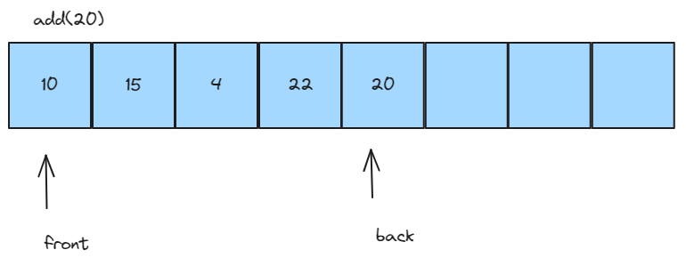
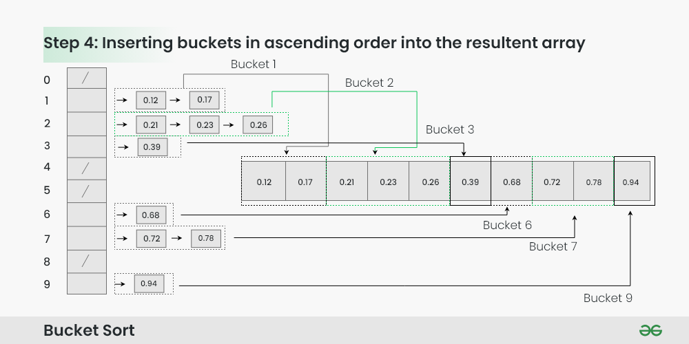
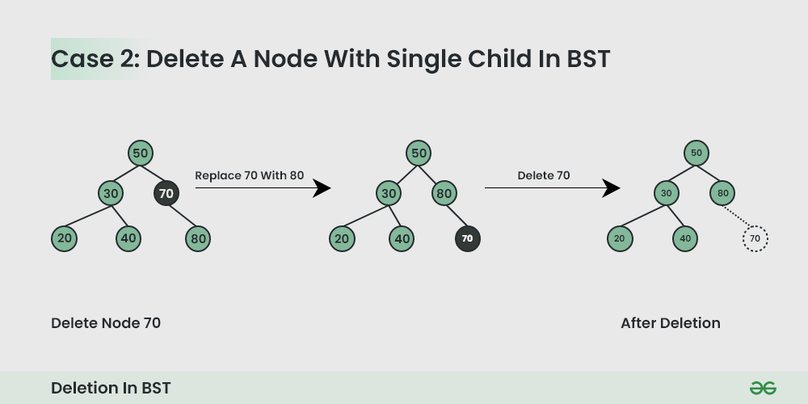

<h1 align="center"> Data Structures and Algorithms in Java Basics </h1>

# Content

1. [Chapter 1: Introducing](#chapter1)
    - [Chapter 1 - Part 1: What is a Data Structure?](#chapter1part1)
    - [Chapter 1 - Part 2: What is an Algorithm?](#chapter1part2)
2. [Chapter 2: The Big-O Notation](#chapter2)
    - [Chapter 2 - Part 1: The Big-O Notation](#chapter2part1)
3. [Chapter 3: Arrays in Java](#chapter3)
    - [Chapter 3 - Part 1: Quick Review of Arrays in Java](#chapter3part1)
    - [Chapter 3 - Part 2: Arrays in Memory](#chapter3part2)
    - [Chapter 3 - Part 3: Big-O Values for Array Operations](#chapter3part3)
    - [Chapter 3 - Part 4: Bubble Sort](#chapter3part4)
    - [Chapter 3 - Part 5: Stable vs Unstable Sort Algorithms](#chapter3part5)
    - [Chapter 3 - Part 6: Selection Sort](#chapter3part6)
    - [Chapter 3 - Part 7: Insertion Sort](#chapter3part7)
    - [Chapter 3 - Part 8: Shell Sort](#chapter3part8)
    - [Chapter 3 - Part 9: Recursion](#chapter3part9)
    - [Chapter 3 - Part 10: Merge Sort](#chapter3part10)
    - [Chapter 3 - Part 11: Quick Sort](#chapter3part11)
    - [Chapter 3 - Part 12: Counting Sort](#chapter3part12)
    - [Chapter 3 - Part 13: Radix Sort](#chapter3part13)
    - [Chapter 3 - Part 14: Sorting Arrays using JDK](#chapter3part14)
4. [Chapter 4: Lists in Java](#chapter4)
    - [Chapter 4 - Part 1: Introduction to Lists](#chapter4part1)
    - [Chapter 4 - Part 2: Array Lists](#chapter4part2)
    - [Chapter 4 - Part 3: Vectors](#chapter4part3)
    - [Chapter 4 - Part 4: Linked Lists](#chapter4part4)
    - [Chapter 4 - Part 5: Singly Linked Lists](#chapter4part5)
    - [Chapter 4 - Part 6: Doubly Linked Lists](#chapter4part6)
    - [Chapter 4 - Part 7: JDK LinkedList Class](#chapter4part7)
5. [Chapter 5: Stacks in Java](#chapter5)
    - [Chapter 5 - Part 1: Introduction to Stacks](#chapter5part1)
    - [Chapter 5 - Part 2: Stack Array Implementation](#chapter5part2)
    - [Chapter 5 - Part 3: Stack Linked List Implementation](#chapter5part3)
    - [Chapter 2 - Part 4: JDK Stack and Deque Class](#chapter5part4)
6. [Chapter 6: Queues in Java](#chapter6)
    - [Chapter 6 - Part 1: Introduction to Queues](#chapter6part1)
    - [Chapter 6 - Part 2: Queues Array Implementation](#chapter6part2)
    - [Chapter 6 - Part 3: Queues Circular Implementation](#chapter6part3)
    - [Chapter 6 - Part 4: JDK Queue Class](#chapter6part4)
7. [Chapter 7: Hashtables in Java](#chapter7)
    - [Chapter 7 - Part 1: Introduction to Hashtables](#chapter7part1)
    - [Chapter 7 - Part 2: Hashtables Array Implementation](#chapter7part2)
    - [Chapter 7 - Part 3: Linear Probing](#chapter7part3)
    - [Chapter 7 - Part 4: Linear Probing - Removing Items](#chapter7part4)
    - [Chapter 7 - Part 5: Linear Probing - Rehashing](#chapter7part5)
    - [Chapter 7 - Part 6: Chaining](#chapter7part6)
    - [Chapter 7 - Part 7: JDK Hashtable Class](#chapter7part7)
    - [Chapter 7 - Part 8: Bucket Sort](#chapter7part8)
8. [Chapter 8: Search Algorithms](#chapter8)
    - [Chapter 8 - Part 1: Linear Search Algorithm](#chapter8part1)
    - [Chapter 8 - Part 2: Binary Search Algorithm](#chapter8part2)
9. [Chapter 9: Trees in Java](#chapter9)
    - [Chapter 9 - Part 1: Introduction to Trees](#chapter9part1)
    - [Chapter 9 - Part 2: Binary Search Tree](#chapter9part2)
    - [Chapter 9 - Part 3: Binary Search Tree - Insertion](#chapter9part3)
    - [Chapter 9 - Part 4: Binary Search Tree - Traversal](#chapter9part4)
    - [Chapter 9 - Part 5: Binary Search Tree - Get, Min, Max](#chapter9part5)
    - [Chapter 9 - Part 6: Binary Search Tree - Delete](#chapter9part6)
    - [Chapter 9 - Part 7: Self-Balancing Binary Search Trees](#chapter9part7)
    - [Chapter 9 - Part 8: Trees in JDK](#chapter9part8)
10. [Chapter 10: Heaps in Java](#chapter10)
    - [Chapter 10 - Part 1: Introduction to Heaps](#chapter10part1)
11. [Chapter 11: Sets in Java](#chapter11)
    - [Chapter 11 - Part 1: Introduction to Sets](#chapter11part1)

## <a name="chapter1"></a>Chapter 1: Introducing
  
#### <a name="chapter1part1"></a>Chapter 1 - Part 1: What is a Data Structure?

- Organizes and stores data
- Each has strenghts and weaknesses

A data structure is not only used for organizing the data. It is also used for processing, retrieving, and storing data. 
There are different basic and advanced types of data structures that are used in almost every program or software system that has been developed. So we must have good knowledge about data structures.

There are many types of data structures and the way that each stores and organizes data will differ. Ex: Arrays order the data sequentially and place each value in its own slot and we can get this slot using the index. A Tree is a hierarchical data structure.

Each data structure do somethings well and others not so well. Ex: A array is great for random access when you know the index of the item you wanna access but when you don't now the index, they are not so well because you have to search(loop) the dataset. 

<br>

<div align="center"><br><sub>Classification of Data Structure - (<a href='https://www.geeksforgeeks.org/data-structures/'>Work by Geeks for Geeks</a>) </sub></div>

<br>

- **Linear data structure**: Data structure in which data elements are arranged sequentially or linearly, where each element is attached to its previous and next adjacent elements, is called a linear data structure. 
Examples of linear data structures are array, stack, queue, linked list, etc.
  - **Static data structure**: Static data structure has a fixed memory size. It is easier to access the elements in a static data structure. 
An example of this data structure is an array.
  - **Dynamic data structure**: In dynamic data structure, the size is not fixed. It can be randomly updated during the runtime which may be considered efficient concerning the memory (space) complexity of the code. 
Examples of this data structure are queue, stack, etc.

- **Non-linear data structure**: Data structures where data elements are not placed sequentially or linearly are called non-linear data structures. In a non-linear data structure, we can’t traverse all the elements in a single run only. 
Examples of non-linear data structures are trees and graphs.

#### <a name="chapter1part2"></a>Chapter 1 - Part 2: What is an Algorithm?

An algorithm describes the steps you have to perform to accomplish a specific task.

Example of Making a Tea

1- Boil Water
2- Add a teabag to a cup
3- Pour the boiling water into the cup
4- Remove the teabag when tea is ready
5- Add the desired amount of milk to the cup
6- Add the desired amount of sugar to the cup
7- Stir the contents of the cup with a spoon

In this example, this is one algorithm to make a Tea. There is many ways to make tea, in this case, not just one algorithm to do the same thing.

For example, there many types of sort algorithm to sort data.

- There can be many algorithms that accomplish the same task
- There can be  many implementations of the same algorithm

**Types of Algorithms**

- Brute Force Algorithm
  - It is the simplest approach to a problem. A brute force algorithm is the first approach that comes to finding when we see a problem.

- Recursive Algorithm
  - A recursive algorithm is based on recursion. In this case, a problem is broken into several sub-parts and called the same function again and again.

- Backtracking Algorithm
  - The backtracking algorithm builds the solution by searching among all possible solutions. Using this algorithm, we keep on building the solution following criteria. Whenever a solution fails we trace back to the failure point build on the next solution and continue this process till we find the solution or all possible solutions are looked after.
 
- Searching Algorithm
  - Searching algorithms are the ones that are used for searching elements or groups of elements from a particular data structure. They can be of different types based on their approach or the data structure in which the element should be found.
 
- Sorting Algorithm
  - Sorting is arranging a group of data in a particular manner according to the requirement. The algorithms which help in performing this function are called sorting algorithms. Generally sorting algorithms are used to sort groups of data in an increasing or decreasing manner.
 
- Hashing Algorithm
  - Hashing algorithms work similarly to the searching algorithm. But they contain an index with a key ID. In hashing, a key is assigned to specific data.
 
- Divide and Conquer Algorithm
  - This algorithm breaks a problem into sub-problems, solves a single sub-problem, and merges the solutions to get the final solution. It consists of the following three steps:
    - Divide
    - Solve
    - Combine
   
- Greedy Algorithm
  - In this type of algorithm, the solution is built part by part. The solution for the next part is built based on the immediate benefit of the next part. The one solution that gives the most benefit will be chosen as the solution for the next part.
 
- Dynamic Programming Algorithm
  - This algorithm uses the concept of using the already found solution to avoid repetitive calculation of the same part of the problem. It divides the problem into smaller overlapping subproblems and solves them.
 
- Randomized Algorithm
  - In the randomized algorithm, we use a random number so it gives immediate benefit. The random number helps in deciding the expected outcome.
 
**How to Design an Algorithm?**

1- The problem that is to be solved by this algorithm i.e. clear problem definition.
2- The constraints of the problem must be considered while solving the problem.
3- The input to be taken to solve the problem.
4- The output is to be expected when the problem is solved.
5- The solution to this problem is within the given constraints.

Then the algorithm is written with the help of the above parameters such that it solves the problem.

## <a name="chapter2"></a>Chapter 2: The Big-O Notation
  
#### <a name="chapter2part1"></a>Chapter 2 - Part 1: The Big-O Notation

How can we be able to compare the performance of one algorithm against another algorithm? One way we could do that is to implement one algorithm and then put a line of code that records the start time and then run the implementation
and then have a line of code that records the end time and we can subtract the start time from the end time and we get the running time of the implementation of that algorithm. And then we do the same for another algorithm and we just compare the two.

In theory but unfortunately that's not a good way to do it because of hardware. Hardware is going to influence the running time of these algorithms. If we were to run an implementation on a desktop computer that was built in 2017 and compare that
to the running time of the exact same implementation on a desktop computer that was built 20 years ago and perhaps is an old Pentium computer, or we'll even go further than that and run the implementation on a Commodore 64 or something like that,
obviously the implementations are going to run slower on the older hardware. And if we were to run an implementation on a super computer, it's going to run really, really fast even though it might be a really inefficient algorithm.

So we need a more objective measure than just the straight running time. And so what we do is we look at the number of steps that it takes to execute an algorithm.

And we call this the **time complexity**.

There are two types of complexity:
  - **Time complexity**: which is the number of steps involved to run an algorithm.
  - **Memory complexity**: which is the amount of memory it takes to run an algorithm.

So we're interested in how many steps does it take to run an algorithm?

Now when we're doing we like to look at the worst case.

Looking at the best case doesn't help us because you're rarely gonna have the best case.

So if we wanna know what the upper bound is, like what is the absolute worst that we can expect from this algorithm, it's much more helpful to look at the worst case.

So it's helpful to compare the worst case scenario for one algorithm against the worst case scenario for the other algorithm.

We've already looked at an algorithm for making tea so now we're going to look at one little step.

```
1. Fetch the bowl containing the sugar
2. Get a Spoon
3. Scoop out sugar using the spoon
4. Pour the sugar from the spoon into the tea
5. Repeat steps 3 and 4 until you've added the desired amount of sugar
```

Now we can see from this that the number of steps that it's going to take to add sugar to your tea is going to depend on how many sugars you want.

If you only want one sugar, then this algorithm will run taking four steps. (1x1,2x1,3x1 and 4x1)

But if you want two sugars, it's going to take six steps because you're going to have to repeat steps three and four. (1x1,2x1,3x2 and 4x2)

So as we can see the number of steps or the time complexity of our sugar algorithm depends on how many sugars someone wants in their tea.

| Number of Sugars  | Steps Required  | 
| :---------------- | :--------------:|
| 1                 | 4               |
| 2                 | 6               |
| 3                 | 8               |
| 4                 | 10              |

If they only want one sugar, it just takes them four steps.

But if they want four sugars, it's gonna take them 10 steps.

So the time complexity gives us an idea of how an algorithm will perform as the number of items it has to deal with grows so as we can see as the number of sugars this algorithm has to add to tea increases, the number of steps required increases.

Another way of saying this is it tells us how well an algorithm will scale.

So how well will it do when it has to deal with 100 items, versus 1,00 items, versus a million items?

And we'll see that some algorithm will scale really well and others not so well.

The more items there are, the more algorithm's performance will degrade.

Now the big O notation is a way of expressing the complexity related to the number of items that an algorithm has to deal with. And it's written as a capital O followed by an expression in parenthesis.

So let's work out the big O value for our sugar algorithm.

- Number of desired sugars = n
- Total number of steps = 2n + 2
- As n grows, the number of steps grows
- The "2" in 2n and the "+2" reamin constant, so they don't factor into the time complexity. The value of n determines the growth rate
- Time complexity is O(n)
- Linear time complexity

| Big-O       |                 | 
| :---------- | :--------------:|
| O(1)        | Constant        |
| O(logn)     | Logarithmic     |
| O(n)        | Linear          |
| O(n.logn)   | n-log-star-n    |
| O(n^2)      | Quadratic       |


And so this is a graph of some of the big O values, and this represents how an algorithm would degrade.

Along the X axis we have the input size, so the number of items; and along the Y axis we have the number of steps.

<br>

<div align="center"><br><sub>Graphs of functions commonly used in the analysis of algorithms, showing the number of operations N versus input size n for each function - (<a href='https://en.wikipedia.org/wiki/Big_O_notation#/media/File:Comparison_computational_complexity.svg'>Work by Cmglee</a>) </sub></div>

<br>

Examples of each time complexity

- **O(1)**: Constant Time Execution

```java
int getFirst(int[] array) {
    return array[0];
}
```

In this case, we are returning the first element of the array, no matter the size of the array, the time to execute this function will always be the same.

- **O(logn)**: Logarithmic Time Execution

```java
boolean binarySearch(int[] array, int x) {
    int left = 0, right = array.length - 1;
    while (left <= right) {
        int mid = left + (right - left) / 2;
        if (array[mid] == x) {
            return true;
        }
        if (array[mid] < x) {
            left = mid + 1;
        } else {
            right = mid - 1;
        }
    }
    return false;
}
```

This is an example of binary search. At each step, we eliminate half of the elements. Therefore, the runtime increases logarithmically with the size of the array.

- **O(n)**: Linear Time Execution

```java
boolean contains(int[] array, int element) {
    for (int i = 0; i < array.length; i++) {
        if (array[i] == element) {
            return true;
        }
    }
    return false;
}
```

In this case, in the worst scenario, we have to traverse the whole array to find out if an element is present or not. Therefore, the execution time increases linearly with the size of the array.

- **O(n.logn)**: Linearithmic Time Execution

```java
class MergeSort { 
    // Merges two subarrays of arr[]. 
    // First subarray is arr[l..m] 
    // Second subarray is arr[m+1..r] 
    void merge(int arr[], int l, int m, int r) 
    { 
        // Find sizes of two subarrays to be merged 
        int n1 = m - l + 1; 
        int n2 = r - m; 
  
        // Create temp arrays 
        int L[] = new int[n1]; 
        int R[] = new int[n2]; 
  
        // Copy data to temp arrays 
        for (int i = 0; i < n1; ++i) 
            L[i] = arr[l + i]; 
        for (int j = 0; j < n2; ++j) 
            R[j] = arr[m + 1 + j]; 
  
        // Merge the temp arrays 
        // Initial indexes of first and second subarrays 
        int i = 0, j = 0; 
  
        // Initial index of merged subarray array 
        int k = l; 
        while (i < n1 && j < n2) { 
            if (L[i] <= R[j]) { 
                arr[k] = L[i]; 
                i++; 
            } 
            else { 
                arr[k] = R[j]; 
                j++; 
            } 
            k++; 
        } 
  
        // Copy remaining elements of L[] if any 
        while (i < n1) { 
            arr[k] = L[i]; 
            i++; 
            k++; 
        } 
  
        // Copy remaining elements of R[] if any 
        while (j < n2) { 
            arr[k] = R[j]; 
            j++; 
            k++; 
        } 
    } 
  
    // Main function that sorts arr[l..r] using 
    // merge() 
    void sort(int arr[], int l, int r) 
    { 
        if (l < r) { 
            // Find the middle point 
            int m = (l + r) / 2; 
  
            // Sort first and second halves 
            sort(arr, l, m); 
            sort(arr, m + 1, r); 
  
            // Merge the sorted halves 
            merge(arr, l, m, r); 
        } 
    } 
  
    // A utility function to print array of size n 
    static void printArray(int arr[]) 
    { 
        int n = arr.length; 
        for (int i = 0; i < n; ++i) 
            System.out.print(arr[i] + " "); 
        System.out.println(); 
    } 
  
    // Driver method 
    public static void main(String args[]) 
    { 
        int arr[] = { 12, 11, 13, 5, 6, 7 }; 
  
        System.out.println("Given Array"); 
        printArray(arr); 
  
        // Calling of Merge Sort 
        MergeSort ob = new MergeSort(); 
        ob.sort(arr, 0, arr.length - 1); 
  
        System.out.println("\nSorted array"); 
        printArray(arr); 
    } 
}

```

Merge Sort is a divide-and-conquer algorithm. It divides the input array into two halves, calls itself the two halves, and then merges the two sorted halves. The merge() function is used for merging two halves. The merge(arr, l, m, r) is a key process that assumes that arr[l..m] and arr[m+1..r] are sorted and merges the two sorted sub-arrays into one. 

Step 1 : Divide Array into Two Parts
Step 2: Merge Sort the first part of the array
Step 3: Merge Sort the second part of the array
Step 4: Merge Both the parts
Step 5: Return the Sorted Array

- **O(n^2)**: Quadratic Time Execution

```java
void printPairs(int[] array) {
    for (int i = 0; i < array.length; i++) {
        for (int j = 0; j < array.length; j++) {
            System.out.println(array[i] + ", " + array[j]);
        }
    }
}
```

In this case, for each element in the array, we are traversing the whole array again. This gives us a runtime that is the square of the size of the array.

- **O(2^n)**: Exponential Time Execution

```java
int fibonacci(int n) {
    if (n <= 1) {
       return n;
    }
    return fibonacci(n-1) + fibonacci(n-2);
}
```

This is an example of computing Fibonacci using recursion. For each number, we compute the two previous numbers, leading to an exponential runtime complexity.

- **O(n!)**: Fatorial Time Execution
```java
public class Solution {
    static void nFacRuntimeFunc(int n) {
        for(int i=0; i<n; i++) {
            nFacRuntimeFunc(n-1);
        }
    }
    public static void main(String[] args) {
        nFacRuntimeFunc(3);
    }
}
```

The time complexity of a function called in a loop affects the time complexity of the loop. If the loop is executed n times and the function in the loop executes (n-1)! steps, then a total of n * (n-1)! = n! steps will be performed. 

## <a name="chapter3"></a>Chapter 3: Arrays in Java
  
#### <a name="chapter3part1"></a>Chapter 3 - Part 1: Quick Review of Arrays in Java

How to create and access elements in a array?

```java
public class Main {

    public static void main(String[] args) {
	    int[] intArray = new int[7];

	    intArray[0] = 20;
	    intArray[1] = 35;
	    intArray[2] = -15;
	    intArray[3] = 7;
	    intArray[4] = 55;
	    intArray[5] = 1;
	    intArray[6] = -22;

	    for (int i = 0; i < intArray.length; i++) {
	        System.out.println(intArray[i]);
        }
    }
}
```

We create a array with 7 slots with the index go from 0 to 6.

#### <a name="chapter3part2"></a>Chapter 3 - Part 2: Arrays in Memory

Arrays is:

- Contiguous block in memory
- Every element occupies the same amount of space in memory
- If a array starts at memory address x, and the size of each element in the array is y, we can calculate the memory address of the ith element by using the following expression: x + i*y
- If we know the index of an element, the time to retrieve the element will be the same, no matter where it is in the array.

For the array above of int

```
intArray[0] = 20;
intArray[1] = 35;
intArray[2] = -15;
intArray[3] = 7;
intArray[4] = 55;
intArray[5] = 1;
intArray[6] = -22;
````

Start address of array = 12, element size = 4 bytes

```
Address of array[0] = 12
Address of array[1] = 12 + (1*4) = 16
Address of array[2] = 12 + (2*4) = 20
Address of array[3] = 12 + (3*4) = 24
Address of array[4] = 12 + (4*4) = 28
Address of array[5] = 12 + (5*4) = 32
Address of array[6] = 12 + (6*4) = 36
```

This is because we begin with the index 0.

Now this is why a array is so efficient to retrieve a element when you now the index of this element. This is because doesn't matter where the element is in the array, we do the same calculation to retrieve them (x + i*y).

#### <a name="chapter3part3"></a>Chapter 3 - Part 3: Big-O Values for Array Operations

**Retrieve an Element from an Array**
- Multiply the size of the element by its index
- Get the start address of the array
- Add the start address to the result of the multiplication

For an int array, assume element starts at address 12. Each int is 4 bytes.

```
Address of array[0] = 12 + (0*4) = 12
Address of array[1] = 12 + (1*4) = 16
Address of array[2] = 12 + (2*4) = 20
Address of array[3] = 12 + (3*4) = 24
```

Doesn't matter how many elements we have, the number of the steps will be the same.

| Number of Elements | Steps to retrieve  | 
| :----------------- | :-----------------:|
| 1                  | 3                  |
| 1000               | 3                  |
| 100000             | 3                  |
| 1000000            | 3                  |
| 1000000000         | 3                  |

Now, let's see some operations in array and the time complexity

| Operation                                        | Time Complexity        | 
| :----------------------------------------------- | :---------------------:|
| Retrieve with index                              | O(1) - Constant time   |
| Retrieve without index                           | O(n) - Linear Time     |
| Add an element to a full array                   | O(n)                   |
| Add an element to the end of a array (has space) | O(1)                   |
| Insert or update an element ar a specific index  | O(1)                   |
| Delete an element by setting it to null          | O(1)                   |
| Delete an element by shifting element            | O(n)                   |

In resume, every time there is a For loop, will be a O(n) complexity

**Retrieve with index**

```java
public class Solution {
    public static void main(String[] args) throws IOException {
        int[] intArray = new int[7];

        intArray[0] = 20;
        intArray[1] = 35;
        intArray[2] = -15;
        intArray[3] = 7;
        intArray[4] = 55;
        intArray[5] = 1;
        intArray[6] = -22;

        System.out.println(intArray[3]);
    }
}
```

**Retrieve without index**

```java
public class Solution {
    public static void main(String[] args) throws IOException {
        int[] intArray = new int[7];

	    intArray[0] = 20;
	    intArray[1] = 35;
	    intArray[2] = -15;
	    intArray[3] = 7;
	    intArray[4] =55;
	    intArray[5] = 1;
	    intArray[6] = -22;

	    int index = -1;
	    for (int i = 0; i < intArray.length; i++) {
	        if (intArray[i] == 7) {
	            index = i;
	            break;
            }
        }

        System.out.println("index = " + index);
    }
}
```

**Add an element to a full array**

```java
public class Solution {
    public static void main(String[] args) throws IOException {
        int[] intArray = new int[7];

        intArray[0] = 20;
        intArray[1] = 35;
        intArray[2] = -15;
        intArray[3] = 7;
        intArray[4] =55;
        intArray[5] = 1;
        intArray[6] = -22;

        int newElement = 30;
        int[] intNewArray = new int[8];

        for (int i = 0; i < intArray.length; i++) {
            intNewArray[i] = intArray[i];
        }
        intNewArray[7] = newElement;

        System.out.println(Arrays.toString(intNewArray));
    }
}
```
**Add an element to the end of a array (has space)**

```java
public class Solution {
    public static void main(String[] args) throws IOException {
        int[] intArray = new int[8];

        intArray[0] = 20;
        intArray[1] = 35;
        intArray[2] = -15;
        intArray[3] = 7;
        intArray[4] =55;
        intArray[5] = 1;
        intArray[6] = -22;

        int newElement = 30;
        intArray[7] = newElement;

        System.out.println(Arrays.toString(intArray));
    }
}
```

**Insert or update an element ar a specific index**

```java
public class Solution {
    public static void main(String[] args) throws IOException {
        int[] intArray = new int[7];

        intArray[0] = 20;
        intArray[1] = 35;
        intArray[2] = -15;
        intArray[3] = 7;
        intArray[4] =55;
        intArray[5] = 1;
        intArray[6] = -22;

        int newElement = 30;
        intArray[1] = newElement;

        System.out.println(Arrays.toString(intArray));
    }
}
```

**Delete an element by setting it to null**

```java
public class Solution {
    public static void main(String[] args) throws IOException {
        Integer[] intArray = new Integer[7];

        intArray[0] = 20;
        intArray[1] = 35;
        intArray[2] = -15;
        intArray[3] = 7;
        intArray[4] =55;
        intArray[5] = 1;
        intArray[6] = -22;

        intArray[1] = null;

        System.out.println(Arrays.toString(intArray));
    }
}
```

**Delete an element by shifting element**

```java
public class Solution {
    public static void main(String[] args) throws IOException {
        Integer[] intArray = new Integer[7];

        intArray[0] = 20;
        intArray[1] = 35;
        intArray[2] = -15;
        intArray[3] = 7;
        intArray[4] = 55;
        intArray[5] = 1;
        intArray[6] = -22;

        int indexToDelete = 4;

        for (int i = indexToDelete; i < intArray.length -1; i++) {
            intArray[i] = intArray[i + 1];
        }

        intArray[intArray.length - 1] = null;

        System.out.println(Arrays.toString(intArray));

    }
}
```

#### <a name="chapter3part4"></a>Chapter 4 - Part 4: Bubble Sort

In Bubble Sort algorithm

- traverse from left and compare adjacent elements and the higher one is placed at right side
- In this way, the largest element is moved to the rightmost end at first.
- This process is then continued to find the second largest and place it and so on until the data is sorted.

<br>

<div align="center"><br><sub>Bubble Sort Algorithm : Placing the largest element at correct position  - (<a href='https://www.geeksforgeeks.org/bubble-sort/'>Work by Geeks for Geeks</a>) </sub></div>

<br>

<div align="center"><br><sub>Bubble Sort Algorithm : Placing the second largest element at correct position - (<a href='https://www.geeksforgeeks.org/bubble-sort/'>Work by Geeks for Geeks</a>) </sub></div>

<br>

<div align="center"><br><sub>Bubble Sort Algorithm : Placing the remaining elements at their correct positions - (<a href='https://www.geeksforgeeks.org/bubble-sort/'>Work by Geeks for Geeks</a>) </sub></div>

<br>

- It is a In-Place algorithm
- O(n^2) - time complexity-quadratic
- it will take 100 steps to sort 10 items, 10000 steps to sort 100 items, 1000000 steps to sort 1000 itens
- Algorithm degrades quickly

```java
public class Main {

    public static void main(String[] args) {

        int[] intArray = { 20, 35, -15, 7, 55, 1, -22 };

        for (int lastUnsortedIndex = intArray.length - 1; lastUnsortedIndex > 0;
                lastUnsortedIndex--) {
            for (int i = 0; i < lastUnsortedIndex; i++) {
                if (intArray[i] > intArray[i + 1]) {
                    swap(intArray, i, i + 1);
                }
            }
        }

        for (int i = 0; i < intArray.length; i++) {
            System.out.println(intArray[i]);
        }


    }

    public static void swap(int[] array, int i, int j) {

        if (i == j) {
            return;
        }

        int temp = array[i];
        array[i] = array[j];
        array[j] = temp;

    }
}
```

other solution

```java
public class Solution {
    public static void main(String[] args) throws IOException {
        Integer[] intArray = new Integer[7];

        intArray[0] = 20;
        intArray[1] = 35;
        intArray[2] = -15;
        intArray[3] = 7;
        intArray[4] = 55;
        intArray[5] = 35;
        intArray[6] = -22;


        for(int j = intArray.length -1; j > 0; j--) {
            for(int i = 0; i < j; i++) {
                if(intArray[i] > intArray[i+1]) {
                    int temp = intArray[i];
                    intArray[i] = intArray[i+1];
                    intArray[i+1] = temp;
                }
            }
        }

        System.out.println(Arrays.toString(intArray));

    }
}
```

If we look at this Bubble Sort, he is a Stable algorithm, because we just make the swap, if ```intArray[i] > intArray[i + 1]```

#### <a name="chapter3part5"></a>Chapter 4 - Part 5: Stable vs Unstable Sort Algorithms

The stability of a sorting algorithm is concerned with how the algorithm treats equal (or repeated) elements. Stable sorting algorithms preserve the relative order of equal elements, while unstable sorting algorithms don’t. In other words, stable sorting maintains the position of two equals elements relative to one another.

<br>

<div align="center"><br><sub>Stable and Unstable Sort Algorithms  - (<a href='https://www.baeldung.com/cs/stable-sorting-algorithms'>Work by Baeldung</a>) </sub></div>

<br>

Stable sorting maintains the order of the two equal balls numbered 8, whereas unstable sorting may invert the relative order of the two 8s.

When equal elements are indistinguishable, such as with integers, or more generally, any data where the entire element is the key, stability is not an issue. Stability is also not an issue if all keys are different.

**Where stable sorting algorithms are useful?**

Consider the following dataset of Student Names and their respective class sections.

```
(Dave,A)
(Alice,B)
(Ken,A)
(Eric,B)
(Carol,A)
```

If we sort this data according to name only, then it is highly unlikely that the resulting dataset will be grouped according to sections as well. 

```
(Alice,B)
(Carol,A)
(Dave,A)
(Eric,B)
(Ken,A)
```

So we might have to sort again to obtain the list of students section-wise too. But in doing so, if the sorting algorithm is not stable, we might get a result like this:

```
(Carol,A)
(Dave,A)
(Ken,A)
(Eric,B)
(Alice,B)
```

The dataset is now sorted according to sections, but not according to names. In the name-sorted dataset, the tuple (Alice, B) was before (Eric, B) , but since the sorting algorithm is not stable, the relative order is lost. If on the other hand, we used a stable sorting algorithm, the result would be:

```
(Carol,A)
(Dave,A)
(Ken,A)
(Alice,B)
(Eric,B)
```

**Which sorting algorithms are stable?**

Some Sorting Algorithms are stable by nature, such as Bubble Sort, Insertion Sort, Merge Sort, Count Sort, etc. Comparison-based stable sorts such as Merge Sort and Insertion Sort maintain stability by ensuring that Element A[j]  comes before A[i]  if and only if A[j] < A[i] , here i, j are indices, and i < j . The relative order is preserved if A[i] == A[j]  i.e. A[i]  comes before A[j] 

**Which sorting algorithms are unstable?**

Quick Sort, Heap Sort etc., can be made stable by also taking the position of the elements into consideration. This change may be done in a way that does not compromise a lot on the performance and takes some extra space.

#### <a name="chapter3part6"></a>Chapter 4 - Part 6: Selection Sort

Selection sort is a simple and efficient sorting algorithm that works by repeatedly selecting the smallest (or largest) element from the unsorted portion of the list and moving it to the sorted portion of the list. 

The algorithm repeatedly selects the smallest (or largest) element from the unsorted portion of the list and swaps it with the first element of the unsorted part. This process is repeated for the remaining unsorted portion until the entire list is sorted. 

Lets consider the following array as an example: arr[] = {64, 25, 12, 22, 11}

- For the first position in the sorted array, the whole array is traversed from index 0 to 4 sequentially. The first position where 64 is stored presently, after traversing whole array it is clear that 11 is the lowest value.

- Thus, replace 64 with 11. After one iteration 11, which happens to be the least value in the array, tends to appear in the first position of the sorted list.

<br>

<div align="center"><br><sub>Selection Sort Algorithm | Swapping 1st element with the minimum in array  - (<a href='https://www.geeksforgeeks.org/selection-sort/'>Work by Geeks for Geeks</a>) </sub></div>

<br>

- For the second position, where 25 is present, again traverse the rest of the array in a sequential manner.

- After traversing, we found that 12 is the second lowest value in the array and it should appear at the second place in the array, thus swap these values.

<br>

<div align="center"><br><sub>Selection Sort Algorithm | swapping i=1 with the next minimum element  - (<a href='https://www.geeksforgeeks.org/selection-sort/'>Work by Geeks for Geeks</a>) </sub></div>

<br>

- Now, for third place, where 25 is present again traverse the rest of the array and find the third least value present in the array.

- While traversing, 22 came out to be the third least value and it should appear at the third place in the array, thus swap 22 with element present at third position.

<br>

<div align="center"><br><sub>Selection Sort Algorithm | swapping i=2 with the next minimum element  - (<a href='https://www.geeksforgeeks.org/selection-sort/'>Work by Geeks for Geeks</a>) </sub></div>

<br>

- Similarly, for fourth position traverse the rest of the array and find the fourth least element in the array

- As 25 is the 4th lowest value hence, it will place at the fourth position.

<br>

<div align="center"><br><sub>Selection Sort Algorithm | swapping i=3 with the next minimum element  - (<a href='https://www.geeksforgeeks.org/selection-sort/'>Work by Geeks for Geeks</a>) </sub></div>

<br>

- At last the largest value present in the array automatically get placed at the last position in the array

- The resulted array is the sorted array.

<br>

<div align="center"><br><sub>Selection Sort Algorithm | Required sorted array  - (<a href='https://www.geeksforgeeks.org/selection-sort/'>Work by Geeks for Geeks</a>) </sub></div>

<br>

```java
public class Main {

    public static void main(String[] args) {


        int[] intArray = { 20, 35, -15, 7, 55, 1, -22 };

        for (int lastUnsortedIndex = intArray.length - 1; lastUnsortedIndex > 0;
                lastUnsortedIndex--) {

            int largest = 0;

            for (int i = 1; i <= lastUnsortedIndex; i++) {
                if (intArray[i] > intArray[largest]) {
                    largest = i;
                }
            }

            swap(intArray, largest, lastUnsortedIndex);

        }


        for (int i = 0; i < intArray.length; i++) {
            System.out.println(intArray[i]);
        }


    }

    public static void swap(int[] array, int i, int j) {

        if (i == j) {
            return;
        }

        int temp = array[i];
        array[i] = array[j];
        array[j] = temp;

    }

}
```

Other Solution

```java
public class Solution {
    public static void main(String[] args) throws IOException {
        Integer[] intArray = new Integer[7];

        intArray[0] = 20;
        intArray[1] = 35;
        intArray[2] = -15;
        intArray[3] = 7;
        intArray[4] = 55;
        intArray[5] = 35;
        intArray[6] = -22;


        for(int j = intArray.length -1; j > 0; j--) {
            int largestIndex = 0;
            for(int i = 1; i <= j; i++) {
                if(intArray[largestIndex] < intArray[i]) {
                    largestIndex = i;
                }
            }
            int temp = intArray[j];
            intArray[j] = intArray[largestIndex];
            intArray[largestIndex] = temp;
        }

        System.out.println(Arrays.toString(intArray));

    }
}
```

- It is a In-Place algorithm
- O(n^2) - time complexity-quadratic
- it will take 100 steps to sort 10 items, 10000 steps to sort 100 items, 1000000 steps to sort 1000 itens
- Doesn't require as much swapping as bubble sort
- Unstable algorithm

#### <a name="chapter3part7"></a>Chapter 4 - Part 7: Insertion Sort

Insertion sort is a simple sorting algorithm that works similar to the way you sort playing cards in your hands. 
The array is virtually split into a sorted and an unsorted part. Values from the unsorted part are picked and placed at the correct position in the sorted part.

To sort an array of size N in ascending order iterate over the array and compare the current element (key) to its predecessor, if the key element is smaller than its predecessor, compare it to the elements before. 
Move the greater elements one position up to make space for the swapped element.

Consider an example: arr[]: {12, 11, 13, 5, 6}

- **First Pass**:
  - Initially, the first two elements of the array are compared in insertion sort.
  - | **12** | **11** | 13 | 5 | 6 |
  - Here, 12 is greater than 11 hence they are not in the ascending order and 12 is not at its correct position. Thus, swap 11 and 12.
  - So, for now 11 is stored in a sorted sub-array.
  - | **11** | **12** | 13 | 5 | 6 |
  
- **Second Pass**:
  -  Now, move to the next two elements and compare them
  - | 11 | **12** | **13** | 5 | 6 |
  - Here, 13 is greater than 12, thus both elements seems to be in ascending order, hence, no swapping will occur. 12 also stored in a sorted sub-array along with 11
  
- **Third Pass**:
  - Now, two elements are present in the sorted sub-array which are 11 and 12
  - Moving forward to the next two elements which are 13 and 5
  - | 11 | 12 | **13** | **5** | 6 |
  - Both 5 and 13 are not present at their correct place so swap them
  - | 11 | 12 | **5** | **13** | 6 |
  - After swapping, elements 12 and 5 are not sorted, thus swap again
  - | 11 | **5** | **12** | 13 | 6 |
  - Here, again 11 and 5 are not sorted, hence swap again
  - | **5** | **11** | 12 | 13 | 6 |
  - Here, 5 is at its correct position
  
- **Fourth Pass**:
  - Now, the elements which are present in the sorted sub-array are 5, 11 and 12
  - Moving to the next two elements 13 and 6
  - | 5 | 11 | 12 | **13** | **6** |
  - Clearly, they are not sorted, thus perform swap between both
  - | 5 | 11 | 12 | **6** | **13** |
  - Now, 6 is smaller than 12, hence, swap again
  - | 5 | 11 | **6** | **12** | 13 |
  - Here, also swapping makes 11 and 6 unsorted hence, swap again
  - | 5 | **6** | **11** | 12 | 13 |
  - Finally, the array is completely sorted.

```java
public class Main {

    public static void main(String[] args) {

        int[] intArray = { 20, 35, -15, 7, 55, 1, -22 };

        for (int firstUnsortedIndex = 1; firstUnsortedIndex < intArray.length;
                firstUnsortedIndex++) {
            int newElement = intArray[firstUnsortedIndex];

            int i;

            for (i = firstUnsortedIndex; i > 0 && intArray[i - 1] > newElement; i--) {
                intArray[i] = intArray[i - 1];
            }

            intArray[i] = newElement;
        }

        for (int i = 0; i < intArray.length; i++) {
            System.out.println(intArray[i]);
        }

    }

}
```


- It is a In-Place algorithm
- O(n^2) - time complexity-quadratic
- it will take 100 steps to sort 10 items, 10000 steps to sort 100 items, 1000000 steps to sort 1000 itens
- Stable algorithm

#### <a name="chapter3part8"></a>Chapter 4 - Part 8: Shell Sort

- Variation of Insertion Sort
- Insertion sort chooses which element to insert using a gap of 1
- Shell Sort starts out using a larger gap value
- As the algorithm runs, the gap is reduced
- Goal is to reduce the amount of shifting required

- As the algorithm progresses, the gap is reduced
- The last gap value is always 1
- A gap value of 1 is equivalent to insertion sort
- So, the algorithm does some preliminary work (using gap values greater than 1), and then becomes insertion sort
- By the time we get to insertion sort, the array has been partially sorted, so there's less shifting required

**Knuth Sequence**

| k   | Gap (interval)  | 
| :-- | :--------------:|
| 1   | 1               |
| 2   | 4               |
| 3   | 13              |
| 4   | 40              |
| 5   | 121             |

- Gap is calculated using ((3^k) - 1)/2
- We set k based on the length of the array
- We want the gap to be as close as possible to the length of the array we want to sort, without being greater than the length

**Working of Shell Sort**

- Suppose, we need to sort the following array.

<br>

<div align="center"><br><sub>Initial array  - (<a href='https://www.programiz.com/dsa/shell-sort'>Work by Programiz</a>) </sub></div>

<br>

- We are using the shell's original sequence (N/2, N/4, ...1) as intervals in our algorithm.
  - In the first loop, if the array size is N = 8 then, the elements lying at the interval of N/2 = 4 are compared and swapped if they are not in order.
  - The 0th element is compared with the 4th element.
  - If the 0th element is greater than the 4th one then, the 4th element is first stored in temp variable and the 0th element (ie. greater element) is stored in the 4th position and the element stored in temp is stored in the 0th position.
  
<br>

<div align="center"><br><sub>Rearrange the elements at n/2 interval  - (<a href='https://www.programiz.com/dsa/shell-sort'>Work by Programiz</a>) </sub></div>

<br>

- This process goes on for all the remaining elements.

<br>

<div align="center"><br><sub>Rearrange all the elements at n/2 interval  - (<a href='https://www.programiz.com/dsa/shell-sort'>Work by Programiz</a>) </sub></div>

<br>

- In the second loop, an interval of N/4 = 8/4 = 2 is taken and again the elements lying at these intervals are sorted.


<br>

<div align="center"><br><sub>Rearrange the elements at n/4 interval  - (<a href='https://www.programiz.com/dsa/shell-sort'>Work by Programiz</a>) </sub></div>

<br>

- You might get confused at this point.

<br>

<div align="center"><br><sub>All the elements in the array lying at the current interval are compared.  - (<a href='https://www.programiz.com/dsa/shell-sort'>Work by Programiz</a>) </sub></div>

<br>

- The elements at 4th and 2nd position are compared. The elements at 2nd and 0th position are also compared. All the elements in the array lying at the current interval are compared.

- The same process goes on for remaining elements

<br>

<div align="center"><br><sub>Rearrange all the elements at n/4 interval  - (<a href='https://www.programiz.com/dsa/shell-sort'>Work by Programiz</a>) </sub></div>

<br>

- Finally, when the interval is N/8 = 8/8 =1 then the array elements lying at the interval of 1 are sorted. The array is now completely sorted.

<br>

<div align="center"><br><sub>Rearrange the elements at n/8 interval  - (<a href='https://www.programiz.com/dsa/shell-sort'>Work by Programiz</a>) </sub></div>

<br>

```java
public class Main {

    public static void main(String[] args) {

	    int[] intArray = { 20, 35, -15, 7, 55, 1, -22 };

        for (int gap = intArray.length / 2; gap > 0; gap /= 2) {


            for (int i = gap; i < intArray.length; i++) {
                int newElement = intArray[i];

                int j = i;

                while (j >= gap && intArray[j - gap] > newElement) {
                    intArray[j] = intArray[j - gap];
                    j -= gap;
                }

                intArray[j] = newElement;


            }

        }

        for (int i = 0; i < intArray.length; i++) {
            System.out.println(intArray[i]);
        }
    }

}
```

- In-Place algorithm
- Dificult to nail down the time complexity because it will depend on the gap. Worst case: O(n^2), but it can perform much better than that
- Doesn't require as much shifting as insertion sort, so it usuaaly performs better
- Unstable algorithm

#### <a name="chapter3part9"></a>Chapter 4 - Part 9: Recursion

**Factorial Algorithm**

- If num is equal to 0, the factorial is 1. Stop. We have the result.
Otherwise...

- set multiplier to 1
- set factorial to 1
- while multiplier is not equal to num, do steps 5 and 6
- multiply factorial by multiplier and assign the result to factorial
- add 1 to multiplier
- Step. The result is factorial


```java
public class Main {

    public static void main(String[] args) {

        System.out.println(iterativeFactorial(3));
        System.out.println(recursiveFactorial(3));
    }

    // 1! = 1 * 0! = 1
    // 2! = 2 * 1 = 2 * 1!
    // 3! = 3 * 2 * 1 = 3 * 2!
    // 4! = 4 * 3 * 2 * 1 = 4 * 3!

    // n! = n *(n - 1)!


    public static int recursiveFactorial(int num) {

        if (num == 0) {
            return 1;
        }

        return num * recursiveFactorial(num - 1);

    }

    public static int iterativeFactorial(int num) {

        if (num == 0) {
            return 1;
        }

        int factorial = 1;
        for (int i = 1; i <= num; i++) {
            factorial *= i;
        }

        return factorial;

    }
}
```

#### <a name="chapter3part10"></a>Chapter 4 - Part 10: Merge Sort

- Divide and conquer algorithm
- Recursive algorithm
- Two phases: Splitting and Merging
- Splitting phase leads to faster sorting during the Merging phase
- Splitting is logical. We don't create new arrays.

**Splitting Phase**

- Start with unsorted array.
- Divide the array into two arrays, which are unsorted. The first array is the left array, and the second array is the right array.
- Split the left and right arrays into two arrays each
- Keep splitting until all the arrays have only one element each - the arrays are sorted

**Merging Phase**

- Merge every left/right pair of sibling arrays into a sorted array
- After the first merge, we'll have a bunch of 2-element sorted arrays
- Then merge those sorted arrays (left/right siblings) to end up with a bunch of 4-element sorted arrays
- Repeat until you have a single sorted array
- Not in-place. Uses temporary arrays.

**Merging process**

- We merge sibling left and right arrays
- We create a temporary array large enough to hold all the elements in the arrays we're merging
- We set i to the first index of the left array, and j to the first index of the right array
- We compare left[i] to right[j]. If left is smaller, we copy it to the temp array and increment i by 1. If right is smaller, we copy it to the temp array and increment j by 1.
- We repeat this process until all elements in the two arrays have been processed
- At this point, the temporary array contains the merged values in sorted order
- We then copy this temporary array back to the original input array, at the correct positions
- If the left array is at positions x to y, and the right array is at positions y + 1 to z, then after the copy, positions x to z will be sorted in the original array


<br>

<div align="center"><br><sub>Merge Sort: Divide the array into two halves - (<a href='https://www.geeksforgeeks.org/merge-sort/'>Work by Geeks for Geeks</a>) </sub></div>

<br>

<div align="center"><br><sub>Merge Sort: Divide the subarrays into two halves (unit length subarrays here) - (<a href='https://www.geeksforgeeks.org/merge-sort/'>Work by Geeks for Geeks</a>) </sub></div>

<br>

<div align="center"><br><sub>Merge Sort: Merge the unit length subarrys into sorted subarrays - (<a href='https://www.geeksforgeeks.org/merge-sort/'>Work by Geeks for Geeks</a>) </sub></div>

<br>

<div align="center"><br><sub>Merge Sort: Merge the sorted subarrys to get the sorted array - (<a href='https://www.geeksforgeeks.org/merge-sort/'>Work by Geeks for Geeks</a>) </sub></div>

<br>


```java
public class Main {

    public static void main(String[] args) {
        int[] intArray = { 20, 35, -15, 7, 55, 1, -22 };

        mergeSort(intArray, 0, intArray.length);

        for (int i = 0; i < intArray.length; i++) {
            System.out.println(intArray[i]);
        }
    }

    // { 20, 35, -15, 7, 55, 1, -22 }
    public static void mergeSort(int[] input, int start, int end) {

        if (end - start < 2) {
            return;
        }

        int mid = (start + end) / 2;
        mergeSort(input, start, mid);
        mergeSort(input, mid, end);
        merge(input, start, mid, end);
    }

    // { 20, 35, -15, 7, 55, 1, -22 }
    public static void merge(int[] input, int start, int mid, int end) {

        if (input[mid - 1] <= input[mid]) {
            return;
        }

        int i = start;
        int j = mid;
        int tempIndex = 0;

        int[] temp = new int[end - start];
        while (i < mid && j < end) {
            temp[tempIndex++] = input[i] <= input[j] ? input[i++] : input[j++];
        }

        System.arraycopy(input, i, input, start + tempIndex, mid - i);
        System.arraycopy(temp, 0, input, start, tempIndex);


    }

}
```

- Not an in-place algorithm 

- O(nlog.n) - base 2.We're repeatedly dividing the array in half during the splitting phase

- Stable algorithm
  

#### <a name="chapter3part11"></a>Chapter 4 - Part 11: Quick Sort

- Divide and conquer algorithm
- Recursive algorithm
- Uses a pivot element to partition the array into two parts
- Elements < pivot to its left, elements > pivot to its right
- Pivot will then be in its correct sorted position

- Process is now repeated fot the left array and right array
- Eventually, every element has been the pivot, so every element will be in its correct sorted position
- As with merge sort, we'll end up partitioning the array into a series of 1-element arrays
- Does this in-place(unlike merge sort)

- Compare 10 with the pivot and as it is less than pivot arrange it accrodingly.

<br>

<div align="center"><br><sub>Partition in QuickSort: Compare pivot with 10 - (<a href='https://www.geeksforgeeks.org/quick-sort/'>Work by Geeks for Geeks</a>) </sub></div>

<br>

- Compare 80 with the pivot. It is greater than pivot.

<br>

<div align="center"><br><sub>Partition in QuickSort: Compare pivot with 80 - (<a href='https://www.geeksforgeeks.org/quick-sort/'>Work by Geeks for Geeks</a>) </sub></div>

<br>

- Compare 30 with pivot. It is less than pivot so arrange it accordingly.

<br>

<div align="center"><br><sub>Partition in QuickSort: Compare pivot with 30 - (<a href='https://www.geeksforgeeks.org/quick-sort/'>Work by Geeks for Geeks</a>) </sub></div>

<br>

- Compare 90 with the pivot. It is greater than the pivot.

<br>

<div align="center"><br><sub>Partition in QuickSort: Compare pivot with 90 - (<a href='https://www.geeksforgeeks.org/quick-sort/'>Work by Geeks for Geeks</a>) </sub></div>

<br>

- Arrange the pivot in its correct position.

<br>

<div align="center"><br><sub>Partition in QuickSort: Place pivot in its correct position - (<a href='https://www.geeksforgeeks.org/quick-sort/'>Work by Geeks for Geeks</a>) </sub></div>

<br>

**Illustration of Quicksort:**

As the partition process is done recursively, it keeps on putting the pivot in its actual position in the sorted array. Repeatedly putting pivots in their actual position makes the array sorted.

Follow the below images to understand how the recursive implementation of the partition algorithm helps to sort the array.

- Initial partition on the main array:

<br>

<div align="center"><br><sub>Quicksort: Performing the partition - (<a href='https://www.geeksforgeeks.org/quick-sort/'>Work by Geeks for Geeks</a>) </sub></div>

<br>

- Partitioning of the subarrays:

<br>

<div align="center"><br><sub>Quicksort: Performing the partition - (<a href='https://www.geeksforgeeks.org/quick-sort/'>Work by Geeks for Geeks</a>) </sub></div>

<br>


```java
public class Main {

    public static void main(String[] args) {
        int[] intArray = { 20, 35, -15, 7, 55, 1, -22 };

        quickSort(intArray, 0, intArray.length);

        for (int i = 0; i < intArray.length; i++) {
            System.out.println(intArray[i]);
        }
    }

    public static void quickSort(int[] input, int start, int end) {
        if (end - start < 2) {
            return;
        }

        int pivotIndex = partition(input, start, end);
        quickSort(input, start, pivotIndex);
        for (int i = 0; i < input.length; i++) {
            System.out.println(input[i]);
        }
        quickSort(input, pivotIndex + 1, end);
    }

    public static int partition(int[] input, int start, int end) {
        // This is using the first element as the pivot
        int pivot = input[start];
        int i = start;
        int j = end;

        while (i < j) {

            // NOTE: empty loop body
            while (i < j && input[--j] >= pivot);
            if (i < j) {
                input[i] = input[j];
            }

            // NOTE: empty loop body
            while (i < j && input[++i] <= pivot);
            if (i < j) {
                input[j] = input[i];
            }

        }

        input[j] = pivot;
        return j;

    }
}
```

- In-place algorithm 

- O(nlog.n) - base 2.We're repeatedly partioning the array into two halves

- Unstable algorithm

#### <a name="chapter3part12"></a>Chapter 4 - Part 12: Counting Sort

- Makes assumptions about the data
- Doesn't use comparisons
- Counts the number of occurences of each value
- Only works with non-negative discrete values (can't work with floats, strings)
- Values must be within a specific range

- Find out the maximum element from the given array.

<br>

<div align="center"><br><sub> - (<a href='https://www.geeksforgeeks.org/counting-sort/'>Work by Geeks for Geeks</a>) </sub></div>

<br>

- Initialize a countArray[] of length max+1 with all elements as 0. This array will be used for storing the occurrences of the elements of the input array

<br>

<div align="center"><br><sub> - (<a href='https://www.geeksforgeeks.org/counting-sort/'>Work by Geeks for Geeks</a>) </sub></div>

<br>

- In the countArray[], store the count of each unique element of the input array at their respective indices.
- For Example: The count of element 2 in the input array is 2. So, store 2 at index 2 in the countArray[]. Similarly, the count of element 5 in the input array is 1, hence store 1 at index 5 in the countArray[].

<br>

<div align="center"><br><sub> - (<a href='https://www.geeksforgeeks.org/counting-sort/'>Work by Geeks for Geeks</a>) </sub></div>

<br>

- Store the cumulative sum or prefix sum of the elements of the countArray[] by doing countArray[i] = countArray[i – 1] + countArray[i]. 
This will help in placing the elements of the input array at the correct index in the output array.

<br>

<div align="center"><br><sub> - (<a href='https://www.geeksforgeeks.org/counting-sort/'>Work by Geeks for Geeks</a>) </sub></div>

<br>

- Iterate from end of the input array and because traversing input array from end preserves the order of equal elements, which eventually makes this sorting algorithm stable.
- Update outputArray[ countArray[ inputArray[i] ] – 1] = inputArray[i].
- Also, update countArray[ inputArray[i] ] = countArray[ inputArray[i] ]– -.

<br>

<div align="center"><br><sub> - (<a href='https://www.geeksforgeeks.org/counting-sort/'>Work by Geeks for Geeks</a>) </sub></div>

<br>

- For i = 6,
- Update outputArray[ countArray[ inputArray[6] ] – 1] = inputArray[6]
- Also, update countArray[ inputArray[6] ] = countArray[ inputArray[6] ]- –

<br>

<div align="center"><br><sub> - (<a href='https://www.geeksforgeeks.org/counting-sort/'>Work by Geeks for Geeks</a>) </sub></div>

<br>

- For i = 5,
- Update outputArray[ countArray[ inputArray[5] ] – 1] = inputArray[5]
- Also, update countArray[ inputArray[5] ] = countArray[ inputArray[5] ]- –

<br>

<div align="center"><br><sub> - (<a href='https://www.geeksforgeeks.org/counting-sort/'>Work by Geeks for Geeks</a>) </sub></div>

<br>

- For i = 4,
- Update outputArray[ countArray[ inputArray[4] ] – 1] = inputArray[4]
- Also, update countArray[ inputArray[4] ] = countArray[ inputArray[4] ]- –

<br>

<div align="center"><br><sub> - (<a href='https://www.geeksforgeeks.org/counting-sort/'>Work by Geeks for Geeks</a>) </sub></div>

<br>


- For i = 3,
- Update outputArray[ countArray[ inputArray[3] ] – 1] = inputArray[3]
- Also, update countArray[ inputArray[3] ] = countArray[ inputArray[3] ]- –

<br>

<div align="center"><br><sub> - (<a href='https://www.geeksforgeeks.org/counting-sort/'>Work by Geeks for Geeks</a>) </sub></div>

<br>

- For i = 2,
- Update outputArray[ countArray[ inputArray[2] ] – 1] = inputArray[2]
- Also, update countArray[ inputArray[2] ] = countArray[ inputArray[2] ]- –

<br>

<div align="center"><br><sub> - (<a href='https://www.geeksforgeeks.org/counting-sort/'>Work by Geeks for Geeks</a>) </sub></div>

<br>

- For i = 1,
- Update outputArray[ countArray[ inputArray[1] ] – 1] = inputArray[1]
- Also, update countArray[ inputArray[1] ] = countArray[ inputArray[1] ]- –

<br>

<div align="center"><br><sub> - (<a href='https://www.geeksforgeeks.org/counting-sort/'>Work by Geeks for Geeks</a>) </sub></div>

<br>

-  For i = 0,
- Update outputArray[ countArray[ inputArray[0] ] – 1] = inputArray[0]
- Also, update countArray[ inputArray[0] ] = countArray[ inputArray[0] ]- –

<br>

<div align="center"><br><sub> - (<a href='https://www.geeksforgeeks.org/counting-sort/'>Work by Geeks for Geeks</a>) </sub></div>

<br>


```java
public class Main {

    public static void main(String[] args) {
        int[] intArray = { 2, 5, 9, 8, 2, 8, 7, 10, 4, 3 };

        countingSort(intArray, 1, 10);

        for (int i = 0; i < intArray.length; i++) {
            System.out.println(intArray[i]);
        }
    }

    public static void countingSort(int[] input, int min, int max) {

        int[] countArray = new int[(max - min) + 1];

        for (int i = 0; i < input.length; i++) {
            countArray[input[i] - min]++;
        }

        int j = 0;
        for (int i = min; i <= max; i++) {
            while (countArray[i - min] > 0) {
                input[j++] = i;
                countArray[i - min]--;
            }
        }

    }
}
```

- Not an in-place algorithm
- O(n) - can achieve this because we're making assumptions about the data we're sorting
- If we want the sort to be stable, we have to do some extra steps


#### <a name="chapter3part13"></a>Chapter 4 - Part 13: Radix Sort

- Makes assumptions about the data
- Data must have same radix and width
- Because of this, data must be integers or strings
- Sort based on each individual digit or letter position
- Start at the rightmost position
- Must use a stable sort algorithm at each stage

<br>

<div align="center"><br><sub>How does Radix Sort Algorithm work | Step 1 - (<a href='https://www.geeksforgeeks.org/radix-sort/'>Work by Geeks for Geeks</a>) </sub></div>

<br>

- Find the largest element in the array, which is 802. It has three digits, so we will iterate three times, once for each significant place.

- Sort the elements based on the unit place digits (X=0). We use a stable sorting technique, such as counting sort, to sort the digits at each significant place.

- Sorting based on the unit place:
  - Perform counting sort on the array based on the unit place digits.
  - The sorted array based on the unit place is [170, 90, 802, 2, 24, 45, 75, 66].
  
<br>

<div align="center"><br><sub>How does Radix Sort Algorithm work | Step 2 - (<a href='https://www.geeksforgeeks.org/radix-sort/'>Work by Geeks for Geeks</a>) </sub></div>

<br>

- Sort the elements based on the tens place digits.
- Sorting based on the tens place:
  - Perform counting sort on the array based on the tens place digits.
  - The sorted array based on the tens place is [802, 2, 24, 45, 66, 170, 75, 90].
  
<br>

<div align="center"><br><sub>How does Radix Sort Algorithm work | Step 3 - (<a href='https://www.geeksforgeeks.org/radix-sort/'>Work by Geeks for Geeks</a>) </sub></div>

<br>

- Sort the elements based on the hundreds place digits.
- Sorting based on the hundreds place:
  - Perform counting sort on the array based on the hundreds place digits.
  - The sorted array based on the hundreds place is [2, 24, 45, 66, 75, 90, 170, 802].
  
<br>

<div align="center"><br><sub>How does Radix Sort Algorithm work | Step 4 - (<a href='https://www.geeksforgeeks.org/radix-sort/'>Work by Geeks for Geeks</a>) </sub></div>

<br>

- The array is now sorted in ascending order.
- The final sorted array using radix sort is [2, 24, 45, 66, 75, 90, 170, 802].

<br>

<div align="center"><br><sub>How does Radix Sort Algorithm work | Step 5 - (<a href='https://www.geeksforgeeks.org/radix-sort/'>Work by Geeks for Geeks</a>) </sub></div>

<br>

```java
public class Main {

    public static void main(String[] args) {

        int[] radixArray = { 4725, 4586, 1330, 8792, 1594, 5729 };

        radixSort(radixArray, 10, 4);

        for (int i = 0; i < radixArray.length; i++) {
            System.out.println(radixArray[i]);
        }
    }

    public static void radixSort(int[] input, int radix, int width) {
        for (int i = 0; i < width; i++) {
            radixSingleSort(input, i, radix);
        }
    }

    public static void radixSingleSort(int[] input, int position, int radix) {

        int numItems = input.length;
        int[] countArray = new int[radix];

        for (int value: input) {
            countArray[getDigit(position, value, radix)]++;
        }
        // Adjust the count array
        for (int j = 1; j < radix; j++) {
            countArray[j] += countArray[j - 1];
        }

        int[] temp = new int[numItems];
        for (int tempIndex = numItems - 1; tempIndex >= 0; tempIndex--) {
            temp[--countArray[getDigit(position, input[tempIndex], radix)]] =
                    input[tempIndex];
        }

        for (int tempIndex = 0; tempIndex < numItems; tempIndex++) {
            input[tempIndex] = temp[tempIndex];
        }

    }


    public static int getDigit(int position, int value, int radix) {
        return value / (int) Math.pow(radix, position) % radix;
    }

}
```

- Counting sort is often used as the sort algorithm ofr radix sort - must be stable counting sort
- O(n) - can achieve this because we're making assumptions about the data we're sorting
- Even so, it often runs slower than O(n.log.n) algorithms because of the overhead involved 
- In-place depends on which sort algorithm you use
- Stable algorithm

#### <a name="chapter3part14"></a>Chapter 4 - Part 14: Sorting Arrays using JDK

A useful class to use to make operations in Arrays in Java is the Arrays.class

We can see the operations in the [Java Arrays Doc](https://docs.oracle.com/javase/8/docs/api/java/util/Arrays.html)

```java
public class Main {

    public static void main(String[] args) {
        int[] intArray = { 20, 35, -15, 7, 55, 1, -22 };
		
		
        Arrays.parallelSort(intArray);

        for (int i = 0; i < intArray.length; i++) {
            System.out.println(intArray[i]);
        }
    }
}
```

## <a name="chapter4"></a>Chapter 4: Lists in Java
  
#### <a name="chapter4part1"></a>Chapter 4 - Part 1: Introduction to Lists

The List interface is found in ```java.util``` package and inherits the ```Collection interface```. It is a factory of the ListIterator interface. Through the ListIterator, we can iterate the list in forward and backward directions. The implementation classes of the List interface are ```ArrayList```, ```LinkedList```, ```Stack```, and ```Vector```. ```ArrayList``` and ```LinkedList``` are widely used in Java programming. The Vector class is deprecated since Java 5.

[Java List Doc](https://docs.oracle.com/javase/8/docs/api/java/util/List.html)

<br>

<div align="center"><br><sub>List and ArrayList in Java Collection Framework - (<a href='https://www.geeksforgeeks.org/list-interface-java-examples/'>Work by Geeks for Geeks</a>) </sub></div>

<br>

<div align="center"><br><sub> - (<a href='https://www.geeksforgeeks.org/list-interface-java-examples/'>Work by Geeks for Geeks</a>) </sub></div>

<br>

The list is an abstract data type. A list isn't a concrete data structure, it's an abstract data type nnd when it comes to abstract data types, normally there's an interface involved and list is no exception.
Some the lists that we're gonna look all implement the ```java.util.list interface```. Classes that implement the list interface represent an ordered collection also known as a sequence. Some of them is Array List, Linked List, Vector.

**Abstract Data Type**

- Doesn´t dictate how the data is organized
- Dictates the operations you can perform
- Concrete data structure is usually a concrete class
- Abstract data type is usually an interface

If you want to implement the list interface, you want to create a custom implementation rather than starting with list itself and implementing that, it's a good idea to instead extend abstract list and abstract sequential list because there are scoledo implementations of the list interface and so they kind of give you a head start and all you have to do is override the methods that you specifically want to implement if you want custom behaviour. So if you are going to implement a custom list, its a good idea to extend one of these two classes.

**Declaration of Java List Interface**

```java
public interface List<E> extends Collection<E> ; 
```

Since List is an interface, objects cannot be created of the type list. We always need a class that implements this List in order to create an object. And also, after the introduction of Generics in Java 1.5, it is possible to restrict the type of object that can be stored in the List. Just like several other user-defined ‘interfaces’ implemented by user-defined ‘classes’, List is an ‘interface’, implemented by the ArrayList class, pre-defined in java.util package.

**Syntax of Java List**

This type of safelist can be defined as:

```java
List<Obj> list = new ArrayList<Obj> (); 
```

Obj is the type of the object to be stored in List

**Example of Java List**

```java
// Java program to Demonstrate List Interface
 
// Importing all utility classes
import java.util.*;
 
// Main class
// ListDemo class
class GFG {
 
    // Main driver method
    public static void main(String[] args)
    {
 
        // Creating an object of List interface
        // implemented by the ArrayList class
        List<Integer> l1 = new ArrayList<Integer>();
 
        // Adding elements to object of List interface
        // Custom inputs
 
        l1.add(0, 1);
        l1.add(1, 2);
 
        // Print the elements inside the object
        System.out.println(l1);
 
        // Now creating another object of the List
        // interface implemented ArrayList class
        // Declaring object of integer type
        List<Integer> l2 = new ArrayList<Integer>();
 
        // Again adding elements to object of List interface
        // Custom inputs
        l2.add(1);
        l2.add(2);
        l2.add(3);
 
        // Will add list l2 from 1 index
        l1.addAll(1, l2);
 
        System.out.println(l1);
 
        // Removes element from index 1
        l1.remove(1);
 
        // Printing the updated List 1
        System.out.println(l1);
 
        // Prints element at index 3 in list 1
        // using get() method
        System.out.println(l1.get(3));
 
        // Replace 0th element with 5
        // in List 1
        l1.set(0, 5);
 
        // Again printing the updated List 1
        System.out.println(l1);
    }
} 
```

**Operations in a Java List Interface**

- Adding elements to List class using add() method
- In order to add an element to the list, we can use the add() method. This method is overloaded to perform multiple operations based on different parameters.
  - **add(Object)**: This method is used to add an element at the end of the List.
  - **add(int index, Object)**: This method is used to add an element at a specific index in the List

```java
// Java Program to Add Elements to a List
 
// Importing all utility classes
import java.util.*;
 
// Main class
class GFG {
 
    // Main driver method
    public static void main(String args[])
    {
        // Creating an object of List interface,
        // implemented by ArrayList class
        List<String> al = new ArrayList<>();
 
        // Adding elements to object of List interface
        // Custom elements
        al.add("Geeks");
        al.add("Geeks");
        al.add(1, "For");
 
        // Print all the elements inside the
        // List interface object
        System.out.println(al);
    }
}
```

- Updating elements in List class using set() method
- After adding the elements, if we wish to change the element, it can be done using the set() method. Since List is indexed, the element which we wish to change is referenced by the index of the element. Therefore, this method takes an index and the updated element which needs to be inserted at that index. 

```java
// Java Program to Update Elements in a List
 
// Importing utility classes
import java.util.*;
 
// Main class
class GFG {
 
    // Main driver method
    public static void main(String args[])
    {
        // Creating an object of List interface
        List<String> al = new ArrayList<>();
 
        // Adding elements to object of List class
        al.add("Geeks");
        al.add("Geeks");
        al.add(1, "Geeks");
 
        // Display theinitial elements in List
        System.out.println("Initial ArrayList " + al);
 
        // Setting (updating) element at 1st index
        // using set() method
        al.set(1, "For");
 
        // Print and display the updated List
        System.out.println("Updated ArrayList " + al);
    }
}
```

- Searching for elements using indexOf(), lastIndexOf methods
- Searching for elements in the List interface is a common operation in Java programming. The List interface provides several methods to search for elements, such as the indexOf(), lastIndexOf() methods.
- The indexOf() method returns the index of the first occurrence of a specified element in the list, while the lastIndexOf() method returns the index of the last occurrence of a specified element.
  - **indexOf(element)**: Returns the index of the first occurrence of the specified element in the list, or -1 if the element is not found
  - **lastIndexOf(element)**: Returns the index of the last occurrence of the specified element in the list, or -1 if the element is not found

```java
import java.util.ArrayList;
import java.util.List;
 
public class ListExample {
    public static void main(String[] args)
    {
        // create a list of integers
        List<Integer> numbers = new ArrayList<>();
 
        // add some integers to the list
        numbers.add(1);
        numbers.add(2);
        numbers.add(3);
        numbers.add(2);
 
        // use indexOf() to find the first occurrence of an
        // element in the list
        int index = numbers.indexOf(2);
        System.out.println(
            "The first occurrence of 2 is at index "
            + index);
 
        // use lastIndexOf() to find the last occurrence of
        // an element in the list
        int lastIndex = numbers.lastIndexOf(2);
        System.out.println(
            "The last occurrence of 2 is at index "
            + lastIndex);
    }
}
```

- Removing elements using remove() method
- In order to remove an element from a list, we can use the remove() method. This method is overloaded to perform multiple operations based on different parameters. They are:
  - **remove(Object)**: This method is used to simply remove an object from the List. If there are multiple such objects, then the first occurrence of the object is removed.
  - **remove(int index)**: Since a List is indexed, this method takes an integer value which simply removes the element present at that specific index in the List. After removing the element, all the elements are moved to the left to fill the space and the indices of the objects are updated.

```java
   
// Java Program to Remove Elements from a List
 
// Importing List and ArrayList classes
// from java.util package
import java.util.ArrayList;
import java.util.List;
 
// Main class
class GFG {
 
    // Main driver method
    public static void main(String args[])
    {
 
        // Creating List class object
        List<String> al = new ArrayList<>();
 
        // Adding elements to the object
        // Custom inputs
        al.add("Geeks");
        al.add("Geeks");
 
        // Adding For at 1st indexes
        al.add(1, "For");
 
        // Print the initialArrayList
        System.out.println("Initial ArrayList " + al);
 
        // Now remove element from the above list
        // present at 1st index
        al.remove(1);
 
        // Print the List after removal of element
        System.out.println("After the Index Removal " + al);
 
        // Now remove the current object from the updated
        // List
        al.remove("Geeks");
 
        // Finally print the updated List now
        System.out.println("After the Object Removal "
                           + al);
    }
}
```

- Accessing Elements in List class using get() method
- In order to access an element in the list, we can use the get() method, which returns the element at the specified index
  - **get(int index)**: This method returns the element at the specified index in the list.

```java
// Java Program to Access Elements of a List
 
// Importing all utility classes
import java.util.*;
 
// Main class
class GFG {
    // Main driver method
    public static void main(String args[])
    {
        // Creating an object of List interface,
        // implemented by ArrayList class
        List<String> al = new ArrayList<>();
 
        // Adding elements to object of List interface
        al.add("Geeks");
        al.add("For");
        al.add("Geeks");
 
        // Accessing elements using get() method
        String first = al.get(0);
        String second = al.get(1);
        String third = al.get(2);
 
        // Printing all the elements inside the
        // List interface object
        System.out.println(first);
        System.out.println(second);
        System.out.println(third);
        System.out.println(al);
    }
}
```

- Checking if an element is present in the List class using contains() method
- In order to check if an element is present in the list, we can use the contains() method. This method returns true if the specified element is present in the list, otherwise, it returns false.
  - **contains(Object)**: This method takes a single parameter, the object to be checked if it is present in the list.

```java
// Java Program to Check if an Element is Present in a List
 
// Importing all utility classes
import java.util.*;
 
// Main class
class GFG {
    // Main driver method
    public static void main(String args[])
    {
        // Creating an object of List interface,
        // implemented by ArrayList class
        List<String> al = new ArrayList<>();
 
        // Adding elements to object of List interface
        al.add("Geeks");
        al.add("For");
        al.add("Geeks");
 
        // Checking if element is present using contains()
        // method
        boolean isPresent = al.contains("Geeks");
 
        // Printing the result
        System.out.println("Is Geeks present in the list? "
                           + isPresent);
    }
}
```

Now, let's see some operations in List and the time complexity

| Operation                                        | Time Complexity        | 
| :----------------------------------------------- | :---------------------:|
| Adding Element in List Interface                 | O(1) - Constant time   |
| Remove Element from List Interface               | O(n) - Linear Time     |
| Replace Element in List Interface                | O(n)                   |
| Traversing List Interface                        | O(n)                   |   

#### <a name="chapter4part2"></a>Chapter 4 - Part 2: Array Lists

Java ArrayList is a part of the Java collection framework and it is a class of java.util package. It provides us with dynamic arrays in Java. Though, it may be slower than standard arrays but can be helpful in programs where lots of manipulation in the array is needed. This class is found in java.util package. The main advantage of Java ArrayList is, if we declare an array then we need to mention the size, but in ArrayList, it is not needed to mention the size of ArrayList. If you want to mention the size then you can do it.

[Java ArrayList Doc](https://docs.oracle.com/javase/8/docs/api/java/util/ArrayList.html)

ArrayList is a Java class implemented using the List interface. Java ArrayList, as the name suggests, provides the functionality of a dynamic array where the size is not fixed as an array. Also, as a part of the Collection framework, it has many features not available with arrays.

**Java ArrayList Example**

Let´s create a Class Employee

```java
public class Employee {

    private String firstName;
    private String lastName;
    private int id;

    public Employee(String firstName, String lastName, int id) {
        this.firstName = firstName;
        this.lastName = lastName;
        this.id = id;
    }

    public String getFirstName() {
        return firstName;
    }

    public void setFirstName(String firstName) {
        this.firstName = firstName;
    }

    public String getLastName() {
        return lastName;
    }

    public void setLastName(String lastName) {
        this.lastName = lastName;
    }

    public int getId() {
        return id;
    }

    public void setId(int id) {
        this.id = id;
    }

    @Override
    public boolean equals(Object o) {
        if (this == o) return true;
        if (o == null || getClass() != o.getClass()) return false;

        Employee employee = (Employee) o;

        if (id != employee.id) return false;
        if (!firstName.equals(employee.firstName)) return false;
        return lastName.equals(employee.lastName);
    }

    @Override
    public int hashCode() {
        int result = firstName.hashCode();
        result = 31 * result + lastName.hashCode();
        result = 31 * result + id;
        return result;
    }

    @Override
    public String toString() {
        return "Employee{" +
                "firstName='" + firstName + '\'' +
                ", lastName='" + lastName + '\'' +
                ", id=" + id +
                '}';
    }
}
```

No, let´s make operations using the ArrayList

**Add Elements**

```java
import java.util.ArrayList;
import java.util.List;

public class Main {

    public static void main(String[] args) {

        List<Employee> employeeList = new ArrayList<>();
        employeeList.add(new Employee("Jane", "Jones", 123));
        employeeList.add(new Employee("John", "Doe", 4567));
        employeeList.add(new Employee("Mary", "Smith", 22));
        employeeList.add(new Employee("Mike", "Wilson", 3245));

        employeeList.forEach(employee -> System.out.println(employee)); // print all elements using Lambda

        System.out.println(employeeList.get(1)); // constant time complexity

        System.out.println(employeeList.isEmpty()); // verify if the list is empty - return boolean
   }
}
```

output
```
Employee{firstName='Jane', lastName='Jones', id=123}
Employee{firstName='John', lastName='Doe', id=4567}
Employee{firstName='Mary', lastName='Smith', id=22}
Employee{firstName='Mike', lastName='Wilson', id=3245}
Employee{firstName='John', lastName='Doe', id=4567}
false
```

OBS: If we not specify the default capacity of a ArrayList, the default will be 10. If the capacity exceed when we are adding elements, the ArrayList will be automatically resize

**Updating elements**

```java
import java.util.ArrayList;
import java.util.List;

public class Main {

    public static void main(String[] args) {
	List<Employee> employeeList = new ArrayList<>();
        employeeList.add(new Employee("Jane", "Jones", 123));
        employeeList.add(new Employee("John", "Doe", 4567));
        employeeList.add(new Employee("Mary", "Smith", 22));
        employeeList.add(new Employee("Mike", "Wilson", 3245));

        employeeList.set(1, new Employee("John", "Adams", 4568)); // add in a specific position and update the value
        employeeList.add(new Employee("June", "Homes", 2234)); // add in the end of the list
        employeeList.add(3,new Employee("Lily", "Will", 3356)); // add in a specific position in the middle of values
        employeeList.forEach(employee -> System.out.println(employee));

        System.out.println(employeeList.size()); // prints the total number of elements in the list
   }
}
```

output
```
Employee{firstName='Jane', lastName='Jones', id=123}
Employee{firstName='John', lastName='Adams', id=4568}
Employee{firstName='Mary', lastName='Smith', id=22}
Employee{firstName='Lily', lastName='Will', id=3356}
Employee{firstName='Mike', lastName='Wilson', id=3245}
Employee{firstName='June', lastName='Homes', id=2234}
```

**Return a array from a List**
```java
import java.util.ArrayList;
import java.util.List;

public class Main {

    public static void main(String[] args) {
	List<Employee> employeeList = new ArrayList<>();
        employeeList.add(new Employee("Jane", "Jones", 123));
        employeeList.add(new Employee("John", "Doe", 4567));
        employeeList.add(new Employee("Mary", "Smith", 22));
        employeeList.add(new Employee("Mike", "Wilson", 3245));

        Employee[] employeeArray = employeeList.toArray(new Employee[employeeList.size()]); // creates a array of Employee from the size of the Array list
        for (Employee employee: employeeArray) {
            System.out.println(employee);
        }
    }
}
```

output
```
Employee{firstName='Jane', lastName='Jones', id=123}
Employee{firstName='John', lastName='Doe', id=4567}
Employee{firstName='Mary', lastName='Smith', id=22}
Employee{firstName='Mike', lastName='Wilson', id=3245}
```

**Verifying if the List contains a element**
-OBS: By Default, the contains method in array list implements the equals. If the element we are looking for not implement the equals and use the default, what will be compared will be the reference

```java
import java.util.ArrayList;
import java.util.List;

public class Main {

    public static void main(String[] args) {
	List<Employee> employeeList = new ArrayList<>();
        employeeList.add(new Employee("Jane", "Jones", 123));
        employeeList.add(new Employee("John", "Doe", 4567));
        employeeList.add(new Employee("Mary", "Smith", 22));
        employeeList.add(new Employee("Mike", "Wilson", 3245));

        // without equals method implemented in the Employee class
        System.out.println(employeeList.contains(new Employee("John", "Doe", 4567)));
        System.out.println(employeeList.indexOf(new Employee("John", "Doe", 4567)));
        // after equals method implemented in the Employee class
        System.out.println(employeeList.contains(new Employee("John", "Doe", 4567)));
        System.out.println(employeeList.indexOf(new Employee("John", "Doe", 4567)));
    }
}
```

output
```
false
false
true
true
```

**Remove element**

```java
```java
import java.util.ArrayList;
import java.util.List;

public class Main {

    public static void main(String[] args) {
	List<Employee> employeeList = new ArrayList<>();
        employeeList.add(new Employee("Jane", "Jones", 123));
        employeeList.add(new Employee("John", "Doe", 4567));
        employeeList.add(new Employee("Mary", "Smith", 22));
        employeeList.add(new Employee("Mike", "Wilson", 3245));

        employeeList.remove(2);
        employeeList.forEach(employee -> System.out.println(employee));	
    }
}
```

output
```
Employee{firstName='Jane', lastName='Jones', id=123}
Employee{firstName='John', lastName='Doe', id=4567}
Employee{firstName='Mike', lastName='Wilson', id=3245}
```

**Important Features of ArrayList in Java**

- ArrayList inherits AbstractList class and implements the List interface.
- ArrayList is initialized by size. However, the size is increased automatically if the collection grows or shrinks if the objects are removed from the collection.
- Java ArrayList allows us to randomly access the list.
- ArrayList can not be used for primitive types, like int, char, etc. We need a wrapper class for such cases.
- ArrayList in Java can be seen as a vector in C++.
- ArrayList is not Synchronized. Its equivalent synchronized class in Java is Vector.

**Some Key Points of ArrayList**

- ArrayList is Underlined data Structure Resizable Array or Growable Array.
- ArrayList Duplicates Are Allowed.
- Insertion Order is Preserved.
- Heterogeneous objects are allowed.
- Null insertion is possible.

Now, let's see some operations in ArrayList and the time complexity

| Operation                 | Time Complexity        | Why                                                                                                                                              |
| :------------------------ | :---------------------:| :-----------------------------------------------------------------------------------------------------------------------------------------------:|
| add()                     | O(1) - Constant time   |  takes O(1) time; however, worst-case scenario, when a new array has to be created (exced 10) and all the elements copied to it, it’s O(n)       |
| add(index, element)       | O(n) - Linear Time     |  on average runs in O(n) time. Have to iterate over the array and create a new space                                                             |
| get()                     | O(1)                   |  is always a constant time O(1) operation, because you have to pass the index                                                                    |
| remove()                  | O(n)                   |  runs in linear O(n) time. We have to iterate the entire array to find the element qualifying for removal.                                       |
| set()                     | O(1)                   |  The “set” method only replaces the element at the given position, so it does not resize the underlying array nor move other elements around it. |
| indexOf()                 | O(n)                   |  It iterates through the internal array and checks each element one by one, so the time complexity for this operation always requires O(n) time. |
| contains()                | O(n)                   |  implementation is based on indexOf(), so it’ll also run in O(n) time.                                                                           |

**Advantages of Java ArrayList**
- Dynamic size: ArrayList can dynamically grow and shrink in size, making it easy to add or remove elements as needed.
- Easy to use: ArrayList is simple to use, making it a popular choice for many Java developers.
- Fast access: ArrayList provides fast access to elements, as it is implemented as an array under the hood.
- Good for random access if you have the index
- Good for random access if you have the index
- Ordered collection: ArrayList preserves the order of elements, allowing you to access elements in the order they were added.
- Supports null values: ArrayList can store null values, making it useful in cases where the absence of a value needs to be represented.

**Disadvantages of Java ArrayList**
- Slower than arrays: ArrayList is slower than arrays for certain operations, such as inserting elements in the middle of the list.
- Not so good for inserting items into the list in any position other than the end.
- It's not so good for deletions, removals.
- It's not so good for accessing an item in the list when you don't have it's index.
- Increased memory usage: ArrayList requires more memory than arrays, as it needs to maintain its dynamic size and handle resizing.
- Not thread-safe: ArrayList is not thread-safe, meaning that multiple threads may access and modify the list concurrently, leading to potential race conditions and data corruption.
- Performance degradation: ArrayList’s performance may degrade as the number of elements in the list increases, especially for operations such as searching for elements or inserting elements in the middle of the list.

#### <a name="chapter4part3"></a>Chapter 4 - Part 3: Vectors

- They are very similar to ArrayList, but Vector is **synchronized** and has some legacy methods that the collection framework does not contain.
- Vector implements a dynamic array which means it can grow or shrink as required. Like an array, it contains components that can be accessed using an integer index.
- It also maintains an insertion order like an ArrayList. Still, it is rarely used in a non-thread environment as it is synchronized, and due to this, it gives a poor performance in adding, searching, deleting, and updating its elements.
- The Iterators returned by the Vector class are fail-fast. In the case of concurrent modification, it fails and throws the ConcurrentModificationException.

Synchronization in Java is the capability to control the access of multiple threads to any shared resource. Java Synchronization is better option where we want to allow only one thread to access the shared resource. If you declare any method as synchronized, it is known as synchronized method. Synchronized method is used to lock an object for any shared resource.

Vector Implementation Add Example

```java
public synchronized boolean add(E e) {
        modCount++;
        ensureCapacityHelper(elementCount + 1);
        elementData[elementCount++] = e;
        return true;
    }
```

#### <a name="chapter4part4"></a>Chapter 4 - Part 4: Linked Lists

Linked List is a linear data structure, in which elements are not stored at a contiguous location, rather they are linked using pointers. Linked List forms a series of connected nodes, where each node stores the data and the address of the next node.

<br>

<div align="center"><br><sub>Single Linked List - (<a href='https://www.geeksforgeeks.org/what-is-linked-list/'>Work by Geeks for Geeks</a>) </sub></div>

<br>

- **Node Structure**: A node in a linked list typically consists of two components:
- **Data**: It holds the actual value or data associated with the node.
- **Next Pointer**: It stores the memory address (reference) of the next node in the sequence.
- **Head and Tail**: The linked list is accessed through the head node, which points to the first node in the list. The last node in the list points to NULL or nullptr, indicating the end of the list. This node is known as the tail node.

**Why linked list data structure needed?**

Here are a few advantages of a linked list that is listed below, it will help you understand why it is necessary to know.

- **Dynamic Data structure**: The size of memory can be allocated or de-allocated at run time based on the operation insertion or deletion.
- **Ease of Insertion/Deletion**: The insertion and deletion of elements are simpler than arrays since no elements need to be shifted after insertion and deletion, Just the address needed to be updated.
- **Efficient Memory Utilization**: As we know Linked List is a dynamic data structure the size increases or decreases as per the requirement so this avoids the wastage of memory. 
- **Implementation**: Various advanced data structures can be implemented using a linked list like a stack, queue, graph, hash maps, etc.

There are mainly three types of linked lists:
- Single-linked list
- Double linked list
- Circular linked list

**Operations on Linked Lists**
- **Insertion**: Adding a new node to a linked list involves adjusting the pointers of the existing nodes to maintain the proper sequence. Insertion can be performed at the beginning, end, or any position within the list
- **Deletion**: Removing a node from a linked list requires adjusting the pointers of the neighboring nodes to bridge the gap left by the deleted node. Deletion can be performed at the beginning, end, or any position within the list.
- **Searching**: Searching for a specific value in a linked list involves traversing the list from the head node until the value is found or the end of the list is reached.

**Advantages of Linked Lists**

- **Dynamic Size**: Linked lists can grow or shrink dynamically, as memory allocation is done at runtime.
- **Insertion and Deletion**: Adding or removing elements from a linked list is efficient, especially for large lists.
- **Flexibility**: Linked lists can be easily reorganized and modified without requiring a contiguous block of memory.

**Disadvantages of Linked Lists**

- **Random Access**: Unlike arrays, linked lists do not allow direct access to elements by index. Traversal is required to reach a specific node.
- **Extra Memory**: Linked lists require additional memory for storing the pointers, compared to arrays.

Now, let's see some operations in Singly and Double Linked List and the time complexity

| Operation                     | Time Complexity Singly Linked List  | Time Complexity Doubly Linked List   |
| :---------------------------- | :----------------------------------:| :-----------------------------------:|
| Accessing by Index            | O(n) - Linear Time                  |  O(n) - Linear Time                  |
| Insertion at Beginning        | O(1) - Constant time                |  O(1) - Constant time                |
| Insertion at End              | O(n)                                |  O(1)                                |
| Insertion at Given Position   | O(n)                                |  O(n)                                |
| Deletion at Beginning         | O(1)                                |  O(1)                                |
| Deletion at End               | O(n)                                |  O(1)                                |
| Deletion at Given Position    | O(n)                                |  O(n)                                |
| Searching                     | O(n)                                |  O(n)                                |

#### <a name="chapter4part5"></a>Chapter 4 - Part 5: Singly Linked Lists

<br>

<div align="center"><br><sub>Single Linked List - (<a href='https://www.geeksforgeeks.org/what-is-linked-list/'>Work by Geeks for Geeks</a>) </sub></div>

<br>

**Characteristics of a Singly Linked List:**

- Each node holds a single value and a reference to the next node in the list.
- The list has a head, which is a reference to the first node in the list, and a tail, which is a reference to the last node in the list.
- The nodes are not stored in a contiguous block of memory, but instead, each node holds the address of the next node in the list.
- Accessing elements in a singly linked list requires traversing the list from the head to the desired node, as there is no direct access to a specific node in memory.

Now this is different from arrays and lists that are backed by arrays. With an array, each item in the list is completely unaware of other items in the array, but items in a linked list know which item comes after them, and that means that we have to store some extra information with each item.

When we have an array of integers, we just have to store the integer value in each position, but when it comes to a linked list, we have to store the integer value and we have to store a reference to the next integer in the list.

<br>

<div align="center"><br><sub>Single Linked List - (<a href='https://github.com/vitorstabile'>Work by Vitor Garcia</a>) </sub></div>

<br>

 - Each item in the list is called a node
 - The first item in the list is the head of the list

So if you have a reference to the head, you can traverse the entire list. You would start at the head and then you'd go to head.next, and then you'd go to that next field, that next one, until you hit null.

**Insert**

<br>

<div align="center"><br><sub>Single Linked List - (<a href='https://github.com/vitorstabile'>Work by Vitor Garcia</a>) </sub></div>

<br>

- Create a new node "Bill"
- Assign "Jane" to the next field
- Assign head to "Bill"
- Will be O(1) time complexity

So let's say we wanted to insert Bill. Well, the first thing we're gonna have to do is create a new node for Bill. So we'd have a box somewhere that has Bill in it. When it comes to linked lists, you always insert a new element at the front of the list.
And you can understand why. We only ever store a reference to the first element, and so if we wanted to insert an item anywhere other than the front, then we'd have to traverse the list to get there.

And one of the advantages of using a linked list is that if you insert items at the front of the list, you can do it in constant time complexity, because the steps you have to do don't depend on the number of items in the list.
You're always gonna do the same number of steps. 

So we create a new node for Bill, and we're gonna wanna put Bill here, or up here in front. Bill is gonna wanna point to Jane. So after we've created the new node, we'll assign the next field Jane, and then we're gonna assign head to Bill, because Bill will be the new head of the list, and so that's all we have to do to insert a node.

We create the actual node instance. We point the next field at the current head of the list because the new node is gonna become the new head, and then we point the head field at the new node. And that's gonna always be constant time complexity, because it doesn't matter. You could have three items in the list or a million items in the list, and you're just gonna do the same number of steps, **as long as you're inserting at the front of the list**.

And so after the insertion, this is what the list would look like. Bill's next field points to Jane, and the head field now points to Bill because he's at the front of the list.

<br>

<div align="center"><br><sub>Single Linked List - (<a href='https://github.com/vitorstabile'>Work by Vitor Garcia</a>) </sub></div>

<br>

**Delete**

<br>

<div align="center"><br><sub>Single Linked List - (<a href='https://github.com/vitorstabile'>Work by Vitor Garcia</a>) </sub></div>

<br>

- Assign "Bill" to a temporary variable "removedNode"
- Assign "head" to "Jane"
- Return "removedNode"
- Will be O(1) time complexity

So how about deleting? Now what if we wanted to pull Bill off? And once again, we'll want to delete from the front of the list. Otherwise, we're gonna have to traverse the list looking for the node we want to delete.

Now in the implementation, I'll show you, when we do a deletion, we return the node that we deleted. So we're first gonna assign Bill to a temporary variable called removedNode, and then what do we wanna do? Well, all we're gonna do is move the head to Jane, because that effectively removes Bill from the list. Because for a linked list, the only sort of information that we're holding is this head field. And so if we break this link to Bill and we change heads so it's pointing to Jane, Bill has effectively been removed from the list. There's no way we can get from head to Bill. And then at that point, we would return the removedNode, which we previously stored Bill into that field. And that's all we have to do to delete a node from the front of the list. Once again, this will be constant time complexity, because it doesn't matter how many items are in the list. You're gonna do the same number of steps.

<br>

<div align="center"><br><sub>Single Linked List - (<a href='https://github.com/vitorstabile'>Work by Vitor Garcia</a>) </sub></div>

<br>

We have, Bill will be hanging off here. He'll still be pointing to Jane, but there's no way for us to reach him from the head of the list. And if we wanted to do clean out, we could set Bill's next field to null if we wanted to.

In a singly linked list, each node contains a reference to the next node in the sequence. Traversing a singly linked list is done in a forward direction.

When you're working with a singly linked list, you want to insert and delete items at the front of the list because you only have a reference to the head of the list, and so if you want to insert and delete items anywhere else, you'd have to start at head and you've got to traverse the entire list to find what you're looking for.

Now, let´s make operations using the SingleLinked List

Let's create our class that we will store

```java
public class Employee {

    private String firstName;
    private String lastName;
    private int id;

    public Employee(String firstName, String lastName, int id) {
        this.firstName = firstName;
        this.lastName = lastName;
        this.id = id;
    }

    public String getFirstName() {
        return firstName;
    }

    public void setFirstName(String firstName) {
        this.firstName = firstName;
    }

    public String getLastName() {
        return lastName;
    }

    public void setLastName(String lastName) {
        this.lastName = lastName;
    }

    public int getId() {
        return id;
    }

    public void setId(int id) {
        this.id = id;
    }

    @Override
    public boolean equals(Object o) {
        if (this == o) return true;
        if (o == null || getClass() != o.getClass()) return false;

        Employee employee = (Employee) o;

        if (id != employee.id) return false;
        if (!firstName.equals(employee.firstName)) return false;
        return lastName.equals(employee.lastName);
    }

    @Override
    public int hashCode() {
        int result = firstName.hashCode();
        result = 31 * result + lastName.hashCode();
        result = 31 * result + id;
        return result;
    }

    @Override
    public String toString() {
        return "Employee{" +
                "firstName='" + firstName + '\'' +
                ", lastName='" + lastName + '\'' +
                ", id=" + id +
                '}';
    }
}
```

So, the first class we'll work on is the node class and this class is going to need two variables, one for the employee instance and one for the next node in the list because remember, when we're working with a linked list, every node knows about the next node in the list and so, we need a field that contains a reference to the next node in the list

In Java, by contains a link, we mean that it stores the object reference of the next node. We will not use the Generics. So, let's add a node class,

```java
public class EmployeeNode {

    private Employee employee;
    private EmployeeNode next;

    public EmployeeNode(Employee employee) {
        this.employee = employee;
    }

    public Employee getEmployee() {
        return employee;
    }

    public void setEmployee(Employee employee) {
        this.employee = employee;
    }

    public EmployeeNode getNext() {
        return next;
    }

    public void setNext(EmployeeNode next) {
        this.next = next;
    }

    public String toString() {
        return employee.toString();
    }
}
```

Now, let's create a class to the LinkedList. All we need to know for the linked list is the head node, that's it. From there we can traverse the entire list because every node in the list contains a link to the next node and so, let's create a class for a linked list.

```java
public class EmployeeLinkedList {

    private EmployeeNode head;
}
```

So, let's say we wanna add an item to the linked list. For the best performance, we should add items to the beginning, so we don't have to traverse the list looking for an insertion point and so, we're going to code an addToFront method. Now, let's see some operations in Singly Linked List and the time complexity

```java
public class EmployeeLinkedList {

    // same code

   public void addToFront(Employee employee) {
        EmployeeNode node = new EmployeeNode(employee);
        node.setNext(head);
        head = node;
    }

}
```

So, we'll say public void addToFront and we need the employee instance that we wanna add, so we'll say EmployeeNode node equals new EmployeeNode and we just have to pass the employee and then we need to set this new node's next field. Its new node's next field is going to point at whatever head it's currently pointing at because when we add a new node to the front of the list, the current head of the list is now going to become the second node in the list and so, this new node is going to point to the current head. So, we'll say node.setNext head. And then of course the last thing we wanna do is set head to the new node.

We need a way to print the list, so let's go back to our EmployeeLinkedList the method .printList();

```java
public class EmployeeLinkedList {

    // same code

    public void printList() {
        EmployeeNode current = head;
        System.out.print("HEAD -> ");
        while (current != null) {
            System.out.print(current);
            System.out.print(" -> ");
            current = current.getNext();
        }
        System.out.println("null");
    }

}
```

Now, let's add objects to our linked List and print

```java
public class Solution {
    public static void main(String[] args) {
        Employee janeJones = new Employee("Jane", "Jones", 123);
        Employee johnDoe = new Employee("John", "Doe", 4567);
        Employee marySmith = new Employee("Mary", "Smith", 22);
        Employee mikeWilson = new Employee("Mike", "Wilson", 3245);

        EmployeeLinkedList list = new EmployeeLinkedList();
        list.addToFront(janeJones);
        list.addToFront(johnDoe);
        list.addToFront(marySmith);
        list.addToFront(mikeWilson);
	list.printList();
    }
}
```

output
```
HEAD -> Employee{firstName='Mike', lastName='Wilson', id=3245} -> Employee{firstName='Mary', lastName='Smith', id=22} -> Employee{firstName='John', lastName='Doe', id=4567} -> Employee{firstName='Jane', lastName='Jones', id=123} -> null
```

Now, let's create a method to count the size of the list. Let's create a variable size in the EmployeeLinkedList and add to addToFront method

```java
public class EmployeeLinkedList {

    private EmployeeNode head;

    private int size;

   public void addToFront(Employee employee) {
        EmployeeNode node = new EmployeeNode(employee);
        node.setNext(head);
        head = node;
	size++
    }

}

public int getSize() {
        return size;
    }
```

Now, let's count

```java
public class Solution {
    public static void main(String[] args) {
        Employee janeJones = new Employee("Jane", "Jones", 123);
        Employee johnDoe = new Employee("John", "Doe", 4567);
        Employee marySmith = new Employee("Mary", "Smith", 22);
        Employee mikeWilson = new Employee("Mike", "Wilson", 3245);

        EmployeeLinkedList list = new EmployeeLinkedList();
        list.addToFront(janeJones);
        list.addToFront(johnDoe);
        list.addToFront(marySmith);
        list.addToFront(mikeWilson);
	System.out.println(list.getSize());
    }
}
```

output
```
4
```

Now, let's implement a way if the LinkedList is empty. A way is see if head is null

```java
public class EmployeeLinkedList {
	// same code

	public boolean isEmpty() {
        return head == null;
    }
```

Let's test

```java
public class Solution {
    public static void main(String[] args) {
        Employee janeJones = new Employee("Jane", "Jones", 123);
        Employee johnDoe = new Employee("John", "Doe", 4567);
        Employee marySmith = new Employee("Mary", "Smith", 22);
        Employee mikeWilson = new Employee("Mike", "Wilson", 3245);

        EmployeeLinkedList list = new EmployeeLinkedList();
        list.addToFront(janeJones);
        list.addToFront(johnDoe);
        list.addToFront(marySmith);
        list.addToFront(mikeWilson);
	System.out.println(list.isEmpty());
    }
}
```

output
```
false
```

So, the last method we'll look at is how do we remove items from the front?

```java
public class EmployeeLinkedList {
	// same code

	public EmployeeNode removeFromFront() {
        if (isEmpty()) {
            return null;
        }

        EmployeeNode removedNode = head;
        head = head.getNext();
        size--;
        removedNode.setNext(null);
        return removedNode;
    }
```

Let's test

```java
public class Solution {
    public static void main(String[] args) {
        Employee janeJones = new Employee("Jane", "Jones", 123);
        Employee johnDoe = new Employee("John", "Doe", 4567);
        Employee marySmith = new Employee("Mary", "Smith", 22);
        Employee mikeWilson = new Employee("Mike", "Wilson", 3245);

        EmployeeLinkedList list = new EmployeeLinkedList();
        list.addToFront(janeJones);
        list.addToFront(johnDoe);
        list.addToFront(marySmith);
        list.addToFront(mikeWilson);
	System.out.println(list.getSize());
        list.removeFromFront();
        list.removeFromFront();
        System.out.println(list.getSize());
	list.printList();
    }
}
```
output
```
4
2
HEAD -> Employee{firstName='John', lastName='Doe', id=4567} -> Employee{firstName='Jane', lastName='Jones', id=123} -> null
```

The class EmployeeLinkedList

```java
public class EmployeeLinkedList {

    private EmployeeNode head;
    private int size;

    public void addToFront(Employee employee) {
        EmployeeNode node = new EmployeeNode(employee);
        node.setNext(head);
        head = node;
        size++;
    }

    public EmployeeNode removeFromFront() {
        if (isEmpty()) {
            return null;
        }

        EmployeeNode removedNode = head;
        head = head.getNext();
        size--;
        removedNode.setNext(null);
        return removedNode;
    }

    public int getSize() {
        return size;
    }

    public boolean isEmpty() {
        return head == null;
    }

    public void printList() {
        EmployeeNode current = head;
        System.out.print("HEAD -> ");
        while (current != null) {
            System.out.print(current);
            System.out.print(" -> ");
            current = current.getNext();
        }
        System.out.println("null");
    }

}
```

**Application of Singly Linked Lists:**

- **Memory management**: Singly linked lists can be used to implement memory pools, in which memory is allocated and deallocated as needed.
- **Database indexing**: Singly linked lists can be used to implement linked lists in databases, allowing for fast insertion and deletion operations.
- **Representing polynomials and sparse matrices**: Singly linked lists can be used to efficiently represent polynomials and sparse matrices, where most elements are zero.
- **Operating systems**: Singly linked lists are used in operating systems for tasks such as scheduling processes and managing system resources.

**Advantages of Singly Linked Lists:**

- **Dynamic memory allocation**: Singly linked lists allow for dynamic memory allocation, meaning that the size of the list can change at runtime as elements are added or removed.
- **Cache friendliness**: Singly linked lists can be cache-friendly as nodes can be stored in separate cache lines, reducing cache misses and improving performance.
- **Space-efficient**: Singly linked lists are space-efficient, as they only need to store a reference to the next node in each element, rather than a large block of contiguous memory.

**Disadvantages of Singly Linked Lists:**

- **Poor random access performance**: Accessing an element in a singly linked list requires traversing the list from the head to the desired node, making it slow for random access operations compared to arrays.
- **Increased memory overhead**: Singly linked lists require additional memory for storing the pointers to the next node in each element, resulting in increased memory overhead compared to arrays.
- **Vulnerability to data loss**: Singly linked lists are vulnerable to data loss if a node’s next pointer is lost or corrupted, as there is no way to traverse the list and access other elements.
- **Not suitable for parallel processing**: Singly linked lists are not suitable for parallel processing, as updating a node requires exclusive access to its next pointer, which cannot be easily done in a parallel environment.
- **Backward traversing not possible**: In singly linked list does not support backward traversing.

Now, let's see some operations in Singly Linked List and the time complexity

| Operation                     | Time Complexity Singly Linked List  | Why                                                                       |
| :---------------------------- | :----------------------------------:| :------------------------------------------------------------------------:|
| Accessing by Index            | O(n) - Linear Time                  |  We have to transverse the intere list to access the node                 |
| Insertion at Beginning        | O(1) - Constant time                |  Because we know the location of head and insert befor the head           |
| Insertion at End              | O(n)                                |  We have to transverse the list to find the null and insert in the end    |
| Insertion at Given Position   | O(n)                                |  We have to transverse the list to find the given position and insert     |
| Deletion at Beginning         | O(1)                                |  Because we know the location of head and delete the head                 |
| Deletion at End               | O(n)                                |  We have to transverse the list to find the null and delete in the last   |
| Deletion at Given Position    | O(n)                                |  We have to transverse the list to find the given position and delete     |
| Searching                     | O(n)                                |  We have to transverse the list to find the element                       |

#### <a name="chapter4part6"></a>Chapter 4 - Part 6: Doubly Linked Lists

A doubly linked list is a special type of linked list in which each node contains a pointer to the previous node as well as the next node of the linked list.

<br>

<div align="center"><br><sub>Double Linked List - (<a href='https://github.com/vitorstabile'>Work by Vitor Garcia</a>) </sub></div>

<br>

- Each item in the list has next and previous fields
- The list has a head and a tail

This time if we want to insert or remove a node from the end of the list we can do it in constant time because we have a pointer, or a reference, to the tail of the list.

But if you want to work with nodes in the middle of the list you're gonna have the same problem that a singly linked list had. You're gonna have to traverse from the head or from the tail, find the node you wanna work with, and in the worst case, that could be a linear operation.

**Insert at head**

- Create new node "Bill"
- Assign "Jane" to Bill's next field
- Assign whatever Jane is pointing to as previous to Bill's previous field
- Assign "Bill" to Jane's previous field
- Assign head to "Bill"
- O(1) time complexity

<br>

<div align="center"><br><sub>Double Linked List - (<a href='https://github.com/vitorstabile'>Work by Vitor Garcia</a>) </sub></div>

<br>

So we have a little more work to do now because we have two references that we have to manage, the next and the previous. And so if we wanted to insert Bill at the head we'd start out the same way that we did for inserting a node in a singly linked list. We're gonna create a new node for the new information. And now we need to set Bill's next and previous fields. So his next field is going to be whatever is currently being pointed to by head. So this is the same as when we did singly linked lists. And his previous field is going to point to whatever Jane's previous field is, because if, if we're inserting Bill in front of Jane, which is what we're doing, then Jane's previous field is now going to become Bill. And Bill's previous field will become whatever Jane was pointing to. Now if we're always inserting at the head, that would mean that Bill's previous field is going to point to null. And now we have to fix Jane's previous field because Bill is being inserted in front of her. And so we want her previous field to now point to Bill. And then we're going to assign the head field to Bill because Bill becomes the new node that's at the front of the list. And so essentially when we insert a node it's all about setting the references of the node we're inserting and also updating the previous field of the current head node.

**Insert at tail**

- Create new node "Bill"
- Assign tail's next field to Bill's next field
- Assign tail to Bill's previous field
- Assign tail's next field to "Bill"
- Assign tail to "Bill"
- O(1) time complexity

<br>

<div align="center"><br><sub>Double Linked List - (<a href='https://github.com/vitorstabile'>Work by Vitor Garcia</a>) </sub></div>

<br>

So once again, if we want to insert Bill at the tail we'll create a new node called Bill. And we want to assign the tail's next field to Bill's next field. So Mike's next field has been updated to Bill. Bill's previous field has been set to Mike. And his next field has been set to null. Which is what Mike's next field used to be. And the tail has now been set to Bill.

**Delete from head**

- Assign "Jane" to "removedNode"
- Assign John's previous field to Jane's previous field
- Assign head to Jane's next field
- Return "removedNode" from the method
- O(1) time complexity

<br>

<div align="center"><br><sub>Double Linked List - (<a href='https://github.com/vitorstabile'>Work by Vitor Garcia</a>) </sub></div>

<br>

So let's say we want to delete from the head of the list. So we wanna delete Jane. Well let's look first at what we'd have to do. Well we're gonna assign Jane to a remove node. And then we wanna assign John's previous field to whatever Jane's previous field is pointing at because we're removing her. So we wanna take that reference and go here. And then we just need to move the head reference to John. And that effectively moves, removes Jane from the list. So we're gonna assign Jane to remove node. We're gonna assign John's previous field to Jane's previous field. We're gonna assign head to whatever is at Jane's next field. Because Jane's next field is pointing to John so we're gonna assign John to head. And then we're gonna return, remove node from the method. And if we wanted to we could clean up Jane's next field by setting it to null.

**Delete from tail**

- Assign "Bill" to "removedNode"
- Assign Mike's next field to Bill's next field
- Assign tail to Bill's previous field
- Return "removedNode" from the method
- O(1) time complexity

<br>

<div align="center"><br><sub>Double Linked List - (<a href='https://github.com/vitorstabile'>Work by Vitor Garcia</a>) </sub></div>

<br>

**To insert a node A between nodes B and C**

- Assign A's field to B's next field
- Assign A's previous field to C's previous field
- Assign B's next field to A
- Assign C's previous field to A
- O(1) time complexity BUT we have to to find the insertion position first, so this is actually O(n)

**To remove node A from between B and C**

- Assign A to "removedNode"
- Assign C's previous field to A's previous field
- Return A from the method
- O(1) time complexity BUT we have to find A first, so this is actually O(n)

Let's create our class that we will store

```java
public class Employee {

    private String firstName;
    private String lastName;
    private int id;

    public Employee(String firstName, String lastName, int id) {
        this.firstName = firstName;
        this.lastName = lastName;
        this.id = id;
    }

    public String getFirstName() {
        return firstName;
    }

    public void setFirstName(String firstName) {
        this.firstName = firstName;
    }

    public String getLastName() {
        return lastName;
    }

    public void setLastName(String lastName) {
        this.lastName = lastName;
    }

    public int getId() {
        return id;
    }

    public void setId(int id) {
        this.id = id;
    }

    @Override
    public boolean equals(Object o) {
        if (this == o) return true;
        if (o == null || getClass() != o.getClass()) return false;

        Employee employee = (Employee) o;

        if (id != employee.id) return false;
        if (!firstName.equals(employee.firstName)) return false;
        return lastName.equals(employee.lastName);
    }

    @Override
    public int hashCode() {
        int result = firstName.hashCode();
        result = 31 * result + lastName.hashCode();
        result = 31 * result + id;
        return result;
    }

    @Override
    public String toString() {
        return "Employee{" +
                "firstName='" + firstName + '\'' +
                ", lastName='" + lastName + '\'' +
                ", id=" + id +
                '}';
    }
}
```

Let's update our class EmployeeNode, because now we have the next and the previous and implement the gets and sets

```java
public class EmployeeNode {

    private Employee employee;
    private EmployeeNode next;
    private EmployeeNode previous;

    public EmployeeNode(Employee employee) {
        this.employee = employee;
    }

    public Employee getEmployee() {
        return employee;
    }

    public void setEmployee(Employee employee) {
        this.employee = employee;
    }

    public EmployeeNode getNext() {
        return next;
    }

    public void setNext(EmployeeNode next) {
        this.next = next;
    }

    public EmployeeNode getPrevious() {
        return previous;
    }

    public void setPrevious(EmployeeNode previous) {
        this.previous = previous;
    }

    public String toString() {
        return employee.toString();
    }

}
```

Let's create the double linked list class. We have to put the tail now.

```java
public class EmployeeDoublyLinkedList {

    private EmployeeNode head;
    private EmployeeNode tail;
    private int size;
}
```

Now, we need to modify the add front method. So we need to make a couple of changes here. We have to check whether we're adding a node to an empty list, and if we are, we need to set the tail to that new node, and also if we're not adding into an empty list, then we need to change the current head's previous field to the node we're adding. So before we set the head, we're going to say, if head equals null, and we could call our is empty method two, but I'm gonna say head equals null to make it clear what we're doing here. If we're adding this node into an empty list, then we need to set the tail. So we'll say tail equals node. If we're not adding the node into an empty list, we don't need to worry about the tail. The tail isn't going to change. Okay, so if we're adding the node to an empty list, we set the tail to node. If the list is not empty, then we need to set the current head node's previous field to the new node. So we'll say else, head.setPrevious to the node that we're adding, and that's it.

```java
public class EmployeeDoublyLinkedList {

    private EmployeeNode head;
    private EmployeeNode tail;
    private int size;

    public void addToFront(Employee employee) {
        EmployeeNode node = new EmployeeNode(employee);

        if (head == null) {
            tail = node;
        }
        else {
            head.setPrevious(node);
            node.setNext(head);
        }

        head = node;
        size++;
    }

    public void printList() {
        EmployeeNode current = head;
        System.out.print("HEAD -> ");
        while (current != null) {
            System.out.print(current);
            System.out.print(" <=> ");
            current = current.getNext();
        }
        System.out.println("null");
    }

}
```

Let's insert

```java
public class Solution {
    public static void main(String[] args) {
        Employee janeJones = new Employee("Jane", "Jones", 123);
        Employee johnDoe = new Employee("John", "Doe", 4567);
        Employee marySmith = new Employee("Mary", "Smith", 22);
        Employee mikeWilson = new Employee("Mike", "Wilson", 3245);

        EmployeeDoubleLinkedList list = new EmployeeDoubleLinkedList();
        list.addToFront(janeJones);
        list.addToFront(johnDoe);
        list.addToFront(marySmith);
        list.addToFront(mikeWilson);
        list.printList();
    }
}
```

output
```
HEAD -> Employee{firstName='Mike', lastName='Wilson', id=3245} <=> Employee{firstName='Mary', lastName='Smith', id=22} <=> Employee{firstName='John', lastName='Doe', id=4567} <=> Employee{firstName='Jane', lastName='Jones', id=123} <=> null
```

Now, let's implement the add to end

```java
public class EmployeeDoublyLinkedList {

    //same code

    public void addToEnd(Employee employee) {
        EmployeeNode node = new EmployeeNode(employee);
        if (tail == null) {
            head = node;
        }
        else {
            tail.setNext(node);
            node.setPrevious(tail);
        }

        tail = node;
        size++;
    }

}
```

Let's test

```java
public class Main {

    public static void main(String[] args) {
        Employee janeJones = new Employee("Jane", "Jones", 123);
        Employee johnDoe = new Employee("John", "Doe", 4567);
        Employee marySmith = new Employee("Mary", "Smith", 22);
        Employee mikeWilson = new Employee("Mike", "Wilson", 3245);

        EmployeeDoublyLinkedList list = new EmployeeDoublyLinkedList();

        list.addToFront(janeJones);
        list.addToFront(johnDoe);
        list.addToFront(marySmith);
        list.addToFront(mikeWilson);

        list.printList();
        System.out.println(list.getSize());

        Employee billEnd = new Employee("Bill", "End", 78);
        list.addToEnd(billEnd);
        list.printList();
        System.out.println(list.getSize());

    }
}
```

output
```
HEAD -> Employee{firstName='Mike', lastName='Wilson', id=3245} <=> Employee{firstName='Mary', lastName='Smith', id=22} <=> Employee{firstName='John', lastName='Doe', id=4567} <=> Employee{firstName='Jane', lastName='Jones', id=123} <=> Employee{firstName='Bill', lastName='End', id=78} <=> null
5
```

Now, let's implement if is is empty and remove from the Front and the end

```java
 public boolean isEmpty() {
        return head == null;
    }

public EmployeeNode removeFromFront() {
        if (isEmpty()) {
            return null;
        }

        EmployeeNode removedNode = head;

        if (head.getNext() == null) {
            tail = null;
        }
        else {
            head.getNext().setPrevious(null);
        }

        head = head.getNext();
        size--;
        removedNode.setNext(null);
        return removedNode;
    }

    public EmployeeNode removeFromEnd() {
        if (isEmpty()) {
            return null;
        }

        EmployeeNode removedNode = tail;

        if (tail.getPrevious() == null) {
            head = null;
        }
        else {
            tail.getPrevious().setNext(null);
        }

        tail = tail.getPrevious();
        size--;
        removedNode.setPrevious(null);
        return removedNode;
    }
```

```java
public class Main {

    public static void main(String[] args) {
        Employee janeJones = new Employee("Jane", "Jones", 123);
        Employee johnDoe = new Employee("John", "Doe", 4567);
        Employee marySmith = new Employee("Mary", "Smith", 22);
        Employee mikeWilson = new Employee("Mike", "Wilson", 3245);

        EmployeeDoublyLinkedList list = new EmployeeDoublyLinkedList();

        list.addToFront(janeJones);
        list.addToFront(johnDoe);
        list.addToFront(marySmith);
        list.addToFront(mikeWilson);

        Employee billEnd = new Employee("Bill", "End", 78);
        list.removeFromFront();
        list.printList();
        System.out.println(list.getSize());
        list.removeFromEnd();
        list.printList();
        System.out.println(list.getSize());

    }
}
```

output
```
HEAD -> Employee{firstName='Mary', lastName='Smith', id=22} <=> Employee{firstName='John', lastName='Doe', id=4567} <=> Employee{firstName='Jane', lastName='Jones', id=123} <=> null
3
HEAD -> Employee{firstName='Mary', lastName='Smith', id=22} <=> Employee{firstName='John', lastName='Doe', id=4567} <=> null
2
```

The EmployeeDoublyLinkedList.class

```java
public class EmployeeDoublyLinkedList {

    private EmployeeNode head;
    private EmployeeNode tail;
    private int size;

    public void addToFront(Employee employee) {
        EmployeeNode node = new EmployeeNode(employee);

        if (head == null) {
            tail = node;
        }
        else {
            head.setPrevious(node);
            node.setNext(head);
        }

        head = node;
        size++;
    }

    public void addToEnd(Employee employee) {
        EmployeeNode node = new EmployeeNode(employee);
        if (tail == null) {
            head = node;
        }
        else {
            tail.setNext(node);
            node.setPrevious(tail);
        }

        tail = node;
        size++;
    }

    public EmployeeNode removeFromFront() {
        if (isEmpty()) {
            return null;
        }

        EmployeeNode removedNode = head;

        if (head.getNext() == null) {
            tail = null;
        }
        else {
            head.getNext().setPrevious(null);
        }

        head = head.getNext();
        size--;
        removedNode.setNext(null);
        return removedNode;
    }

    public EmployeeNode removeFromEnd() {
        if (isEmpty()) {
            return null;
        }

        EmployeeNode removedNode = tail;

        if (tail.getPrevious() == null) {
            head = null;
        }
        else {
            tail.getPrevious().setNext(null);
        }

        tail = tail.getPrevious();
        size--;
        removedNode.setPrevious(null);
        return removedNode;
    }

    public int getSize() {
        return size;
    }

    public boolean isEmpty() {
        return head == null;
    }

    public void printList() {
        EmployeeNode current = head;
        System.out.print("HEAD -> ");
        while (current != null) {
            System.out.print(current);
            System.out.print(" <=> ");
            current = current.getNext();
        }
        System.out.println("null");
    }


}
```

**Application of Doubly Linked Lists:**

- It is used by web browsers for backward and forward navigation of web pages 
- LRU ( Least Recently Used ) / MRU ( Most Recently Used ) Cache are constructed using Doubly Linked Lists. 
- Used by various applications to maintain undo and redo functionalities. 
- In Operating Systems, a doubly linked list is maintained by thread scheduler to keep track of processes that are being executed at that time.

**Advantages of Doubly Linked Lists:**

- A DLL can be traversed in both forward and backward directions. 
- The delete operation in DLL is more efficient if a pointer to the node to be deleted is given.
- We can quickly insert a new node before a given node
- In a singly linked list, to delete a node, a pointer to the previous node is needed. To get this previous node, sometimes the list is traversed. In DLL, we can get the previous node using the previous pointer.

**Disadvantages of Doubly Linked Lists:**

- Every node of DLL Requires extra space for a previous pointer. It is possible to implement DLL with a single pointer though
- All operations require an extra pointer previous to be maintained. For example, in insertion, we need to modify previous pointers together with the next pointers. For example in the following functions for insertions at different positions, we need 1 or 2 extra steps to set the previous pointer.

Now, let's see some operations in Doubly Linked List and the time complexity

| Operation                     | Time Complexity Doubly Linked List  | Why                                                                       |
| :---------------------------- | :----------------------------------:| :------------------------------------------------------------------------:|
| Accessing by Index            | O(n) - Linear Time                  |  We have to transverse the intere list to access the node                 |
| Insertion at Beginning        | O(1) - Constant time                |  Because we know the location of head and insert befor the head           |
| Insertion at End              | O(1)                                |  Because we know the location of tail and insert after the tail           |
| Insertion at Given Position   | O(n)                                |  We have to transverse the list to find the given position and insert     |
| Deletion at Beginning         | O(1)                                |  Because we know the location of head and delete the head                 |
| Deletion at End               | O(1)                                |  Because we know the location of tail and insert delete the tail          |
| Deletion at Given Position    | O(n)                                |  We have to transverse the list to find the given position and delete     |
| Searching                     | O(n)                                |  We have to transverse the list to find the element                       |

#### <a name="chapter4part7"></a>Chapter 4 - Part 7: JDK LinkedList Class

We can see the operations in the [Java LinkedList Doc](https://docs.oracle.com/javase/8/docs/api/java/util/LinkedList.html)

The implementation of Linked List in Java is Doubly Linked List

- addFirst - Add in the head
- addLast - Add in the tail
- removeFirst - remove in the head
- removeLast - remove in the tail

```java
public class Solution {
    public static void main(String[] args) {
        Employee janeJones = new Employee("Jane", "Jones", 123);
        Employee johnDoe = new Employee("John", "Doe", 4567);
        Employee marySmith = new Employee("Mary", "Smith", 22);
        Employee mikeWilson = new Employee("Mike", "Wilson", 3245);
        Employee billEnd = new Employee("Bill", "End", 78);

        LinkedList<Employee> list = new LinkedList<>();
        list.addFirst(janeJones);
        list.addFirst(johnDoe);
        list.addFirst(marySmith);
        list.addFirst(mikeWilson);

        Iterator iter = list.iterator();
        System.out.print("HEAD -> ");
        while (iter.hasNext()) {
            System.out.print(iter.next());
            System.out.print("<=>");
        }
        System.out.println("null");

        list.addLast(billEnd);
        iter = list.iterator();
        System.out.print("HEAD -> ");
        while (iter.hasNext()) {
            System.out.print(iter.next());
            System.out.print("<=>");
        }
        System.out.println("null");

        list.removeFirst();
        iter = list.iterator();
        System.out.print("HEAD -> ");
        while (iter.hasNext()) {
            System.out.print(iter.next());
            System.out.print("<=>");
        }
        System.out.println("null");

        list.removeLast();
        iter = list.iterator();
        System.out.print("HEAD -> ");
        while (iter.hasNext()) {
            System.out.print(iter.next());
            System.out.print("<=>");
        }
        System.out.println("null");

//        for (Employee employee: list) {
//            System.out.println(employee);
//        }
    }
}
```

## <a name="chapter5"></a>Chapter 5: Stacks in Java
  
#### <a name="chapter5part1"></a>Chapter 5 - Part 1: Introduction to Stacks

- Abstract data type
- LIFO - Last in, first out
- push - adds an item as the top item on the stack
- pop - removes the top item on the stack
- peek - gets the top item on the stack without popping it
- Ideal backing data structure: linked list

Here's an empty stack. There is nothing on it. So the top would be null if we were dealing with a linked list.

<br>

<div align="center"><br><sub>Empty Stack - (<a href='https://github.com/vitorstabile'>Work by Vitor Garcia</a>) </sub></div>

<br>

Then let's say we push Jane. Well, Jane will now go into the stack and she is the top item on the stack, so we have a top pointer or a top variable that's pointing to Jane.

<br>

<div align="center"><br><sub>Push Jane - (<a href='https://github.com/vitorstabile'>Work by Vitor Garcia</a>) </sub></div>

<br>

We're gonna push John and Mary sequentially, so Mary's now at the top of the stack.

<br>

<div align="center"><br><sub>Last Push Mary - (<a href='https://github.com/vitorstabile'>Work by Vitor Garcia</a>) </sub></div>

<br>

Now, if we did a pop at this point, Mary would be the popped value because Mary's at the top of the stack, she was the last item to be added to the stack, and so if we do a pop, the popped value will be Mary and the new top of the stack will be John.

<br>

<div align="center"><br><sub>Pop() - (<a href='https://github.com/vitorstabile'>Work by Vitor Garcia</a>) </sub></div>

<br>

Now, if we do a peek, the peeked value will be John, but you'll notice that John is still on the stack, so here's the state of our stack before doing the peek and after the peek, John is still on the stack but we've been able to access him. We've stored him off in some variable, so we can look at what the top item of the stack is.

<br>

<div align="center"><br><sub>peekValue - (<a href='https://github.com/vitorstabile'>Work by Vitor Garcia</a>) </sub></div>

<br>

**Time Complexity**
- O(1) for push, pop, and peek, when using linked list
- If you use an array, then push is O(n), because the array may have to be resized
- If you know the maximum number of items that will ever be on the stack, an array can be a good choice
- If memory is tight, an array might be a good choice
- Linked list is ideal.

| Operation                     | Time Complexity Stack               | Why                                                                       |
| :---------------------------- | :----------------------------------:| :------------------------------------------------------------------------:|
| Push a element in Stack       | O(1) - Constant time                |  We will push the element to the top of the stack                         |
| Pop a element from the stack  | O(1)                                |  We will pop the element of the top of the stack                          |
| Peek a element from the stack | O(1)                                |  We will peek the element of the top of the stack                         |
| Check if is empty             | O(1)                                |  Check if the peek operation return null                                  |

#### <a name="chapter5part2"></a>Chapter 5 - Part 2: Stack Array Implementation

Create the Employee Class

```java
public class Employee {

    private String firstName;
    private String lastName;
    private int id;

    public Employee(String firstName, String lastName, int id) {
        this.firstName = firstName;
        this.lastName = lastName;
        this.id = id;
    }

    public String getFirstName() {
        return firstName;
    }

    public void setFirstName(String firstName) {
        this.firstName = firstName;
    }

    public String getLastName() {
        return lastName;
    }

    public void setLastName(String lastName) {
        this.lastName = lastName;
    }

    public int getId() {
        return id;
    }

    public void setId(int id) {
        this.id = id;
    }

    @Override
    public boolean equals(Object o) {
        if (this == o) return true;
        if (o == null || getClass() != o.getClass()) return false;

        Employee employee = (Employee) o;

        if (id != employee.id) return false;
        if (!firstName.equals(employee.firstName)) return false;
        return lastName.equals(employee.lastName);
    }

    @Override
    public int hashCode() {
        int result = firstName.hashCode();
        result = 31 * result + lastName.hashCode();
        result = 31 * result + id;
        return result;
    }

    @Override
    public String toString() {
        return "Employee{" +
                "firstName='" + firstName + '\'' +
                ", lastName='" + lastName + '\'' +
                ", id=" + id +
                '}';
    }

}
```

The Stack Array implementation

```java
import java.util.EmptyStackException;

public class ArrayStack {

    private Employee[] stack;
    private int top;

    public ArrayStack(int capacity) {
        stack = new Employee[capacity];
    }

    public void push(Employee employee) {
        if (top == stack.length) {
            // need to resize the backing array
            Employee[] newArray = new Employee[2 * stack.length];
            System.arraycopy(stack, 0, newArray, 0, stack.length);
            stack = newArray;
        }

        stack[top++] = employee;
    }

    public Employee pop() {
        if (isEmpty()) {
            throw new EmptyStackException();
        }

        Employee employee = stack[--top];
        stack[top] = null;
        return employee;
    }

    public Employee peek() {
        if (isEmpty()) {
            throw new EmptyStackException();
        }

        return stack[top - 1];
    }

    public int size() {
        return top;
    }

    public boolean isEmpty() {
        return top == 0;
    }

    public void printStack() {
        for (int i = top - 1; i >= 0; i--) {
            System.out.println(stack[i]);
        }
    }

}
```

Operations

```java
public class Main {

    public static void main(String[] args) {

        ArrayStack stack = new ArrayStack(10);

        stack.push(new Employee("Jane", "Jones", 123));
        stack.push(new Employee("John", "Doe", 4567));
        stack.push(new Employee("Mary", "Smith", 22));
        stack.push(new Employee("Mike", "Wilson", 3245));
        stack.push(new Employee("Bill", "End", 78));

        //stack.printStack();

        System.out.println(stack.peek());
        //stack.printStack();

        System.out.println("Popped: " + stack.pop());
        System.out.println(stack.peek());


    }
}
```

#### <a name="chapter5part3"></a>Chapter 5 - Part 3:  Stack Linked List Implementation

Create the Employee Class

```java
public class Employee {

    private String firstName;
    private String lastName;
    private int id;

    public Employee(String firstName, String lastName, int id) {
        this.firstName = firstName;
        this.lastName = lastName;
        this.id = id;
    }

    public String getFirstName() {
        return firstName;
    }

    public void setFirstName(String firstName) {
        this.firstName = firstName;
    }

    public String getLastName() {
        return lastName;
    }

    public void setLastName(String lastName) {
        this.lastName = lastName;
    }

    public int getId() {
        return id;
    }

    public void setId(int id) {
        this.id = id;
    }

    @Override
    public boolean equals(Object o) {
        if (this == o) return true;
        if (o == null || getClass() != o.getClass()) return false;

        Employee employee = (Employee) o;

        if (id != employee.id) return false;
        if (!firstName.equals(employee.firstName)) return false;
        return lastName.equals(employee.lastName);
    }

    @Override
    public int hashCode() {
        int result = firstName.hashCode();
        result = 31 * result + lastName.hashCode();
        result = 31 * result + id;
        return result;
    }

    @Override
    public String toString() {
        return "Employee{" +
                "firstName='" + firstName + '\'' +
                ", lastName='" + lastName + '\'' +
                ", id=" + id +
                '}';
    }

}
```

The List Stack class

```java
import java.util.LinkedList;
import java.util.ListIterator;

public class LinkedStack {

    private LinkedList<Employee> stack;

    public LinkedStack() {
        stack = new LinkedList<Employee>();
    }

    public void push(Employee employee) {
        stack.push(employee);
    }

    public Employee pop() {
        return stack.pop();
    }

    public Employee peek() {
        return stack.peek();
    }

    public boolean isEmpty() {
        return stack.isEmpty();
    }

    public void printStack() {
        ListIterator<Employee> iterator = stack.listIterator();
        while (iterator.hasNext()) {
            System.out.println(iterator.next());
        }
    }
}
```

The operations

```java
public class Main {

    public static void main(String[] args) {

        Employee janeJones = new Employee("Jane", "Jones", 123);
        Employee johnDoe = new Employee("John", "Doe", 4567);
        Employee marySmith = new Employee("Mary", "Smith", 22);
        Employee mikeWilson = new Employee("Mike", "Wilson", 3245);
        Employee billEnd = new Employee("Bill", "End", 78);

        LinkedStack stack = new LinkedStack();
        stack.push(janeJones);
        stack.push(johnDoe);
        stack.push(marySmith);
        stack.push(mikeWilson);
        stack.push(billEnd);

        //stack.printStack();

        //System.out.println(stack.peek());
        //stack.printStack();

        System.out.println("Popped: " + stack.pop());
        System.out.println(stack.peek());


    }
}
```

#### <a name="chapter5part4"></a>Chapter 5 - Part 4: JDK Stack and Deque Class

We can see the operations in the [Java Stack Doc](https://docs.oracle.com/javase/8/docs/api/java/util/Stack.html)

Java Collection framework provides a Stack class that models and implements a Stack data structure. The class is based on the basic principle of last-in-first-out. In addition to the basic push and pop operations, the class provides three more functions of empty, search, and peek. The class can also be said to extend Vector and treats the class as a stack with the five mentioned functions. The class can also be referred to as the subclass of Vector.

The class supports one default constructor Stack() which is used to create an empty stack. 

```java
public class Stack<E> extends Vector<E>
```

**How to Create a Stack?**

In order to create a stack, we must import java.util.stack package and use the Stack() constructor of this class. The below example creates an empty Stack.

```java
Stack<E> stack = new Stack<E>();
```

Here E is the type of Object.

**Performing various operations on Stack class**

- **Adding Elements**: In order to add an element to the stack, we can use the push() method. This push() operation place the element at the top of the stack.

```java
// Java program to add the
// elements in the stack
import java.io.*;
import java.util.*;

class StackDemo {

	// Main Method
	public static void main(String[] args)
	{

		// Default initialization of Stack
		Stack stack1 = new Stack();

		// Initialization of Stack
		// using Generics
		Stack<String> stack2 = new Stack<String>();

		// pushing the elements
		stack1.push("4");
		stack1.push("All");
		stack1.push("Geeks");

		stack2.push("Geeks");
		stack2.push("For");
		stack2.push("Geeks");

		// Printing the Stack Elements
		System.out.println(stack1);
		System.out.println(stack2);
	}
}
```

output
```
[4, All, Geeks]
[Geeks, For, Geeks]
```

- **Accessing the Element**: To retrieve or fetch the first element of the Stack or the element present at the top of the Stack, we can use peek() method. The element retrieved does not get deleted or removed from the Stack.

```java
// Java program to demonstrate the accessing
// of the elements from the stack
import java.util.*;
import java.io.*;
 
public class StackDemo {
 
      // Main Method
    public static void main(String args[])
    {
        // Creating an empty Stack
        Stack<String> stack = new Stack<String>();
 
        // Use push() to add elements into the Stack
        stack.push("Welcome");
        stack.push("To");
        stack.push("Geeks");
        stack.push("For");
        stack.push("Geeks");
 
        // Displaying the Stack
        System.out.println("Initial Stack: " + stack);
 
        // Fetching the element at the head of the Stack
        System.out.println("The element at the top of the"
                           + " stack is: " + stack.peek());
 
        // Displaying the Stack after the Operation
        System.out.println("Final Stack: " + stack);
    }
}
```
output
```
Initial Stack: [Welcome, To, Geeks, For, Geeks]
The element at the top of the stack is: Geeks
Final Stack: [Welcome, To, Geeks, For, Geeks]
```

- **Removing Elements**: To pop an element from the stack, we can use the pop() method. The element is popped from the top of the stack and is removed from the same.

```java
// Java program to demonstrate the removing
// of the elements from the stack
import java.util.*;
import java.io.*;
 
public class StackDemo {
    public static void main(String args[])
    {
        // Creating an empty Stack
        Stack<Integer> stack = new Stack<Integer>();
 
        // Use add() method to add elements
        stack.push(10);
        stack.push(15);
        stack.push(30);
        stack.push(20);
        stack.push(5);
 
        // Displaying the Stack
        System.out.println("Initial Stack: " + stack);
 
        // Removing elements using pop() method
        System.out.println("Popped element: "
                           + stack.pop());
        System.out.println("Popped element: "
                           + stack.pop());
 
        // Displaying the Stack after pop operation
        System.out.println("Stack after pop operation "
                           + stack);
    }
}
```

output
```
Initial Stack: [10, 15, 30, 20, 5]
Popped element: 5
Popped element: 20
Stack after pop operation [10, 15, 30]/
```

**Prioritize use of  Deque over Stack**

We can see the operations in the [Java Deque Doc](https://docs.oracle.com/javase/8/docs/api/java/util/Deque.html)

- The Stack class in Java is a legacy class and inherits from Vector in Java. It is a thread-safe class and hence involves overhead when we do not need thread safety. It is recommended to use ArrayDeque for stack implementation as it is more efficient in a single-threaded environment.

```java
// A Java Program to show implementation
// of Stack using ArrayDeque
 
import java.util.*;
 
class GFG {
    public static void main (String[] args) {
        Deque<Character> stack = new ArrayDeque<Character>();
        stack.push('A');
        stack.push('B');
        System.out.println(stack.peek());
        System.out.println(stack.pop());
    }
}
```

output
```
B
B
```

- One more reason to use Deque over Stack is Deque has the ability to use streams convert to list with keeping LIFO concept applied while Stack does not.

```java
import java.util.*;
import java.util.stream.Collectors;
 
class GFG {
    public static void main (String[] args) {
  
          Stack<Integer> stack = new Stack<>();
        Deque<Integer> deque = new ArrayDeque<>();
 
        stack.push(1);//1 is the top
        deque.push(1);//1 is the top
        stack.push(2);//2 is the top
        deque.push(2);//2 is the top
 
        List<Integer> list1 = stack.stream().collect(Collectors.toList());//[1,2]
          System.out.println("Using Stack -");
          for(int i = 0; i < list1.size(); i++){
              System.out.print(list1.get(i) + " " );
        }
          System.out.println();
 
        List<Integer> list2 = deque.stream().collect(Collectors.toList());//[2,1]
          System.out.println("Using Deque -");
          for(int i = 0; i < list2.size(); i++){
              System.out.print(list2.get(i) + " " );
        }
          System.out.println();
       
    }
}
```

output
```
Using Stack -
1 2 
Using Deque -
2 1 
```

- Stack is a class, so it is a concrete implementation of the stack data type. Deque, on the other hand, is an interface and has several implementations with different characteristics. Therefore, you can choose a suitable deque implementation based on your requirements.
- 
- In the Stack class, all methods are marked with the synchronized keyword. Therefore, you can safely use Stack in a multithreaded application. For a single-threaded application, however, this synchronization is superfluous and would hurt performance. The JDK offers, on the one hand, non-thread-safe implementations that work without locks (ArrayDeque and LinkedList).
- 
- The order in which the Stack and Deque iterators operate differs, as the following example shows:

```java
Stack<String> stack = new Stack();
        stack.push("A");
        stack.push("B");
        stack.push("C");

        System.out.println("Stack: ");
        for (String s : stack) {
            System.out.println(s);
        }

        Deque<String> deque = new ArrayDeque();
        deque.push("A");
        deque.push("B");
        deque.push("C");

        System.out.println("\nDeque: ");
        for (String s : deque) {
            System.out.println(s);
        }
    }
```

output
```
Stack: 
A
B
C

Deque: 
C
B
A
```

Stack's iterator iterates over the elements from bottom to top, that is, in insertion order. Deque's iterator, on the other hand, iterates from top to bottom, i.e., in removal order.

To iterate over a deque in insertion order, we can retrieve a corresponding iterator via the descendingIterator() method:

```java
for (Iterator<String> iterator = deque.descendingIterator(); iterator.hasNext(); ) {
  String s = iterator.next();
  // ... do something with s ...
}
```

## <a name="chapter6"></a>Chapter 6: Queues in Java
  
#### <a name="chapter6part1"></a>Chapter 6 - Part 1: Introduction to Queues

- Abstract data type
- FIFO - First In, First Out
- add - also called enqueue - add an item to the end of the queue
- remove - also called dequeue - remove the item at the front of the queue
- peek - get the item at the front of the queue, but don´t remove it

Alright, so here's a queue and 10 is at the front, and 22 is at the back. So these items were added to the queue in the order 10, 15, 4, and 22.

<br>

<div align="center"><br><sub>Queue - (<a href='https://github.com/vitorstabile'>Work by Vitor Garcia</a>) </sub></div>

<br>

Then if we add 20, we're gonna add 20 to the back of the queue. When we add an item the front of the queue doesn't change, but the back will be now pointing to the new item.


<br>

<div align="center"><br><sub>Queue - (<a href='https://github.com/vitorstabile'>Work by Vitor Garcia</a>) </sub></div>

<br>

If we remove an item, we're gonna remove the item from the front. So we're gonna remove 10, and the front now points to 15. Now depending on the implementation, you might clean up the 10, but this is essentially how this works. So if you add an item the back pointer will change, and if you remove an item the front pointer will change,

<br>

<div align="center"><br><sub>Queue - (<a href='https://github.com/vitorstabile'>Work by Vitor Garcia</a>) </sub></div>

<br>

If we were now to peek, the peek value would be 15 but nothing in the queue changes, so when we peek we get the item at the front of the queue, but we don't remove it from the queue. So nothing changes, the front pointer will not change.

<br>

<div align="center"><br><sub>Queue - (<a href='https://github.com/vitorstabile'>Work by Vitor Garcia</a>) </sub></div>

<br>

A queue can be implemented using **Arrays** or **Linked Lists**.

**Time Complexity**
- O(1) for add() in Queue in Array and Linked List
- O(1) for remove() in Queue in Array and Linked List
- O(1) for peek() in Queue in Array and Linked List
- initialize() is O(N) for array and Linked List, because we will add elements one by one.
- isfull() is O(1) to array, because we just need to check the if the rear have element. In Linked List we have to transverse the list 
- isEmpty() is O(1) to array and Linked List. Just check if the first element is not empty.

| Operation                     | Time Complexity Stack               | Why                                                                       |
| :---------------------------- | :----------------------------------:| :------------------------------------------------------------------------:|
| add()                         | O(1) - Constant time                |  The element will be at the back                                          |
| remove()                      | O(1)                                |  Remove the element in the front                                          |
| peek()                        | O(1)                                |  We will peek the element of the front                                    |
| isEmpty()                     | O(1)                                |  Check if the peek operation return null                                  |


#### <a name="chapter6part2"></a>Chapter 6 - Part 2: Queues Array Implementation

Create the Employee Class

```java
public class Employee {

    private String firstName;
    private String lastName;
    private int id;

    public Employee(String firstName, String lastName, int id) {
        this.firstName = firstName;
        this.lastName = lastName;
        this.id = id;
    }

    public String getFirstName() {
        return firstName;
    }

    public void setFirstName(String firstName) {
        this.firstName = firstName;
    }

    public String getLastName() {
        return lastName;
    }

    public void setLastName(String lastName) {
        this.lastName = lastName;
    }

    public int getId() {
        return id;
    }

    public void setId(int id) {
        this.id = id;
    }

    @Override
    public boolean equals(Object o) {
        if (this == o) return true;
        if (o == null || getClass() != o.getClass()) return false;

        Employee employee = (Employee) o;

        if (id != employee.id) return false;
        if (!firstName.equals(employee.firstName)) return false;
        return lastName.equals(employee.lastName);
    }

    @Override
    public int hashCode() {
        int result = firstName.hashCode();
        result = 31 * result + lastName.hashCode();
        result = 31 * result + id;
        return result;
    }

    @Override
    public String toString() {
        return "Employee{" +
                "firstName='" + firstName + '\'' +
                ", lastName='" + lastName + '\'' +
                ", id=" + id +
                '}';
    }


}
```

ArrayQueue Class

```
import java.util.NoSuchElementException;

public class ArrayQueue {

    private Employee[] queue;
    private int front;
    private int back;

    public ArrayQueue(int capacity) {
        queue = new Employee[capacity];
    }

    public void add(Employee employee) {
        if (back == queue.length) {
            Employee[] newArray = new Employee[2 * queue.length];
            System.arraycopy(queue, 0, newArray, 0, queue.length);
            queue = newArray;
        }

        queue[back] = employee;
        back++;
    }

    public Employee remove() {
        if (size() == 0) {
            throw new NoSuchElementException();
        }

        Employee employee = queue[front];
        queue[front] = null;
        front++;
        if (size() == 0) {
            front = 0;
            back = 0;
        }

        return employee;
    }

    public Employee peek() {
        if (size() == 0) {
            throw new NoSuchElementException();
        }

        return queue[front];
    }

    public int size() {
        return back - front;
    }

    public void printQueue() {
        for (int i = front; i < back; i++) {
            System.out.println(queue[i]);
        }
    }

}
```

Operations

```java
public class Main {

    public static void main(String[] args) {

        Employee janeJones = new Employee("Jane", "Jones", 123);
        Employee johnDoe = new Employee("John", "Doe", 4567);
        Employee marySmith = new Employee("Mary", "Smith", 22);
        Employee mikeWilson = new Employee("Mike", "Wilson", 3245);
        Employee billEnd = new Employee("Bill", "End", 78);

        ArrayQueue queue = new ArrayQueue(10);
        queue.add(janeJones);
        queue.add(johnDoe);
        queue.add(marySmith);
        queue.add(mikeWilson);
        queue.add(billEnd);
        //queue.printQueue();

        queue.remove();
        queue.remove();
        //queue.printQueue();

        //System.out.println(queue.peek());
        queue.remove();
        queue.remove();
        queue.remove();
        //queue.remove();

        queue.add(mikeWilson);


        queue.printQueue();

    }
}
```

#### <a name="chapter6part3"></a>Chapter 6 - Part 3: Queues Circular Implementation

The Circular Queue take in count the resize problem. 
A Circular Queue is an extended version of a normal queue where the last element of the queue is connected to the first element of the queue forming a circle.

```java
import java.util.NoSuchElementException;

public class ArrayQueue {

    private Employee[] queue;
    private int front;
    private int back;

    public ArrayQueue(int capacity) {
        queue = new Employee[capacity];
    }

    public void add(Employee employee) {
        if (size() == queue.length - 1) {
            Employee[] newArray = new Employee[2 * queue.length];
            System.arraycopy(queue, 0, newArray, 0, queue.length);
            queue = newArray;
        }

        // 0   jane
        // 1    john
        // 2  -   -back
        // 3  -mike - front
        // 4   -bill

        // 0 mike
        // 1 bill
        // 2 jane
        // 3 john
        // 4 - back
        // 5
        // 9


        queue[back] = employee;
        if (back < queue.length - 1) {
            back++;
        }
        else {
            back = 0;
        }
    }

    public Employee remove() {
        if (size() == 0) {
            throw new NoSuchElementException();
        }

        Employee employee = queue[front];
        queue[front] = null;
        front++;
        if (size() == 0) {
            front = 0;
            back = 0;
        }

        return employee;
    }

    public Employee peek() {
        if (size() == 0) {
            throw new NoSuchElementException();
        }

        return queue[front];
    }

    public int size() {
        return back - front;
    }

    public void printQueue() {
        for (int i = front; i < back; i++) {
            System.out.println(queue[i]);
        }
    }

}
```

Now, with the new implementation

```java
import java.util.NoSuchElementException;

public class ArrayQueue {

    private Employee[] queue;
    private int front;
    private int back;

    public ArrayQueue(int capacity) {
        queue = new Employee[capacity];
    }

    public void add(Employee employee) {
        if (size() == queue.length - 1) {
            int numItems = size();
            Employee[] newArray = new Employee[2 * queue.length];

            System.arraycopy(queue, front, newArray, 0, queue.length - front);
            System.arraycopy(queue, 0, newArray, queue.length - front, back);

            queue = newArray;

            front = 0;
            back = numItems;
        }

        // 0   jane
        // 1    john
        // 2  -   -back
        // 3  -mike - front
        // 4   -bill

        // 0 mike
        // 1 bill
        // 2 jane
        // 3 john
        // 4 - back
        // 5
        // 9


        queue[back] = employee;
        if (back < queue.length - 1) {
            back++;
        }
        else {
            back = 0;
        }
    }

    public Employee remove() {
        if (size() == 0) {
            throw new NoSuchElementException();
        }

        Employee employee = queue[front];
        queue[front] = null;
        front++;
        if (size() == 0) {
            front = 0;
            back = 0;
        }
        else if (front == queue.length) {
            front = 0;
        }

        return employee;
    }

    public Employee peek() {
        if (size() == 0) {
            throw new NoSuchElementException();
        }

        return queue[front];
    }

    public int size() {
        if (front <= back) {
            return back - front;
        }
        else {
            return back - front + queue.length;
        }

    }

    public void printQueue() {
        if (front <= back) {
            for (int i = front; i < back; i++) {
                System.out.println(queue[i]);
            }
        }
        else {
            for (int i = front; i < queue.length; i++) {
                System.out.println(queue[i]);
            }
            for (int i = 0; i < back; i++) {
                System.out.println(queue[i]);
            }
        }
    }

}
```

#### <a name="chapter6part4"></a>Chapter 6 - Part 4: JDK Queue Class

We can see the operations in the [Java Queue Doc](https://docs.oracle.com/javase/8/docs/api/java/util/Queue.html)

We can see the operations in the [Java ArrayBlockingQueue Doc](https://docs.oracle.com/javase/8/docs/api/java/util/concurrent/ArrayBlockingQueue.html)

We can see the operations in the [Java ConcurrentLinkedQueue Doc](https://docs.oracle.com/javase/8/docs/api/java/util/concurrent/ConcurrentLinkedQueue.html)

We can see the operations in the [Java PriorityQueue Doc](https://docs.oracle.com/javase/8/docs/api/java/util/PriorityQueue.html)

We can see the operations in the [Java Deque Doc](https://docs.oracle.com/javase/8/docs/api/java/util/Deque.html)

We can see the operations in the [Java ArrayDeque Doc](https://docs.oracle.com/javase/8/docs/api/java/util/ArrayDeque.html)

ince Queue is an interface, objects cannot be created of the type queue. We always need a class which extends this list in order to create an object. And also, after the introduction of Generics in Java 1.5, it is possible to restrict the type of object that can be stored in the Queue. This type-safe queue can be defined as:

```java
// Obj is the type of the object to be stored in Queue 
Queue<Obj> queue = new PriorityQueue<Obj> ();
```

In Java, the Queue interface is a subtype of the Collection interface and represents a collection of elements in a specific order. It follows the first-in, first-out (FIFO) principle, which means that the elements are retrieved in the order in which they were added to the queue.

The Queue interface provides several methods for adding, removing, and inspecting elements in the queue. Here are some of the most commonly used methods:

- add(element): Adds an element to the rear of the queue. If the queue is full, it throws an exception.

- offer(element): Adds an element to the rear of the queue. If the queue is full, it returns false.

- remove(): Removes and returns the element at the front of the queue. If the queue is empty, it throws an exception.

- poll(): Removes and returns the element at the front of the queue. If the queue is empty, it returns null.

- element(): Returns the element at the front of the queue without removing it. If the queue is empty, it throws an exception.

- peek(): Returns the element at the front of the queue without removing it. If the queue is empty, it returns null.

**add elements**

```java
// Java program to add elements
// to a Queue

import java.util.*;

public class GFG {

	public static void main(String args[])
	{
		Queue<String> pq = new PriorityQueue<>();

		pq.add("Geeks");
		pq.add("For");
		pq.add("Geeks");

		System.out.println(pq);
	}
}

```

```
[For, Geeks, Geeks]
```

**remove elements**

```java
// Java program to remove elements
// from a Queue

import java.util.*;

public class GFG {

	public static void main(String args[])
	{
		Queue<String> pq = new PriorityQueue<>();

		pq.add("Geeks");
		pq.add("For");
		pq.add("Geeks");

		System.out.println("Initial Queue " + pq);

		pq.remove("Geeks");

		System.out.println("After Remove " + pq);

		System.out.println("Poll Method " + pq.poll());

		System.out.println("Final Queue " + pq);
	}
}


```

```
Initial Queue [For, Geeks, Geeks]
After Remove [For, Geeks]
Poll Method For
Final Queue [Geeks]
```

## <a name="chapter7"></a>Chapter 7: Hashtables in Java
  
#### <a name="chapter7part1"></a>Chapter 7 - Part 1: Introduction to Hashtables

Hash Table is a data structure which stores data in an associative manner. In a hash table, data is stored in an array format, where each data value has its own unique index value. Access of data becomes very fast if we know the index of the desired data.

Thus, it becomes a data structure in which insertion and search operations are very fast irrespective of the size of the data. Hash Table uses an array as a storage medium and uses hash technique to generate an index where an element is to be inserted or is to be located from.

- Abstract data type
- Provide access to data using keys
- Key doesn't have to be an integer
- Consist of key/value pairs - data types don't have to match
- Optimized for retrieval (when you know the key)
- Associative array is one type of hash table
- Hash table also know as dictionaries and maps.

**Hashing**

Hashing is a technique to convert a range of key values into a range of indexes of an array. We're going to use modulo operator to get a range of key values. Consider an example of hash table of size 20, and the following items are to be stored. Item are in the (key,value) format.

<br>

<div align="center"><br><sub>Hashing - (<a href='https://www.tutorialspoint.com/data_structures_algorithms/hash_data_structure.htm'>Work by Tutorial Point</a>) </sub></div>

<br>

| Sr.No.  | Key    | Hash              |  Array Index   |
| :------ | :-----:| :----------------:|:--------------:|
| 1       | 1      |  1 % 20 = 1       | 1              |
| 2       | 2      |  2 % 20 = 2       | 2              |
| 3       | 42     |  42 % 20 = 2      | 2              |
| 4       | 4      |  4 % 20 = 4       | 4              |
| 5       | 12     |  12 % 20 = 12     | 12             |
| 6       | 14     |  14 % 20 = 14     | 14             |
| 7       | 17     |  17 % 20 = 17     | 17             |
| 8       | 13     |  13 % 20 = 13     | 13             |
| 9       | 17     |  37 % 20 = 17     | 17             |

- Maps keys of any data type to an integer.
- Hash function maps keys to int
- In Java, hash function is Object.hashCode()
- Collision occurs when more than one value has the same hashed value (Ex: Use the length of last name of Employee as key like Mary Jane and Lee John, both have the same length of 4. This will cause a collision)

Now it's possible that the hashing method may produce the same integer for more than one value. And when that happens, it's known as a collision.
So, in our case, let's say, as I mentioned, we're going to use the last name of our employee as the key. Well if we have more than one employee with the last name Jones, then when we go to add Jane Jones to the hash table, Jones will be hashed to an integer.

And if we went to add Mike Jones to the hash table, Jones will be hashed to an integer, and they're gonna get the same results. So their hashed key/values are going to be the same integer. And when the happens, it's known as a collision.

**Linear Probing**

As we can see, it may happen that the hashing technique is used to create an already used index of the array. In such a case, we can search the next empty location in the array by looking into the next cell until we find an empty cell. This technique is called linear probing.

| Sr.No.  | Key    | Hash              |  Array Index   | After Linear Probing, Array Index   |
| :------ | :-----:| :----------------:|:--------------:| :----------------------------------:|
| 1       | 1      |  1 % 20 = 1       | 1              | 1                                   |
| 2       | 2      |  2 % 20 = 2       | 2              | 2                                   |
| 3       | 42     |  42 % 20 = 2      | 2              | 3                                   |
| 4       | 4      |  4 % 20 = 4       | 4              | 4                                   |
| 5       | 12     |  12 % 20 = 12     | 12             | 12                                  |
| 6       | 14     |  14 % 20 = 14     | 14             | 14                                  |
| 7       | 17     |  17 % 20 = 17     | 17             | 17                                  |
| 8       | 13     |  13 % 20 = 13     | 13             | 13                                  |
| 9       | 17     |  37 % 20 = 17     | 17             | 18                                  |

**Load Factor**

- Tell us how full a hash table is
- Load factor =# of items / capacity = size / capacity
- Load factor is used to decide when to resize the array backing the hash table
- Don't want load factor too low (lots of empty space)
- Don't want load factor too high (will increase the likehood of collisions)
- Can play a role in determining the time complexity for retrievel

So let's say we're backing the hash table with an array. The load factor would tell us how full the array is. And we can get that by dividing the number of items by the capacity. Which is essentially, the size over the capacity.

So if we had an array of 10 backing our hash table, and we had five employees currently in the hash table, the load factor would be 0.5. So that tells us that our array is half full. 

So the load factor is used to decide when to resize the array, backing the hash table.

**Add to a Hash Table backed by an array**

- 1: Provide a key/value pair
- 2: Use a hash function to hash the key to an int value
- 3: Store the value at the hashed key value - this is the index into the array

So to add to a hash table backed by an array, we would provide the key/value pair, and then we would use a hash function, or in Java's case, we'd say a hash method, to hash the key to an int value.

So let's say we wanna add Jane Jones and we provide the key Jones, we would have a hash function that hashes Jones to an int value, and then we would store Jane Jones at the hash key/value.

And so, if Jones hashed to the integer four, we would store Jane Jones at index four in the array that's backing the hash table.

**Add "Jane Jones" with the key of "Jones"**

- 1: Use a hash function to map "Jones" to an int - let's assume we get the value 4
- 2: Store "Jane Jones" at array[4]

So as I just went through, if we wanted to add Jane Jones with the key of Jones, we use a hash function to map Jones to an int. And we'll assume we get the value four and that we'd store Jane Jones at array four.

**Retrieve a value from a hash table**

- 1: Provide the key
- 2: Use the same hash function to hash the key to an int value
- 3: Retrieve the value stored at the hashed key value

Now when we want it to retrieve the employee with the key Jones, we would provide the key. And obviously, it's got to be the same key you used when you added the object, or it's not gonna work. And then we're going to hash the key again. And obviously, you have to use the same hash function that you're using to add values, otherwise, it's not gonna work. And so we'll provide the key Jones. We'll use the same hash function to hash the key to an int value, and we would get four. And then we'd go and get the item that's stored at position four in the array.

**Retrieve the employee with the key "Jones"**

- 1: Provide the key "Jones"
- 2: Use the same hash function to map "Jones" to an int - let's assume we get the value 4
- 3: Retrieve the value at array[4] -> "Jane Jones"

And then to get the employee with the key Jones, we'd provide the key, we'd use the same hash function to map Jones to an int, and we should get four, 'cause we're using the same hash function. And so we just go to array index four, and that would get us Jane Jones back.

**Time Complexity**
In Java, on the other hand, have an average constant time complexity for accessing elements by key, but in the worst-case scenario, the time complexity can be linear due to hash collisions. Hash collisions occur when two or more keys map to the same index in the hash table, causing a linear search through the list of values stored at that index to find the desired value. To mitigate the impact of hash collisions, the hash function should distribute the keys evenly across the indices in the hash table.

The keys of a Hash Table are an array behind the scenes that can be accessed by a hash code. That’s why we have the time complexity of O(1) when there is no hash collision.

When there is a hash collision, the key, and value will be inserted in a LinkedList. Then the time complexity to search an element by the key will be O(n).

Insertion (worst): O(n), where n is the size of the hash map. This occurs when there are many hash collisions, leading to linear probing or other collision resolution strategies that may involve traversing the entire hash map.

Lookup and Deletion (worst): O(n), for the same reason as insertion.

| Operation                     | Time Complexity Hash Table          | Why                                                                                                                                                                               |
| :---------------------------- | :----------------------------------:| :--------------------------------------------------------------------------------------------------------------------------------------------------------------------------------:|
| Key Access                    | O(1) Average, O(n) Worst Case       |  The key is hashed to find the index, and the value at that index is returned. Collision resolution may be applied if needed.                                                     |
| Lookup                        | O(1) Average, O(n) Worst Case       |  The key is hashed to find the index, and the value at that index is returned. Collision resolution may be applied if needed.                                                     |
| Search                        | O(n) Worst Case                     |  To search a value (not the key) into a Hash Table we will have the time complexity of O(n).                                                                                      |
| Insertion                     | O(1) Average, O(n) Worst Case       |  The key-value pair is hashed, and the resulting index is used to store the value in the corresponding slot. If a collision occurs, the collision resolution strategy is applied. |
| Deletion                      | O(1) Average, O(n) Worst Case       |  The key is hashed to find the index, and the item at that index is removed. Collision resolution may be necessary.                                                               |


#### <a name="chapter7part2"></a>Chapter 7 - Part 2: Hashtables Array Implementation

Create the Employee Class

```java
public class Employee {

    private String firstName;
    private String lastName;
    private int id;

    public Employee(String firstName, String lastName, int id) {
        this.firstName = firstName;
        this.lastName = lastName;
        this.id = id;
    }

    public String getFirstName() {
        return firstName;
    }

    public void setFirstName(String firstName) {
        this.firstName = firstName;
    }

    public String getLastName() {
        return lastName;
    }

    public void setLastName(String lastName) {
        this.lastName = lastName;
    }

    public int getId() {
        return id;
    }

    public void setId(int id) {
        this.id = id;
    }

    @Override
    public boolean equals(Object o) {
        if (this == o) return true;
        if (o == null || getClass() != o.getClass()) return false;

        Employee employee = (Employee) o;

        if (id != employee.id) return false;
        if (!firstName.equals(employee.firstName)) return false;
        return lastName.equals(employee.lastName);
    }

    @Override
    public int hashCode() {
        int result = firstName.hashCode();
        result = 31 * result + lastName.hashCode();
        result = 31 * result + id;
        return result;
    }

    @Override
    public String toString() {
        return "Employee{" +
                "firstName='" + firstName + '\'' +
                ", lastName='" + lastName + '\'' +
                ", id=" + id +
                '}';
    }


}
```

Simple Hashtable implementation

```java
public class SimpleHashtable {

    private Employee[] hashtable;

    public SimpleHashtable() {
        hashtable = new Employee[10];
    }

    public void put(String key, Employee employee) {
        int hashedKey = hashKey(key);
        if (hashtable[hashedKey] != null) {
            System.out.println("Sorry, there's already an employee at position " + hashedKey);
        }
        else {
            hashtable[hashedKey] = employee;
        }
    }

    public Employee get(String key) {
        int hashedKey = hashKey(key);
        return hashtable[hashedKey];
    }

    private int hashKey(String key) {
        return key.length() % hashtable.length;
    }

    public void printHashtable() {
        for (int i = 0; i < hashtable.length; i++) {
            System.out.println(hashtable[i]);
        }
    }

}
```

Operations

```java
public class Main {

    public static void main(String[] args) {
        Employee janeJones = new Employee("Jane", "Jones", 123);
        Employee johnDoe = new Employee("John", "Doe", 4567);
        Employee marySmith = new Employee("Mary", "Smith", 22);
        Employee mikeWilson = new Employee("Mike", "Wilson", 3245);
        Employee billEnd = new Employee("Bill", "End", 78);

        SimpleHashtable ht = new SimpleHashtable();
        ht.put("Jones", janeJones);
        ht.put("Doe", johnDoe);
        ht.put("Wilson", mikeWilson);
        ht.put("Smith", marySmith);

        //ht.printHashtable();

        System.out.println("Retrieve key Wilson: " + ht.get("Wilson"));

    }
}
```

#### <a name="chapter7part3"></a>Chapter 7 - Part 3: Linear Probing

So we're gonna take a look at two common stategies for handling collisions.

**The first one is called open addressing:**

So with open addressing what we do is if we try to put an employee into the table and we find out that there's already an employee at the slot where we wanna put the new employee, then we look for another position in the array.

If we go back to our main method here, when we call put with Mary Smith, we know that Smith hashes to five and we know that Jane Jones is already at position five.

So what we would do is say, okay, position five is full, so let's look for another position in the array.

There are different ways that we can look for other positions.

**We're going to use what's called linear probing.**

With linear probing, when we discover that a position for a hash key value is already occupied, we increment the hashed value by one, and then we check the resulting index.

So in our case, when we come to put in Mary Smith we would discover that, oops, hashtable position five is already occupied, and so we're gonna increment five to six and then we'll check hashtable six.

And if that's already occupied, we'll increment to seven, and we'll keep doing that until we find an empty slot, or we've check the entire hashtable. If the hastable is full then we can't add the employee into the hashtable.

So it's called linear probing, because each time we increment the index we're doing it in a linear fashion, and every increment of the index is called a probe.

So if we have to increment the index once before we find an empty position, then we had to use one probe. If we have to increment the index three times before we find an empty position, then we had to use three probes, and obviously the lower the number of probes the better.

We need to create a new class called StoredEmploye because we need to update the get method, because is retrieving not the key we looking for

```java
public class StoredEmployee {

    public String key;
    public Employee employee;

    public StoredEmployee(String key, Employee employee) {
        this.key = key;
        this.employee = employee;
    }
}
```

```java
public class SimpleHashtable {

    private StoredEmployee[] hashtable;

    public SimpleHashtable() {
        hashtable = new StoredEmployee[10];
    }

    public void put(String key, Employee employee) {
        int hashedKey = hashKey(key);
        if (occupied(hashedKey)) {
            int stopIndex = hashedKey;
            if (hashedKey == hashtable.length - 1) {
                hashedKey = 0;
            }
            else {
                hashedKey++;
            }

            while (occupied(hashedKey) && hashedKey != stopIndex) {
                hashedKey = (hashedKey + 1) % hashtable.length;
            }
        }

        if (occupied(hashedKey)) {
            System.out.println("Sorry, there's already an employee at position " + hashedKey);
        }
        else {
            hashtable[hashedKey] = new StoredEmployee(key, employee);
        }
    }

    public Employee get(String key) {
        int hashedKey = findKey(key);
        if (hashedKey == -1) {
            return null;
        }
        return hashtable[hashedKey].employee;
    }

    private int hashKey(String key) {
        return key.length() % hashtable.length;
    }

    private int findKey(String key) {
        int hashedKey = hashKey(key);
        if (hashtable[hashedKey] != null &&
                hashtable[hashedKey].key.equals(key)) {
            return hashedKey;
        }

        int stopIndex = hashedKey;
        if (hashedKey == hashtable.length - 1) {
            hashedKey = 0;
        }
        else {
            hashedKey++;
        }

        while (hashedKey != stopIndex &&
                hashtable[hashedKey] != null &&
                !hashtable[hashedKey].key.equals(key)) {
            hashedKey = (hashedKey + 1) % hashtable.length;
        }

        if (stopIndex == hashedKey) {
            return -1;
        }
        else {
            return hashedKey;
        }

    }

    private boolean occupied(int index) {
        return hashtable[index] != null;
    }

    public void printHashtable() {
        for (int i = 0; i < hashtable.length; i++) {
            if (hashtable[i] == null) {
                System.out.println("empty");
            }
            else {
                System.out.println("Position " + i + ": " +hashtable[i].employee);
            }
        }
    }

}
```

Main method

```java
public class Main {

    public static void main(String[] args) {
        Employee janeJones = new Employee("Jane", "Jones", 123);
        Employee johnDoe = new Employee("John", "Doe", 4567);
        Employee marySmith = new Employee("Mary", "Smith", 22);
        Employee mikeWilson = new Employee("Mike", "Wilson", 3245);
        Employee billEnd = new Employee("Bill", "End", 78);

        SimpleHashtable ht = new SimpleHashtable();
        ht.put("Jones", janeJones);
        ht.put("Doe", johnDoe);
        ht.put("Wilson", mikeWilson);
        ht.put("Smith", marySmith);

        ht.printHashtable();

        System.out.println("Retrieve key Wilson: " + ht.get("Wilson"));
        System.out.println("Retrieve key Smith: " + ht.get("Smith"));

        ht.remove("Wilson");
        ht.remove("Jones");
        ht.printHashtable();

        System.out.println("Retrieve key Smith: " + ht.get("Smith"));


    }

}
```

#### <a name="chapter7part4"></a>Chapter 7 - Part 4: Linear Probing - Removing Items

Let's modify the implementation to remove a item

```java
public class SimpleHashtable {

    private StoredEmployee[] hashtable;

    public SimpleHashtable() {
        hashtable = new StoredEmployee[10];
    }

    public void put(String key, Employee employee) {
        int hashedKey = hashKey(key);
        if (occupied(hashedKey)) {
            int stopIndex = hashedKey;
            if (hashedKey == hashtable.length - 1) {
                hashedKey = 0;
            }
            else {
                hashedKey++;
            }

            while (occupied(hashedKey) && hashedKey != stopIndex) {
                hashedKey = (hashedKey + 1) % hashtable.length;
            }
        }

        if (occupied(hashedKey)) {
            System.out.println("Sorry, there's already an employee at position " + hashedKey);
        }
        else {
            hashtable[hashedKey] = new StoredEmployee(key, employee);
        }
    }

    public Employee get(String key) {
        int hashedKey = findKey(key);
        if (hashedKey == -1) {
            return null;
        }
        return hashtable[hashedKey].employee;
    }

    public Employee remove(String key) {
        int hashedKey = findKey(key);
        if (hashedKey == -1) {
            return null;
        }

        Employee employee = hashtable[hashedKey].employee;
        hashtable[hashedKey] = null;
        return employee;
    }

    private int hashKey(String key) {
        return key.length() % hashtable.length;
    }

    private int findKey(String key) {
        int hashedKey = hashKey(key);
        if (hashtable[hashedKey] != null &&
                hashtable[hashedKey].key.equals(key)) {
            return hashedKey;
        }

        int stopIndex = hashedKey;
        if (hashedKey == hashtable.length - 1) {
            hashedKey = 0;
        }
        else {
            hashedKey++;
        }

        while (hashedKey != stopIndex &&
                hashtable[hashedKey] != null &&
                !hashtable[hashedKey].key.equals(key)) {
            hashedKey = (hashedKey + 1) % hashtable.length;
        }

        if (hashtable[hashedKey] != null &&
                hashtable[hashedKey].key.equals(key)) {
            return hashedKey;
        }
        else {
            return -1;
        }

    }

    private boolean occupied(int index) {
        return hashtable[index] != null;
    }

    public void printHashtable() {
        for (int i = 0; i < hashtable.length; i++) {
            if (hashtable[i] == null) {
                System.out.println("empty");
            }
            else {
                System.out.println("Position " + i + ": " +hashtable[i].employee);
            }
        }
    }

}
```

Main Method

```java
public class Main {

    public static void main(String[] args) {
        Employee janeJones = new Employee("Jane", "Jones", 123);
        Employee johnDoe = new Employee("John", "Doe", 4567);
        Employee marySmith = new Employee("Mary", "Smith", 22);
        Employee mikeWilson = new Employee("Mike", "Wilson", 3245);
        Employee billEnd = new Employee("Bill", "End", 78);

        SimpleHashtable ht = new SimpleHashtable();
        ht.put("Jones", janeJones);
        ht.put("Doe", johnDoe);
        ht.put("Wilson", mikeWilson);
        ht.put("Smith", marySmith);

        ht.printHashtable();

        System.out.println("Retrieve key Wilson: " + ht.get("Wilson"));
        System.out.println("Retrieve key Smith: " + ht.get("Smith"));

        ht.remove("Wilson");
        ht.remove("Jones");
        ht.printHashtable();

        System.out.println("Retrieve key Smith: " + ht.get("Smith"));


    }

}
```

#### <a name="chapter7part5"></a>Chapter 7 - Part 5: Linear Probing - Rehashing

At least the implementation has a bug and that is that when we remove employees we set the position to null but that means that when we're doing our linear probing we're not going to be able to find some of our items for example Mary Smith.

When we put Mary Smith into the hash table Jane Jones was occupying position 5 and Mike Wilson was occupying position 6 and so we had to use two probes to find position 7 but then we delete Jane and Mike.

And so when we come to get Mary and we're doing our fine key in this loop here we drop out of the loop as soon as we hit a null position.

And we're gonna hit that null position right away and so that means we can't find Mary anymore. And so there are two ways that you can solve this problem. You can on a remove you can rehash

all of the items that are already in the hash table. So you can say okay we're gonna start with a new hash table so you'd create a new hash table and then you're going to loop through the existing arraigned you're gonna rehash all the values because after we've deleted Jane that would move Mary into position five right?

Because when we do the rehashing when we come to Mary we're gonna hash her key which is going to end up being five and in the new hash table position five would be empty.

```java
public class SimpleHashtable {

    private StoredEmployee[] hashtable;

    public SimpleHashtable() {
        hashtable = new StoredEmployee[10];
    }

    public void put(String key, Employee employee) {
        int hashedKey = hashKey(key);
        if (occupied(hashedKey)) {
            int stopIndex = hashedKey;
            if (hashedKey == hashtable.length - 1) {
                hashedKey = 0;
            }
            else {
                hashedKey++;
            }

            while (occupied(hashedKey) && hashedKey != stopIndex) {
                hashedKey = (hashedKey + 1) % hashtable.length;
            }
        }

        if (occupied(hashedKey)) {
            System.out.println("Sorry, there's already an employee at position " + hashedKey);
        }
        else {
            hashtable[hashedKey] = new StoredEmployee(key, employee);
        }
    }

    public Employee get(String key) {
        int hashedKey = findKey(key);
        if (hashedKey == -1) {
            return null;
        }
        return hashtable[hashedKey].employee;
    }

    public Employee remove(String key) {
        int hashedKey = findKey(key);
        if (hashedKey == -1) {
            return null;
        }

        Employee employee = hashtable[hashedKey].employee;
        hashtable[hashedKey] = null;

        StoredEmployee[] oldHashtable = hashtable;
        hashtable = new StoredEmployee[oldHashtable.length];
        for (int i = 0; i < oldHashtable.length; i++) {
            if (oldHashtable[i] != null) {
                put(oldHashtable[i].key, oldHashtable[i].employee);
            }
        }

        return employee;
    }

    private int hashKey(String key) {
        return key.length() % hashtable.length;
    }

    private int findKey(String key) {
        int hashedKey = hashKey(key);
        if (hashtable[hashedKey] != null &&
                hashtable[hashedKey].key.equals(key)) {
            return hashedKey;
        }

        int stopIndex = hashedKey;
        if (hashedKey == hashtable.length - 1) {
            hashedKey = 0;
        }
        else {
            hashedKey++;
        }

        while (hashedKey != stopIndex &&
                hashtable[hashedKey] != null &&
                !hashtable[hashedKey].key.equals(key)) {
            hashedKey = (hashedKey + 1) % hashtable.length;
        }

        if (hashtable[hashedKey] != null &&
                hashtable[hashedKey].key.equals(key)) {
            return hashedKey;
        }
        else {
            return -1;
        }

    }

    private boolean occupied(int index) {
        return hashtable[index] != null;
    }

    public void printHashtable() {
        for (int i = 0; i < hashtable.length; i++) {
            if (hashtable[i] == null) {
                System.out.println("empty");
            }
            else {
                System.out.println("Position " + i + ": " +hashtable[i].employee);
            }
        }
    }

}
```

Main Method

```java
public class Main {

    public static void main(String[] args) {
        Employee janeJones = new Employee("Jane", "Jones", 123);
        Employee johnDoe = new Employee("John", "Doe", 4567);
        Employee marySmith = new Employee("Mary", "Smith", 22);
        Employee mikeWilson = new Employee("Mike", "Wilson", 3245);
        Employee billEnd = new Employee("Bill", "End", 78);

        SimpleHashtable ht = new SimpleHashtable();
        ht.put("Jones", janeJones);
        ht.put("Doe", johnDoe);
        ht.put("Wilson", mikeWilson);
        ht.put("Smith", marySmith);

        ht.printHashtable();

        System.out.println("Retrieve key Wilson: " + ht.get("Wilson"));
        System.out.println("Retrieve key Smith: " + ht.get("Smith"));

        ht.remove("Wilson");
        ht.remove("Jones");
        ht.printHashtable();

        System.out.println("Retrieve key Smith: " + ht.get("Smith"));


    }

}
```

#### <a name="chapter7part6"></a>Chapter 7 - Part 6: Chaining

The second strategy for dealing with collisions and it's called chaining and it's a lot simpler than linear probing.

When we use chaining, instead of storing the value directly into the array, each array position contains a linked list.

And so, for our example, instead of storing the employees or StoredEmployee instances, we would store a linked list and if we go to add an employee and the key that we use has a hashed value that collides with the hashed value for another key, well, that's okay, because at that position in the array, there's a linked list and linked lists don't have any boundaries.

They're not bounded by size and so, we can just go ahead and add that second employee into the linked list at that array position.

So, we never have the concept of oops, sorry, this array position is already filled and so, we don't have to worry about incrementing indices and all that stuff.

Now, of course the drawback is there's a linked list at every position and so, when you go to retrieve, or delete an item, you have to search the linked list to find the item with the key you're interested in but if you have a good hashing function and if you have a good load factor, then these linked lists will typically be short.

The employee class

```java

public class Employee {

    private String firstName;
    private String lastName;
    private int id;

    public Employee(String firstName, String lastName, int id) {
        this.firstName = firstName;
        this.lastName = lastName;
        this.id = id;
    }

    public String getFirstName() {
        return firstName;
    }

    public void setFirstName(String firstName) {
        this.firstName = firstName;
    }

    public String getLastName() {
        return lastName;
    }

    public void setLastName(String lastName) {
        this.lastName = lastName;
    }

    public int getId() {
        return id;
    }

    public void setId(int id) {
        this.id = id;
    }

    @Override
    public boolean equals(Object o) {
        if (this == o) return true;
        if (o == null || getClass() != o.getClass()) return false;

        Employee employee = (Employee) o;

        if (id != employee.id) return false;
        if (!firstName.equals(employee.firstName)) return false;
        return lastName.equals(employee.lastName);
    }

    @Override
    public int hashCode() {
        int result = firstName.hashCode();
        result = 31 * result + lastName.hashCode();
        result = 31 * result + id;
        return result;
    }

    @Override
    public String toString() {
        return "Employee{" +
                "firstName='" + firstName + '\'' +
                ", lastName='" + lastName + '\'' +
                ", id=" + id +
                '}';
    }


}
```

StoredEmploye Class

```java
public class StoredEmployee {

    public String key;
    public Employee employee;

    public StoredEmployee(String key, Employee employee) {
        this.key = key;
        this.employee = employee;
    }

}
```

The ChainedHashtable class

```java
import java.util.LinkedList;
import java.util.ListIterator;

public class ChainedHashtable {

    private LinkedList<StoredEmployee>[] hashtable;

    public ChainedHashtable() {
        hashtable = new LinkedList[10];
        for (int i = 0; i < hashtable.length; i++) {
            hashtable[i] = new LinkedList<StoredEmployee>();
        }
    }

    public void put(String key, Employee employee) {
        int hashedKey = hashKey(key);
        hashtable[hashedKey].add(new StoredEmployee(key, employee));
    }

    public Employee get(String key) {
        int hashedKey = hashKey(key);
        ListIterator<StoredEmployee> iterator = hashtable[hashedKey].listIterator();
        StoredEmployee employee = null;
        while (iterator.hasNext()) {
            employee = iterator.next();
            if (employee.key.equals(key)) {
                return employee.employee;
            }
        }

        return null;
    }

    public Employee remove(String key) {
        int hashedKey = hashKey(key);
        ListIterator<StoredEmployee> iterator = hashtable[hashedKey].listIterator();
        StoredEmployee employee = null;
        int index = -1;
        while (iterator.hasNext()) {
            employee = iterator.next();
            index++;
            if (employee.key.equals(key)) {
                break;
            }
        }

        if (employee == null) {
            return null;
        }
        else {
            hashtable[hashedKey].remove(index);
            return employee.employee;
        }
    }

    private int hashKey(String key) {
        //return key.length() % hashtable.length;

        return Math.abs(key.hashCode() % hashtable.length);
    }

    public void printHashtable() {
        for (int i = 0; i < hashtable.length; i++) {
            if (hashtable[i].isEmpty()) {
                System.out.println("Position " + i + ": empty");
            }
            else {
                System.out.print("Position " + i + ": ");
                ListIterator<StoredEmployee> iterator = hashtable[i].listIterator();
                while (iterator.hasNext()) {
                    System.out.print(iterator.next().employee);
                    System.out.print("->");
                }
                System.out.println("null");
            }
        }
    }

}
```

The main method

```java
public class Main {

    public static void main(String[] args) {
        Employee janeJones = new Employee("Jane", "Jones", 123);
        Employee johnDoe = new Employee("John", "Doe", 4567);
        Employee marySmith = new Employee("Mary", "Smith", 22);
        Employee mikeWilson = new Employee("Mike", "Wilson", 3245);

        ChainedHashtable ht = new ChainedHashtable();
        ht.put("Jones", janeJones);
        ht.put("Doe", johnDoe);
        ht.put("Wilson", mikeWilson);
        ht.put("Smith", marySmith);

        ht.printHashtable();

//        System.out.println("Retrieve key Smith: " + ht.get("Smith"));
//
//        ht.remove("Doe");
//        ht.remove("Jones");
//        ht.printHashtable();
//

    }
}
```

#### <a name="chapter7part7"></a>Chapter 7 - Part 7: JDK Hashtable Class

We can see the operations in the [Java Map Doc](https://docs.oracle.com/javase/8/docs/api/java/util/Map.html)

We can see the operations in the [Java HashMap Doc](https://docs.oracle.com/javase/8/docs/api/java/util/HashMap.html)

We can see the operations in the [Java LinkedHashMap Doc](https://docs.oracle.com/javase/8/docs/api/java/util/LinkedHashMap.html)

We can see the operations in the [Java Hashtable Doc](https://docs.oracle.com/javase/8/docs/api/java/util/Hashtable.html)

We can see the operations in the [Java ConcurrentHashMap Doc](https://docs.oracle.com/javase/8/docs/api/java/util/concurrent/ConcurrentHashMap.html)

```java
public class Main {

    public static void main(String[] args) {
        Employee janeJones = new Employee("Jane", "Jones", 123);
        Employee johnDoe = new Employee("John", "Doe", 4567);
        Employee marySmith = new Employee("Mary", "Smith", 22);
        Employee mikeWilson = new Employee("Mike", "Wilson", 3245);

        Map<String, Employee> hashMap = new HashMap<String, Employee>();
        hashMap.put("Jones", janeJones);
        hashMap.put("Doe", johnDoe);
        hashMap.put("Smith", marySmith);
        //Employee employee = hashMap.put("Doe", mikeWilson);
        Employee employee = hashMap.putIfAbsent("Doe", mikeWilson);
        System.out.println(employee);

        System.out.println(hashMap.getOrDefault("someone", mikeWilson));

        System.out.println(hashMap.remove("Jones"));

//        System.out.println(hashMap.containsKey("Doe"));
//        System.out.println(hashMap.containsValue(janeJones));

//        Iterator<Employee> iterator = hashMap.values().iterator();
//        while (iterator.hasNext()) {
//            System.out.println(iterator.next());
//        }

        hashMap.forEach((k, v) -> System.out.println("Key = " + k + ", Employee = " + v));

    }
}
```

**Performing Various Operations on HashMap**

- **Adding Elements in HashMap in Java**

```java
// Java program to add elements
// to the HashMap
import java.io.*;
import java.util.*;

class AddElementsToHashMap {
	public static void main(String args[])
	{
		// No need to mention the
		// Generic type twice
		HashMap<Integer, String> hm1 = new HashMap<>();

		// Initialization of a HashMap
		// using Generics
		HashMap<Integer, String> hm2
			= new HashMap<Integer, String>();

		// Add Elements using put method
		hm1.put(1, "Geeks");
		hm1.put(2, "For");
		hm1.put(3, "Geeks");

		hm2.put(1, "Geeks");
		hm2.put(2, "For");
		hm2.put(3, "Geeks");

		System.out.println("Mappings of HashMap hm1 are : "
						+ hm1);
		System.out.println("Mapping of HashMap hm2 are : "
						+ hm2);
	}
}
```

```
Mappings of HashMap hm1 are : {1=Geeks, 2=For, 3=Geeks}
Mapping of HashMap hm2 are : {1=Geeks, 2=For, 3=Geeks}
```

- **Changing Elements in HashMap in Java**

```java
// Java program to change
// elements of HashMap

import java.io.*;
import java.util.*;
class ChangeElementsOfHashMap {
	public static void main(String args[])
	{

		// Initialization of a HashMap
		HashMap<Integer, String> hm
			= new HashMap<Integer, String>();

		// Change Value using put method
		hm.put(1, "Geeks");
		hm.put(2, "Geeks");
		hm.put(3, "Geeks");

		System.out.println("Initial Map " + hm);

		hm.put(2, "For");

		System.out.println("Updated Map " + hm);
	}
}
```

```
Initial Map {1=Geeks, 2=Geeks, 3=Geeks}
Updated Map {1=Geeks, 2=For, 3=Geeks}
```

- **Removing Element from Java HashMap**

```java
// Java program to remove
// elements from HashMap

import java.io.*;
import java.util.*;
class RemoveElementsOfHashMap{
	public static void main(String args[])
	{
		// Initialization of a HashMap
		Map<Integer, String> hm
			= new HashMap<Integer, String>();

		// Add elements using put method
		hm.put(1, "Geeks");
		hm.put(2, "For");
		hm.put(3, "Geeks");
		hm.put(4, "For");

		// Initial HashMap
		System.out.println("Mappings of HashMap are : "
						+ hm);

		// remove element with a key
		// using remove method
		hm.remove(4);

		// Final HashMap
		System.out.println("Mappings after removal are : "
						+ hm);
	}
}
```

```
Mappings of HashMap are : {1=Geeks, 2=For, 3=Geeks, 4=For}
Mappings after removal are : {1=Geeks, 2=For, 3=Geeks}
```

- **Traversal of Java HashMap**

```java
// Java program to traversal a
// Java.util.HashMap

import java.util.HashMap;
import java.util.Map;

public class TraversalTheHashMap {
	public static void main(String[] args)
	{
		// initialize a HashMap
		HashMap<String, Integer> map = new HashMap<>();

		// Add elements using put method
		map.put("vishal", 10);
		map.put("sachin", 30);
		map.put("vaibhav", 20);

		// Iterate the map using
		// for-each loop
		for (Map.Entry<String, Integer> e : map.entrySet())
			System.out.println("Key: " + e.getKey()
							+ " Value: " + e.getValue());
	}
}
```

```
Key: vaibhav Value: 20
Key: vishal Value: 10
Key: sachin Value: 30
```

#### <a name="chapter7part8"></a>Chapter 7 - Part 8: Bucket Sort

Bucket sort is a sorting technique that involves dividing elements into various groups, or buckets. These buckets are formed by uniformly distributing the elements. Once the elements are divided into buckets, they can be sorted using any other sorting algorithm. Finally, the sorted elements are gathered together in an ordered fashion.

- Uses hashing
- Makes assumptions about the data, like radix and counting sort
- Because it makes assumptions, can sort in O(n) time
- Performs best when hashed values of items being sorted are evenly distributed, so there aren't many collisions

**Steps**

- Distribute the items into buckets based on their hashed values (scattering phase)
- Sort the items in each bucket
- Merge the buckets - can just concatenate them (gathering phase)

A generalization of counting sort

The values in bucket X must be greater than the values in bucket X - 1 and less than the values in bucket X + 1

This means that the hash function we use must meet this requirement

- Not in-place
- Stability will depend on sort algorithm used to sort the buckets - ideally, you want a stable sort
- To achieve O(n), must have only one item per bucket
- Insertion sort is often used to sort the buckets, because it is fast whem the number of items is small

**How does Bucket Sort work?**

- To apply bucket sort on the input array [0.78, 0.17, 0.39, 0.26, 0.72, 0.94, 0.21, 0.12, 0.23, 0.68], we follow these steps:

- **Step 1:** Create an array of size 10, where each slot represents a bucket.

<br>

<div align="center"><br><sub> - (<a href='https://www.geeksforgeeks.org/bucket-sort-2/'>Work by Geeks for Geeks</a>) </sub></div>

<br>


**Step 2:** Insert elements into the buckets from the input array based on their range.

Inserting elements into the buckets:

- Take each element from the input array.
- Multiply the element by the size of the bucket array (10 in this case). For example, for element 0.23, we get 0.23 * 10 = 2.3.
- Convert the result to an integer, which gives us the bucket index. In this case, 2.3 is converted to the integer 2.
- Insert the element into the bucket corresponding to the calculated index.
- Repeat these steps for all elements in the input array.

<br>

<div align="center"><br><sub> - (<a href='https://www.geeksforgeeks.org/bucket-sort-2/'>Work by Geeks for Geeks</a>) </sub></div>

<br>

**Step 3:** Sort the elements within each bucket. In this example, we use quicksort (or any stable sorting algorithm) to sort the elements within each bucket.

Sorting the elements within each bucket:

- Apply a stable sorting algorithm (e.g., Bubble Sort, Merge Sort) to sort the elements within each bucket.
- The elements within each bucket are now sorted.

<br>

<div align="center"><br><sub> - (<a href='https://www.geeksforgeeks.org/bucket-sort-2/'>Work by Geeks for Geeks</a>) </sub></div>

<br>

**Step 4:** Gather the elements from each bucket and put them back into the original array.

Gathering elements from each bucket:

- Iterate through each bucket in order.
- Insert each individual element from the bucket into the original array.
- Once an element is copied, it is removed from the bucket.
- Repeat this process for all buckets until all elements have been gathered.

<br>

<div align="center"><br><sub> - (<a href='https://www.geeksforgeeks.org/bucket-sort-2/'>Work by Geeks for Geeks</a>) </sub></div>

<br>

**Step 5:** The original array now contains the sorted elements.

The final sorted array using bucket sort for the given input is [0.12, 0.17, 0.21, 0.23, 0.26, 0.39, 0.68, 0.72, 0.78, 0.94].

<br>

<div align="center"><br><sub> - (<a href='https://www.geeksforgeeks.org/bucket-sort-2/'>Work by Geeks for Geeks</a>) </sub></div>

<br>

**Complexity Analysis of Bucket Sort Algorithm**

Time Complexity: O(n2),

- If we assume that insertion in a bucket takes O(1) time then steps 1 and 2 of the above algorithm clearly take O(n) time.
- The O(1) is easily possible if we use a linked list to represent a bucket.
- Step 4 also takes O(n) time as there will be n items in all buckets.
- The main step to analyze is step 3. This step also takes O(n) time on average if all numbers are uniformly distributed.

**Implementation**

```java

import java.util.ArrayList;
import java.util.Collections;
import java.util.LinkedList;
import java.util.List;
import java.util.Vector;

public class Main {

    public static void main(String[] args) {
	    int[] intArray = { 54, 46, 83, 66, 95, 92, 43 };

        bucketSort(intArray);

        for (int i = 0; i < intArray.length; i++) {
            System.out.println(intArray[i]);
        }
    }

    public static void bucketSort(int[] input) {
        List<Integer>[] buckets = new List[10];

        for (int i = 0; i < buckets.length; i++) {
            // using linked lists for the buckets
            //buckets[i] = new LinkedList<Integer>();

            // using arraylists as the buckets
            buckets[i] = new ArrayList<Integer>();
        }

        for (int i = 0; i < input.length; i++) {
            buckets[hash(input[i])].add(input[i]);
        }

        for (List bucket: buckets) {
            Collections.sort(bucket);
        }

        int j = 0;
        for (int i = 0; i < buckets.length; i++) {
            for (int value: buckets[i]) {
                input[j++] = value;
            }
        }
    }

    private static int hash(int value) {
        return value / 10;
    }


}

```

## <a name="chapter8"></a>Chapter 8: Search Algorithms
  
#### <a name="chapter8part1"></a>Chapter 8 - Part 1: Linear Search Algorithm

**How Does Linear Search Algorithm Work?**

In Linear Search Algorithm

- Every element is considered as a potential match for the key and checked for the same.
- If any element is found equal to the key, the search is successful and the index of that element is returned.
- If no element is found equal to the key, the search yields “No match found”.

For example: Consider the array arr[] = {10, 50, 30, 70, 80, 20, 90, 40} and key = 30

**Step 1:** Start from the first element (index 0) and compare key with each element (arr[i]).

Comparing key with first element arr[0]. SInce not equal, the iterator moves to the next element as a potential match.

<br>

<div align="center"><br><sub> - (<a href='https://www.geeksforgeeks.org/linear-search/'>Work by Geeks for Geeks</a>) </sub></div>

<br>

Comparing key with next element arr[1]. SInce not equal, the iterator moves to the next element as a potential match.

<br>

<div align="center"><br><sub> - (<a href='https://www.geeksforgeeks.org/linear-search/'>Work by Geeks for Geeks</a>) </sub></div>

<br>

**Step 2:** Now when comparing arr[2] with key, the value matches. So the Linear Search Algorithm will yield a successful message and return the index of the element when key is found (here 2).

<br>

<div align="center"><br><sub> - (<a href='https://www.geeksforgeeks.org/linear-search/'>Work by Geeks for Geeks</a>) </sub></div>

<br>

**Time Complexity**

**Best Case:** In the best case, the key might be present at the first index. So the best case complexity is O(1)
**Worst Case:** In the worst case, the key might be present at the last index i.e., opposite to the end from which the search has started in the list. So the worst-case complexity is O(N) where N is the size of the list.
**Average Case:** O(N)

**Advantages of Linear Search:**

- Linear search can be used irrespective of whether the array is sorted or not. It can be used on arrays of any data type.
- Does not require any additional memory.
- It is a well-suited algorithm for small datasets.

**Drawbacks of Linear Search:**

- Linear search has a time complexity of O(N), which in turn makes it slow for large datasets.
- Not suitable for large arrays.

**When to use Linear Search?**

- When we are dealing with a small dataset.
- When you are searching for a dataset stored in contiguous memory.

```java
public class Main {

    public static void main(String[] args) {
        int[] intArray = { 20, 35, -15, 7, 55, 1, -22 };

        System.out.println(linearSearch(intArray, -15));
        System.out.println(linearSearch(intArray, 1));
        System.out.println(linearSearch(intArray, 8888));
        System.out.println(linearSearch(intArray, -22));

    }

    public static int linearSearch(int[] input, int value) {
        for (int i = 0; i < input.length; i++) {
            if (input[i] == value) {
                return i;
            }
        }

        return -1;
    }
}
```

#### <a name="chapter8part2"></a>Chapter 8 - Part 2: Binary Search Algorithm

Binary Search is defined as a searching algorithm used in a sorted array by repeatedly dividing the search interval in half. The idea of binary search is to use the information that the array is sorted and reduce the time complexity to O(log N). 

**Conditions for when to apply Binary Search in a Data Structure:**

- The data structure must be sorted.
- Access to any element of the data structure takes constant time.

**Binary Search Algorithm:**

- Divide the search space into two halves by finding the middle index “mid”.

<br>

<div align="center"><br><sub> - (<a href='https://www.geeksforgeeks.org/binary-search/'>Work by Geeks for Geeks</a>) </sub></div>

<br>

- Compare the middle element of the search space with the key.
- If the key is found at middle element, the process is terminated.
- If the key is not found at middle element, choose which half will be used as the next search space.
  - If the key is smaller than the middle element, then the left side is used for next search.
  - If the key is larger than the middle element, then the right side is used for next search.
- This process is continued until the key is found or the total search space is exhausted.

Consider an array arr[] = {2, 5, 8, 12, 16, 23, 38, 56, 72, 91}, and the target = 23.

**First Step:** Calculate the mid and compare the mid element with the key. If the key is less than mid element, move to left and if it is greater than the mid then move search space to the right.

- Key (i.e., 23) is greater than current mid element (i.e., 16). The search space moves to the right.

<br>

<div align="center"><br><sub> - (<a href='https://www.geeksforgeeks.org/binary-search/'>Work by Geeks for Geeks</a>) </sub></div>

<br>

- Key is less than the current mid 56. The search space moves to the left.

<br>

<div align="center"><br><sub> - (<a href='https://www.geeksforgeeks.org/binary-search/'>Work by Geeks for Geeks</a>) </sub></div>

<br>

**Second Step:** If the key matches the value of the mid element, the element is found and stop search.

<br>

<div align="center"><br><sub> - (<a href='https://www.geeksforgeeks.org/binary-search/'>Work by Geeks for Geeks</a>) </sub></div>

<br>

**Time Complexity:**

- Best Case: O(1)
- Average Case: O(log N)
- Worst Case: O(log N)

**Advantages of Binary Search:**

- Binary search is faster than linear search, especially for large arrays.
- More efficient than other searching algorithms with a similar time complexity, such as interpolation search or exponential search.
- Binary search is well-suited for searching large datasets that are stored in external memory, such as on a hard drive or in the cloud.

**Drawbacks of Binary Search:**

- The array should be sorted.
- Binary search requires that the data structure being searched be stored in contiguous memory locations. 
- Binary search requires that the elements of the array be comparable, meaning that they must be able to be ordered.

**Applications of Binary Search:**

- Binary search can be used as a building block for more complex algorithms used in machine learning, such as algorithms for training neural networks or finding the optimal hyperparameters for a model.
- It can be used for searching in computer graphics such as algorithms for ray tracing or texture mapping.
- It can be used for searching a database.

```java
public class Main {

    public static void main(String[] args) {
        int[] intArray = { -22, -15, 1, 7, 20, 35, 55 };

        System.out.println(iterativeBinarySearch(intArray, -15));
        System.out.println(iterativeBinarySearch(intArray, 35));
        System.out.println(iterativeBinarySearch(intArray, 8888));
        System.out.println(iterativeBinarySearch(intArray, 1));

        System.out.println(recursiveBinarySearch(intArray, -15));
        System.out.println(recursiveBinarySearch(intArray, 35));
        System.out.println(recursiveBinarySearch(intArray, 8888));
        System.out.println(recursiveBinarySearch(intArray, 1));
    }

    public static int iterativeBinarySearch(int[] input, int value) {
        int start = 0;
        int end = input.length;

        while (start < end) {
            int midpoint = (start + end) / 2;
            System.out.println("midpoint = " + midpoint);
            if (input[midpoint] == value) {
                return midpoint;
            }
            else if (input[midpoint] < value) {
                start = midpoint + 1;
            }
            else {
                end = midpoint;
            }
        }

        return -1;
    }

    public static int recursiveBinarySearch(int[] input, int value) {
        return recursiveBinarySearch(input, 0, input.length, value);
    }

    public static int recursiveBinarySearch(int[] input, int start, int end, int value) {
        if (start >= end) {
            return -1;
        }

        int midpoint = (start + end) / 2;
        System.out.println("midpoint = " + midpoint);

        if (input[midpoint] == value) {
            return midpoint;
        }
        else if (input[midpoint] < value) {
            return recursiveBinarySearch(input, midpoint + 1, end, value);
        }
        else {
            return recursiveBinarySearch(input, start, midpoint, value);
        }
    }
}
```
	
## <a name="chapter9"></a>Chapter 9: Trees in Java
  
#### <a name="chapter9part1"></a>Chapter 9 - Part 1: Introduction to Trees

- Every item in the tree is a node
- The node at the top of the tree is the root
- Every non-root node has one and only one parent
- A leaf node has no children
- A singleton tree has only one node-the root

A tree data structure is a hierarchical structure that is used to represent and organize data in a way that is easy to navigate and search. It is a collection of nodes that are connected by edges and has a hierarchical relationship between the nodes. 

The topmost node of the tree is called the root, and the nodes below it are called the child nodes. Each node can have multiple child nodes, and these child nodes can also have their own child nodes, forming a recursive structure.

This data structure is a specialized method to organize and store data in the computer to be used more effectively. It consists of a central node, structural nodes, and sub-nodes, which are connected via edges. We can also say that tree data structure has roots, branches, and leaves connected with one another.

<br>

<div align="center"><br><sub> - (<a href='https://www.geeksforgeeks.org/introduction-to-tree-data-structure-and-algorithm-tutorials/'>Work by Geeks for Geeks</a>) </sub></div>

<br>

**Basic Terminologies In Tree Data Structure:**

- **Parent Node:** The node which is a predecessor of a node is called the parent node of that node. {B} is the parent node of {D, E}.
- **Child Node:** The node which is the immediate successor of a node is called the child node of that node. Examples: {D, E} are the child nodes of {B}.
- **Root Node:** The topmost node of a tree or the node which does not have any parent node is called the root node. {A} is the root node of the tree. A non-empty tree must contain exactly one root node and exactly one path from the root to all other nodes of the tree.
- **Leaf Node or External Node:** The nodes which do not have any child nodes are called leaf nodes. {K, L, M, N, O, P, G} are the leaf nodes of the tree.
- **Ancestor of a Node:** Any predecessor nodes on the path of the root to that node are called Ancestors of that node. {A,B} are the ancestor nodes of the node {E}
- **Descendant:** A node x is a descendant of another node y if and only if y is an ancestor of y.
- **Sibling:** Children of the same parent node are called siblings. {D,E} are called siblings.
- **Level of a node:** The count of edges on the path from the root node to that node. The root node has level 0.
- **Internal node:** A node with at least one child is called Internal Node.
- **Neighbour of a Node:** Parent or child nodes of that node are called neighbors of that node.
- **Subtree:** Any node of the tree along with its descendant.

**Representation of Tree Data Structure:**

A tree consists of a root, and zero or more subtrees T1, T2, … , Tk such that there is an edge from the root of the tree to the root of each subtree.

<br>

<div align="center"><br><sub> - (<a href='https://www.geeksforgeeks.org/introduction-to-tree-data-structure-and-algorithm-tutorials/'>Work by Geeks for Geeks</a>) </sub></div>

<br>

**Representation of a Node in Tree Data Structure:**

```java
struct Node
{
   int data;
   struct Node *first_child;
   struct Node *second_child;
   struct Node *third_child;
   .
   .
   .
   struct Node *nth_child;
};
```

**Example of Tree data structure**

<br>

<div align="center"><br><sub> - (<a href='https://www.geeksforgeeks.org/introduction-to-tree-data-structure-and-algorithm-tutorials/'>Work by Geeks for Geeks</a>) </sub></div>

<br>

Here,

- Node 1 is the root node
- 1 is the parent of 2 and 3
- 2 and 3 are the siblings
- 4, 5, 6, and 7 are the leaf nodes
- 1 and 2 are the ancestors of 5

**Types of Tree data structures:**

<br>

<div align="center"><br><sub> - (<a href='https://www.geeksforgeeks.org/introduction-to-tree-data-structure-and-algorithm-tutorials/'>Work by Geeks for Geeks</a>) </sub></div>

<br>

**Binary tree:** In a binary tree, each node can have a maximum of two children linked to it. Some common types of binary trees include full binary trees, complete binary trees, balanced binary trees, and degenerate or pathological binary trees.

**Ternary Tree:** A Ternary Tree is a tree data structure in which each node has at most three child nodes, usually distinguished as “left”, “mid” and “right”.

**N-ary Tree or Generic Tree:** Generic trees are a collection of nodes where each node is a data structure that consists of records and a list of references to its children(duplicate references are not allowed). Unlike the linked list, each node stores the address of multiple nodes.

#### <a name="chapter9part2"></a>Chapter 9 - Part 2: Binary Search Tree

- Every node has 0,1 or 2 children
- Children are referred to as left child as right child
- In practice, we use binary search trees

**Binary Search Tree (BST)**

- Can perform insertions, deletions, and retrievals in O(logn) time
- The left child always has a smaller value than its parent
- The right child always has a larger value than its parent
- This means everything to the left of the root is less than the value of the root, and everything to the right of the root is greater than the value of the root
- Because of that, we can do a binary search

<br>

<div align="center"><br><sub> - (<a href='https://github.com/vitorstabile'>Work by Vitor Garcia</a>) </sub></div>

<br>

So essentially, binary search trees are ideal for doing binary searches and that's why they're called binary search trees. And because of that characteristic as well, we can do insertions, deletions and retrievals.

That's searching for a value, so that's obviously O(logn). We can do those in O(logn) time because it only ever takes us O(logn) steps to find the insertion point or to find the value we want to delete or retrieve.

And so this is a binary search tree, so the root is 15.

Everything to the left of the root is smaller than 15 and everything to the right of the root is larger than 15 and this has to hold true for every node in the tree.

So if look at three, three has one child, two, and two is less than three, and so two has to go to the left.

If we put two here, this would not be a binary search tree because it would violate the rule that everything to the left has to be less than, and everything to the right has to be greater than.

22 is greater than 15, so it goes to the right. 18 is less than 22, so it goes to the left. 19 is greater than 18, so it goes to the right and 25 is greater than 22, and so it goes to the right, and so this meets the requirements of a binary search tree.

Now let's say we came in and we wanna find the value of 18. So we'd come in, we compare 18 to 15, while 18 is larger than 15 so we know it has to be to the right of the root, so we go down to the right child. 18 is less than 22, so we know it has to be to the left of this node because everything on the left is less than 22.

So we come down to the left child, 18 equals 18. Boom, we're done, we found 18 in just three steps, and so it's called a binary search tree because it's naturally organised so that you can do a binary search just by comparing values against a node and then depending on the result, going to the left or going to the right and so each time, you're cutting the values in half, the values you have to search.

**How to Insert a value in a Binary Search Tree:**

A new key is always inserted at the leaf by maintaining the property of the binary search tree. We start searching for a key from the root until we hit a leaf node. Once a leaf node is found, the new node is added as a child of the leaf node. The below steps are followed while we try to insert a node into a binary search tree:

- Check the value to be inserted (say X) with the value of the current node (say val) we are in:
  - If X is less than val move to the left subtree.
  - Otherwise, move to the right subtree.
 
- Once the leaf node is reached, insert X to its right or left based on the relation between X and the leaf node’s value.

<br>

<div align="center"><br><sub> - (<a href='https://commons.wikimedia.org/wiki/File:Binary-search-tree-insertion-animation.gif'>Work by Penjee</a>) </sub></div>

<br>


#### <a name="chapter9part3"></a>Chapter 9 - Part 3: Binary Search Tree - Insertion

Let's create the TreeNode

```java
public class TreeNode {

    private int data;
    private TreeNode leftChild;
    private TreeNode rightChild;

    public void insert(int value) {
        if (value == data) {
            return;
        }

        if (value < data) {
            if (leftChild == null) {
                leftChild = new TreeNode(value);
            }
            else {
                leftChild.insert(value);
            }
        }
        else {
            if (rightChild == null) {
                rightChild = new TreeNode(value);
            }
            else {
                rightChild.insert(value);
            }
        }
    }

    public TreeNode(int data) {
        this.data = data;
    }

    public int getData() {
        return data;
    }

    public void setData(int data) {
        this.data = data;
    }

    public TreeNode getLeftChild() {
        return leftChild;
    }

    public void setLeftChild(TreeNode leftChild) {
        this.leftChild = leftChild;
    }

    public TreeNode getRightChild() {
        return rightChild;
    }

    public void setRightChild(TreeNode rightChild) {
        this.rightChild = rightChild;
    }
}
```

Implement the Tree

```java
public class Tree {

    private TreeNode root;

    public void insert(int value) {
        if (root == null) {
            root = new TreeNode(value);
        }
        else {
            root.insert(value);
        }
    }


}
```

The operations

```java
public class Main {

    public static void main(String[] args) {
	    Tree intTree = new Tree();
	    intTree.insert(25);
	    intTree.insert(20);
	    intTree.insert(15);
	    intTree.insert(27);
	    intTree.insert(30);
	    intTree.insert(29);
	    intTree.insert(26);
	    intTree.insert(22);
	    intTree.insert(32);
		
    }
}
```

#### <a name="chapter9part4"></a>Chapter 9 - Part 4: Binary Search Tree - Traversal

- **Level:** visit nodes on each level
- **Pre-order:** visit the root of every subtree first
- **Post-order:** visit the root of every subtree last
- **In-order:** visit left child, then root, then right child

<br>

<div align="center"><br><sub> - (<a href='https://github.com/vitorstabile'>Work by Vitor Garcia</a>) </sub></div>

<br>

- Pre-order Traversal of the above tree: 1-2-4-5-3-6-7

So now we have pre-order, and with pre-order we always visit the root of a subtree first.

- In-order Traversal of the above tree: 4-2-5-1-6-3-7

Okay, so with an in-order traversal, we completely visit the left side and then we visit the root and then we completely visit the right side.

- Post-order Traversal of the above tree: 4-5-2-6-7-3-1

And finally, we have post-order. We had pre-order back here where we visited the root first or the node, and then the left and then the right. In post-order the root goes last, and so you visit the entire left subtree for a node and then the entire right subtree for the node and finally you hit the node.

- Level-order Traversal of the above tree: 1-2-3-4-5-6-7

And for the level traversal we start at level zero and then we move to level one and we move from left to right, and then we go to level two and we move from left to right, and we go to three and we move from left to right.

Let's create the TreeNode

```java
public class TreeNode {

    private int data;
    private TreeNode leftChild;
    private TreeNode rightChild;

    public void insert(int value) {
        if (value == data) {
            return;
        }

        if (value < data) {
            if (leftChild == null) {
                leftChild = new TreeNode(value);
            }
            else {
                leftChild.insert(value);
            }
        }
        else {
            if (rightChild == null) {
                rightChild = new TreeNode(value);
            }
            else {
                rightChild.insert(value);
            }
        }
    }

    public void traverseInOrder() {
        if (leftChild != null) {
            leftChild.traverseInOrder();
        }
        System.out.print(data + ", ");
        if (rightChild != null) {
            rightChild.traverseInOrder();
        }
    }

    public TreeNode(int data) {
        this.data = data;
    }

    public int getData() {
        return data;
    }

    public void setData(int data) {
        this.data = data;
    }

    public TreeNode getLeftChild() {
        return leftChild;
    }

    public void setLeftChild(TreeNode leftChild) {
        this.leftChild = leftChild;
    }

    public TreeNode getRightChild() {
        return rightChild;
    }

    public void setRightChild(TreeNode rightChild) {
        this.rightChild = rightChild;
    }
}
```

Implement the Tree

```java
public class Tree {

    private TreeNode root;

    public void insert(int value) {
        if (root == null) {
            root = new TreeNode(value);
        }
        else {
            root.insert(value);
        }
    }

    public void traverseInOrder() {
        if (root != null) {
            root.traverseInOrder();
        }
    }


}
```

The operations

```java
public class Main {

    public static void main(String[] args) {
	    Tree intTree = new Tree();
	    intTree.insert(25);
	    intTree.insert(20);
	    intTree.insert(15);
	    intTree.insert(27);
	    intTree.insert(30);
	    intTree.insert(29);
	    intTree.insert(26);
	    intTree.insert(22);
	    intTree.insert(32);

	    intTree.traverseInOrder();
    }
}
```

#### <a name="chapter9part5"></a>Chapter 9 - Part 5: Binary Search Tree - Get, Min, Max

- Let’s say we want to search for the number X, We start at the root. Then:
  - We compare the value to be searched with the value of the root.
    - If it’s equal we are done with the search if it’s smaller we know that we need to go to the left subtree because in a binary search tree all the elements in the left subtree are smaller and all the elements in the right subtree are larger.
  - Repeat the above step till no more traversal is possible
  - If at any iteration, key is found, return True. Else False.
 
<br>

<div align="center"><br><sub> - (<a href='https://upload.wikimedia.org/wikipedia/commons/9/9b/Binary_search_tree_example.gif'>Work by Penjee</a>) </sub></div>

<br>

Let's create the TreeNode

```java
public class TreeNode {

    private int data;
    private TreeNode leftChild;
    private TreeNode rightChild;

    public TreeNode(int data) {
        this.data = data;
    }

    public void insert(int value) {
        if (value == data) {
            return;
        }

        if (value < data) {
            if (leftChild == null) {
                leftChild = new TreeNode(value);
            }
            else {
                leftChild.insert(value);
            }
        }
        else {
            if (rightChild == null) {
                rightChild = new TreeNode(value);
            }
            else {
                rightChild.insert(value);
            }
        }
    }

    public TreeNode get(int value) {
        if (value == data) {
            return this;
        }

        if (value < data) {
            if (leftChild != null) {
                return leftChild.get(value);
            }
        }
        else {
            if (rightChild != null) {
                return rightChild.get(value);
            }
        }

        return null;
    }

    public int min() {
        if (leftChild == null) {
            return data;
        }
        else {
            return leftChild.min();
        }
    }

    public int max() {
        if (rightChild == null) {
            return data;
        }
        else {
            return rightChild.max();
        }
    }

    public void traverseInOrder() {
        if (leftChild != null) {
            leftChild.traverseInOrder();
        }
        System.out.print(data + ", ");
        if (rightChild != null) {
            rightChild.traverseInOrder();
        }
    }

    public int getData() {
        return data;
    }

    public void setData(int data) {
        this.data = data;
    }

    public TreeNode getLeftChild() {
        return leftChild;
    }

    public void setLeftChild(TreeNode leftChild) {
        this.leftChild = leftChild;
    }

    public TreeNode getRightChild() {
        return rightChild;
    }

    public void setRightChild(TreeNode rightChild) {
        this.rightChild = rightChild;
    }

    public String toString() {
        return "Data = " + data;
    }
}

```

Implement the Tree

```java
public class Tree {

    private TreeNode root;

    public void insert(int value) {
        if (root == null) {
            root = new TreeNode(value);
        }
        else {
            root.insert(value);
        }
    }

    public TreeNode get(int value) {
        if (root != null) {
            return root.get(value);
        }

        return null;
    }

    public int min() {
        if (root == null) {
            return Integer.MIN_VALUE;
        }
        else {
            return root.min();
        }
    }

    public int max() {
        if (root == null) {
            return Integer.MAX_VALUE;
        }
        else {
            return root.max();
        }
    }

    public void traverseInOrder() {
        if (root != null) {
            root.traverseInOrder();
        }
    }

}
```

The operations

```java
public class Main {

    public static void main(String[] args) {

        Tree intTree = new Tree();
	    intTree.insert(25);
	    intTree.insert(20);
	    intTree.insert(15);
	    intTree.insert(27);
	    intTree.insert(30);
	    intTree.insert(29);
	    intTree.insert(26);
	    intTree.insert(22);
	    intTree.insert(32);
	    intTree.insert(17);

//        intTree.traverseInOrder();
//        System.out.println();
//
//        System.out.println(intTree.get(27));
//        System.out.println(intTree.get(17));
//        System.out.println(intTree.get(8888));

        System.out.println(intTree.min());
        System.out.println(intTree.max());
    }
}
```

#### <a name="chapter9part6"></a>Chapter 9 - Part 6: Binary Search Tree - Delete

**Delete a Leaf Node in BST**

<br>

<div align="center"><br><sub> - (<a href='https://www.geeksforgeeks.org/deletion-in-binary-search-tree/?ref=lbp'>Work by Geeks for Geeks</a>) </sub></div>

<br>


**Case 2. Delete a Node with Single Child in BST**

Deleting a single child node is also simple in BST. Copy the child to the node and delete the node. 

<br>

<div align="center"><br><sub> - (<a href='https://www.geeksforgeeks.org/deletion-in-binary-search-tree/?ref=lbp'>Work by Geeks for Geeks</a>) </sub></div>

<br>

**Implement cases 1 and 2**

Let's create the TreeNode

```java
public class TreeNode {

    private int data;
    private TreeNode leftChild;
    private TreeNode rightChild;

    public TreeNode(int data) {
        this.data = data;
    }

    public void insert(int value) {
        if (value == data) {
            return;
        }

        if (value < data) {
            if (leftChild == null) {
                leftChild = new TreeNode(value);
            }
            else {
                leftChild.insert(value);
            }
        }
        else {
            if (rightChild == null) {
                rightChild = new TreeNode(value);
            }
            else {
                rightChild.insert(value);
            }
        }
    }

    public TreeNode get(int value) {
        if (value == data) {
            return this;
        }

        if (value < data) {
            if (leftChild != null) {
                return leftChild.get(value);
            }
        }
        else {
            if (rightChild != null) {
                return rightChild.get(value);
            }
        }

        return null;
    }

    public int min() {
        if (leftChild == null) {
            return data;
        }
        else {
            return leftChild.min();
        }
    }

    public int max() {
        if (rightChild == null) {
            return data;
        }
        else {
            return rightChild.max();
        }
    }

    public void traverseInOrder() {
        if (leftChild != null) {
            leftChild.traverseInOrder();
        }
        System.out.print(data + ", ");
        if (rightChild != null) {
            rightChild.traverseInOrder();
        }
    }

    public int getData() {
        return data;
    }

    public void setData(int data) {
        this.data = data;
    }

    public TreeNode getLeftChild() {
        return leftChild;
    }

    public void setLeftChild(TreeNode leftChild) {
        this.leftChild = leftChild;
    }

    public TreeNode getRightChild() {
        return rightChild;
    }

    public void setRightChild(TreeNode rightChild) {
        this.rightChild = rightChild;
    }

    public String toString() {
        return "Data = " + data;
    }
}
```

Implement the Tree

```java

public class Tree {

    private TreeNode root;

    public void insert(int value) {
        if (root == null) {
            root = new TreeNode(value);
        }
        else {
            root.insert(value);
        }
    }

    public TreeNode get(int value) {
        if (root != null) {
            return root.get(value);
        }

        return null;
    }

    public void delete(int value) {
        root = delete(root, value);
    }

    private TreeNode delete(TreeNode subtreeRoot, int value) {
        if (subtreeRoot == null) {
            return subtreeRoot;
        }

        if (value < subtreeRoot.getData()) {
            subtreeRoot.setLeftChild(delete(subtreeRoot.getLeftChild(), value));
        }
        else if (value > subtreeRoot.getData()) {
            subtreeRoot.setRightChild(delete(subtreeRoot.getRightChild(), value));
        }
        else {
            // Cases 1 and 2: node to delete has 0 or 1 child(ren)
            if (subtreeRoot.getLeftChild() == null) {
                return subtreeRoot.getRightChild();
            }
            else if (subtreeRoot.getRightChild() == null) {
                return subtreeRoot.getLeftChild();
            }
        }

        return subtreeRoot;
    }

    public int min() {
        if (root == null) {
            return Integer.MIN_VALUE;
        }
        else {
            return root.min();
        }
    }

    public int max() {
        if (root == null) {
            return Integer.MAX_VALUE;
        }
        else {
            return root.max();
        }
    }

    public void traverseInOrder() {
        if (root != null) {
            root.traverseInOrder();
        }
    }

}
```

The operations

```java
public class Main {

    public static void main(String[] args) {

        Tree intTree = new Tree();
	    intTree.insert(25);
	    intTree.insert(20);
	    intTree.insert(15);
	    intTree.insert(27);
	    intTree.insert(30);
	    intTree.insert(29);
	    intTree.insert(26);
	    intTree.insert(22);
	    intTree.insert(32);
	    intTree.insert(17);

        intTree.traverseInOrder();
        System.out.println();
//
//        System.out.println(intTree.get(27));
//        System.out.println(intTree.get(17));
//        System.out.println(intTree.get(8888));

//        System.out.println(intTree.min());
//        System.out.println(intTree.max());

    }
}
```

**Case 3. Delete a Node with Both Children in BST**

Deleting a node with both children is not so simple. Here we have to delete the node is such a way, that the resulting tree follows the properties of a BST.  

The trick is to find the inorder successor of the node. Copy contents of the inorder successor to the node, and delete the inorder successor.

<br>

<div align="center"><br><sub> - (<a href='https://www.geeksforgeeks.org/deletion-in-binary-search-tree/?ref=lbp'>Work by Geeks for Geeks</a>) </sub></div>

<br>

**Implement cases 3**

Let's create the TreeNode

```java
public class TreeNode {

    private int data;
    private TreeNode leftChild;
    private TreeNode rightChild;

    public TreeNode(int data) {
        this.data = data;
    }

    public void insert(int value) {
        if (value == data) {
            return;
        }

        if (value < data) {
            if (leftChild == null) {
                leftChild = new TreeNode(value);
            }
            else {
                leftChild.insert(value);
            }
        }
        else {
            if (rightChild == null) {
                rightChild = new TreeNode(value);
            }
            else {
                rightChild.insert(value);
            }
        }
    }

    public TreeNode get(int value) {
        if (value == data) {
            return this;
        }

        if (value < data) {
            if (leftChild != null) {
                return leftChild.get(value);
            }
        }
        else {
            if (rightChild != null) {
                return rightChild.get(value);
            }
        }

        return null;
    }

    public int min() {
        if (leftChild == null) {
            return data;
        }
        else {
            return leftChild.min();
        }
    }

    public int max() {
        if (rightChild == null) {
            return data;
        }
        else {
            return rightChild.max();
        }
    }

    public void traverseInOrder() {
        if (leftChild != null) {
            leftChild.traverseInOrder();
        }
        System.out.print(data + ", ");
        if (rightChild != null) {
            rightChild.traverseInOrder();
        }
    }

    public int getData() {
        return data;
    }

    public void setData(int data) {
        this.data = data;
    }

    public TreeNode getLeftChild() {
        return leftChild;
    }

    public void setLeftChild(TreeNode leftChild) {
        this.leftChild = leftChild;
    }

    public TreeNode getRightChild() {
        return rightChild;
    }

    public void setRightChild(TreeNode rightChild) {
        this.rightChild = rightChild;
    }

    public String toString() {
        return "Data = " + data;
    }
}
```

Implement the Tree

```java
public class Tree {

    private TreeNode root;

    public void insert(int value) {
        if (root == null) {
            root = new TreeNode(value);
        }
        else {
            root.insert(value);
        }
    }

    public TreeNode get(int value) {
        if (root != null) {
            return root.get(value);
        }

        return null;
    }

    public void delete(int value) {
        root = delete(root, value);
    }

    private TreeNode delete(TreeNode subtreeRoot, int value) {
        if (subtreeRoot == null) {
            return subtreeRoot;
        }

        if (value < subtreeRoot.getData()) {
            subtreeRoot.setLeftChild(delete(subtreeRoot.getLeftChild(), value));
        }
        else if (value > subtreeRoot.getData()) {
            subtreeRoot.setRightChild(delete(subtreeRoot.getRightChild(), value));
        }
        else {
            // Cases 1 and 2: node to delete has 0 or 1 child(ren)
            if (subtreeRoot.getLeftChild() == null) {
                return subtreeRoot.getRightChild();
            }
            else if (subtreeRoot.getRightChild() == null) {
                return subtreeRoot.getLeftChild();
            }

            // Case 3: node to delete has 2 children

            // Replace the value in the subtreeRoot node with the smallest value
            // from the right subtree
            subtreeRoot.setData(subtreeRoot.getRightChild().min());

            // Delete the node that has the smallest value in the right subtree
            subtreeRoot.setRightChild(delete(subtreeRoot.getRightChild(), subtreeRoot.getData()));
        }

        return subtreeRoot;
    }

    public int min() {
        if (root == null) {
            return Integer.MIN_VALUE;
        }
        else {
            return root.min();
        }
    }

    public int max() {
        if (root == null) {
            return Integer.MAX_VALUE;
        }
        else {
            return root.max();
        }
    }

    public void traverseInOrder() {
        if (root != null) {
            root.traverseInOrder();
        }
    }

}
```

The operations

```java
public class Main {

    public static void main(String[] args) {

        Tree intTree = new Tree();
	    intTree.insert(25);
	    intTree.insert(20);
	    intTree.insert(15);
	    intTree.insert(27);
	    intTree.insert(30);
	    intTree.insert(29);
	    intTree.insert(26);
	    intTree.insert(22);
	    intTree.insert(32);
	    intTree.insert(17);

        intTree.traverseInOrder();
        System.out.println();
//
//        System.out.println(intTree.get(27));
//        System.out.println(intTree.get(17));
//        System.out.println(intTree.get(8888));

//        System.out.println(intTree.min());
//        System.out.println(intTree.max());

        intTree.delete(8888);
        intTree.traverseInOrder();
        System.out.println();

    }
}
```

#### <a name="chapter9part7"></a>Chapter 9 - Part 7: Self-Balancing Binary Search Trees

Self-Balancing Binary Search Trees are height-balanced binary search trees that automatically keep the height as small as possible when insertion and deletion operations are performed on the tree. 

The height is typically maintained in order of logN so that all operations take O(logN) time on average. 

Examples: The most common examples of self-balancing binary search trees are 

- AVL Tree
- Red Black Tree and 
- Splay Tree

**AVL Tree:**

An AVL tree defined as a self-balancing Binary Search Tree (BST) where the difference between heights of left and right subtrees for any node cannot be more than one.

<br>

<div align="center"><br><sub> - (<a href='https://www.geeksforgeeks.org/self-balancing-binary-search-trees/?ref=lbp'>Work by Geeks for Geeks</a>) </sub></div>

<br>

Basic operations on AVL Tree include:

- Insertion
- Searching
- Deletion

**Red-Black Tree:**

Red-Black tree is a self-balancing binary search tree in which every node is colored with either red or black. The root and leaf nodes (i.e., NULL nodes) are always marked as black.

<br>

<div align="center"><br><sub> - (<a href='https://www.geeksforgeeks.org/self-balancing-binary-search-trees/?ref=lbp'>Work by Geeks for Geeks</a>) </sub></div>

<br>

- **Root property:** The root is black.
- **External property:** Every leaf (Leaf is a NULL child of a node) is black in Red-Black tree.
- **Internal property:** The children of a red node are black. Hence possible parent of red node is a black node.
- **Depth property:** All the leaves have the same black depth.
- **Path property:** Every simple path from the root to descendant leaf node contains the same number of black nodes

**Splay Tree:**

Splay is a self-balancing binary search tree. The basic idea behind splay trees is to bring the most recently accessed or inserted element to the root of the tree by performing a sequence of tree rotations, called splaying.

Basic operations that are performed in a splay tree are:

- Insertion
- Searching
- Deletion
- Rotation (There are two types of rotation in a Splay tree named zig rotation and zag rotation)

| Metric                                  | Red-Black Tree                            | AVL Tree                                    |  Splay Tree                                          |
| :-------------------------------------- | :----------------------------------------:| :------------------------------------------:|:----------------------------------------------------:|
| Insertion in worst case                 | O(logN)                                   |  O(logN)                                    | Amortized O(logN)                                    |
| Maximum height of tree                  | 2*log(n)                                  |  1.44*log(n)                                | O(n)                                                 |
| Search in worst case                    | O(logN), Moderate                         |  O(logN), Faster                            | Amortized O(logN), Slower                            |
| Efficient Implementation requires       | Three pointers with color bit per node    |  Two pointers with balance factor per node  | Only two pointers with no extra information          |
| Deletion in  worst case                 | O(logN)                                   |  O(logN)                                    | Amortized O(logN)                                    |
| Mostly used                             | As universal data structure               |  When frequent lookups are required         | When same element is retrieved again and again       |
| Real world Application                  | Database Transactions                     |  Multiset, Multimap, Map, Set, etc.         | Cache implementation, Garbage collection Algorithms  |

#### <a name="chapter9part8"></a>Chapter 9 - Part 8: Trees in JDK

We can see the operations in the [Java TreeMap Doc](https://docs.oracle.com/javase/8/docs/api/java/util/TreeMap.html)

We can see the operations in the [Java TreeSet Doc](https://docs.oracle.com/javase/8/docs/api/java/util/TreeSet.html)

## <a name="chapter10"></a>Chapter 10: Heaps in Java
  
#### <a name="chapter10part1"></a>Chapter 10 - Part 1: Introduction to Heaps

A Heap is a special Tree-based Data Structure in which the tree is a complete binary tree.

- A complete binary tree
- Must satisfy the heap property
- Max heap: Every parent is greater than or equal to its children
- Min heap: Every parent is less than or equal to its children

**Types of heaps**

- Max-Heap
  - In this heap, the value of the root node must be the greatest among all its child nodes and the same thing must be done for its left and right sub-tree also.
  - The total number of comparisons required in the max heap is according to the height of the tree. The height of the complete binary tree is always logn; therefore, the time complexity would also be O(logn).

- Min-Heap
  - In this heap, the value of the root node must be the smallest among all its child nodes and the same thing must be done for its left and right sub-tree also.
  - In this heap, the value of the root node must be the smallest among all its child nodes and the same thing must be done for its left and right sub-tree also.
 
<br>

<div align="center"><br><sub> - (<a href='https://www.geeksforgeeks.org/introduction-to-heap-data-structure-and-algorithm-tutorials/'>Work by Geeks for Geeks</a>) </sub></div>

<br>

**Properties of Heap**

- Heap has the following Properties:
  - **Complete Binary Tree**: A heap tree is a complete binary tree, meaning all levels of the tree are fully filled except possibly the last level, which is filled from left to right. This property ensures that the tree is efficiently represented using an array.
  - **Heap Property**: This property ensures that the minimum (or maximum) element is always at the root of the tree according to the heap type.
  - **Parent-Child Relationship**: The relationship between a parent node at index ‘i’ and its children is given by the formulas: left child at index 2i+1 and right child at index 2i+2 for 0-based indexing of node numbers.
  - **Efficient Insertion and Removal**: Insertion and removal operations in heap trees are efficient. New elements are inserted at the next available position in the bottom-rightmost level, and the heap property is restored by comparing the element with its parent and swapping if necessary. Removal of the root element involves replacing it with the last element and heapifying down.
  - **Efficient Access to Extremal Elements**: The minimum or maximum element is always at the root of the heap, allowing constant-time access.

- A binary heap must be a complete tree
- Children are added at each level from left to right
- Usually implemented as arrays
- The maximum or minimum value will always be at the root of the tree - the advantage of using heap
- Heapify: process of converting a binary tree into a heap - this often has to be done after an insertion or deletion
- No required ordering between siblings

**Operations Supported by Heap:**

- Operations supported by min – heap and max – heap are same. The difference is just that min-heap contains minimum element at root of the tree and max – heap contains maximum element at the root of the tree.

**Heapify:**

It is the process to rearrange the elements to maintain the property of heap data structure. It is done when a certain node creates an imbalance in the heap due to some operations on that node. It takes O(log N) to balance the tree. 

- For max-heap, it balances in such a way that the maximum element is the root of that binary tree and
- For min-heap, it balances in such a way that the minimum element is the root of that binary tree.

- **Insertion:**

- If we insert a new element into the heap since we are adding a new element into the heap so it will distort the properties of the heap so we need to perform the heapify operation so that it maintains the property of the heap.
- This operation also takes O(logN) time.

**Examples:**

Assume initially heap(taking max-heap) is as follows

```
           8
      /        \
     4          5
   /  \    
  1    2     
```

Now if we insert 10 into the heap

```
           8
      /        \
     4          5
   /  \        /
  1    2     10 
```

After heapify operation final heap will be look like this

```
          10
      /        \
     4          8
   /  \        /
  1    2     5 
```

- **Delete:**

- If we delete the element from the heap it always deletes the root element of the tree and replaces it with the last element of the tree.
- Since we delete the root element from the heap it will distort the properties of the heap so we need to perform heapify operations so that it maintains the property of the heap.
- It takes O(logN) time.

**Examples:**

Assume initially heap(taking max-heap) is as follows

```
           15
      /        \
     5          7
   /  \    
  2    3     
```

Now if we delete 15 into the heap it will be replaced by leaf node of the tree for temporary.

```
           3
      /        \
     5          7
   /     
  2         
```

After heapify operation final heap will be look like this

```
           7
      /        \
     5          3
   /     
  2         
```

- **getMax (For max-heap) or getMin (For min-heap):**

It finds the maximum element or minimum element for max-heap and min-heap respectively and as we know minimum and maximum elements will always be the root node itself for min-heap and max-heap respectively. It takes O(1) time.

- **removeMin or removeMax:**

This operation returns and deletes the maximum element and minimum element from the max-heap and min-heap respectively. In short, it deletes the root element of the heap binary tree.

**Applications of Heap Data Structure:**

- **Priority Queues:** Priority queues can be efficiently implemented using Binary Heap because it supports insert(), delete() and extractmax(), decreaseKey() operations in O(log N) time.

- **Binomial Heap** and **Fibonacci Heap** are variations of Binary Heap. These variations perform union also in O(log N) time which is an O(N) operation in Binary Heap.

- Order statistics: The Heap data structure can be used to efficiently find the kth smallest (or largest) element in an array. You can see this gfg article to know more about the kth smallest or largest element.

**Advantages of Heaps:**

- Fast access to maximum/minimum element (O(1))
- Efficient Insertion and Deletion operations (O(log n))
- Flexible size
- Can be efficiently implemented as an array
- Suitable for real-time applications

**Disadvantages of Heaps:**

- Not suitable for searching for an element other than maximum/minimum (O(n) in worst case)
- Extra memory overhead to maintain heap structure
- Slower than other data structures like arrays and linked lists for non-priority queue operations.

## <a name="chapter11"></a>Chapter 11: Sets in Java
  
#### <a name="chapter11part1"></a>Chapter 11 - Part 1: Introduction to Sets
